# SpringCloud

### 微服务架构

简单地说， 微服务是系统架构上的一种设计风格， 它的主旨是将一个原本独立的系统拆分成多个小型服务，这些小型服务都在各自独立的进程中运行，服务之间通过基于HTTP的RESTful API进行通信协作；

被拆分后的每一个小型服务都围绕着系统中的某一项业务功能进行构建， 并且每个服务都是一个独立的项目，可以进行独立的测试、开发和部署等；

由于各个独立的服务之间使用的是基于HTTP的作为数据通信协作的基础，所以这些微服务可以使用不同的语言来开发；

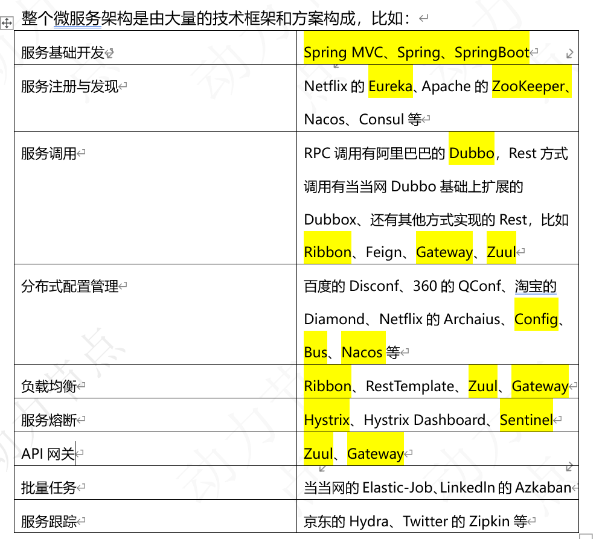

Spring Cloud是一个``一站式``的开发``分布式系统``的框架，为开发者提供了一系列的构建分布式系统的``工具集``；

Spring Cloud基于``Spring Boot``框架构建微服务架构

Spring Cloud的整体架构  :        

​    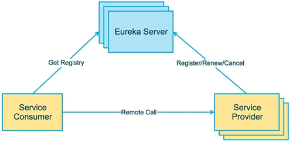

Service Provider： 暴露服务的服务提供方。

Service Consumer：调用远程服务的服务消费方。

EureKa Server： 服务注册中心和服务发现中心。

**什么是服务注册？**

服务注册：将服务所在主机、端口、版本号、通信协议等信息登记到``注册中心``上；

**什么是服务发现？**

服务发现：``服务消费者``向``注册中心``请求已经登记的服务列表，然后得到某个服务的主机、端口、版本号、通信协议等信息，从而实现对具体服务的调用；


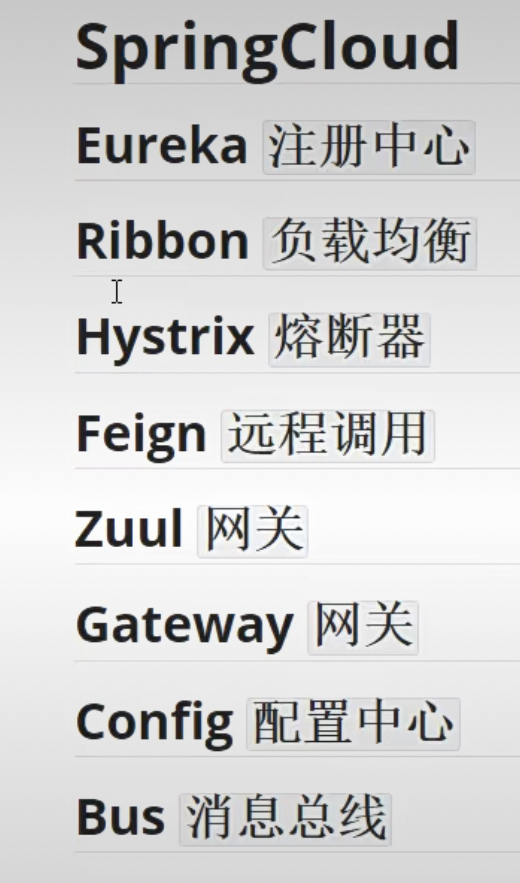

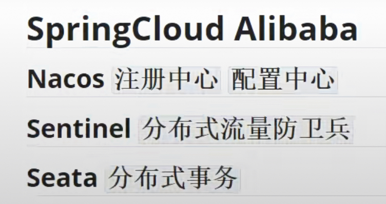

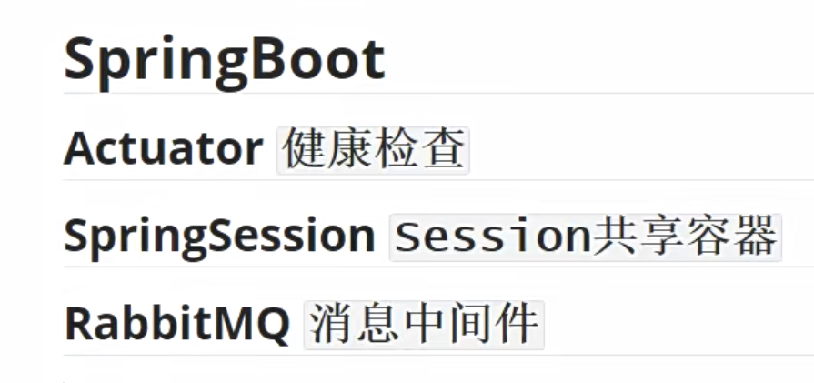

### CAP理论（consistency availability partition tolerance）

#### C一致性：是指``数据``能``一起变化``。

显然数据只有在``写（增删改）请求``的时候才会发生变化。数据发生变化是否一致是需要经过``读请求``来做检验的。如果系统内部发生了问题从而导致系统的节点无法发生一致性变化，则读请求``不返回任何数据``。

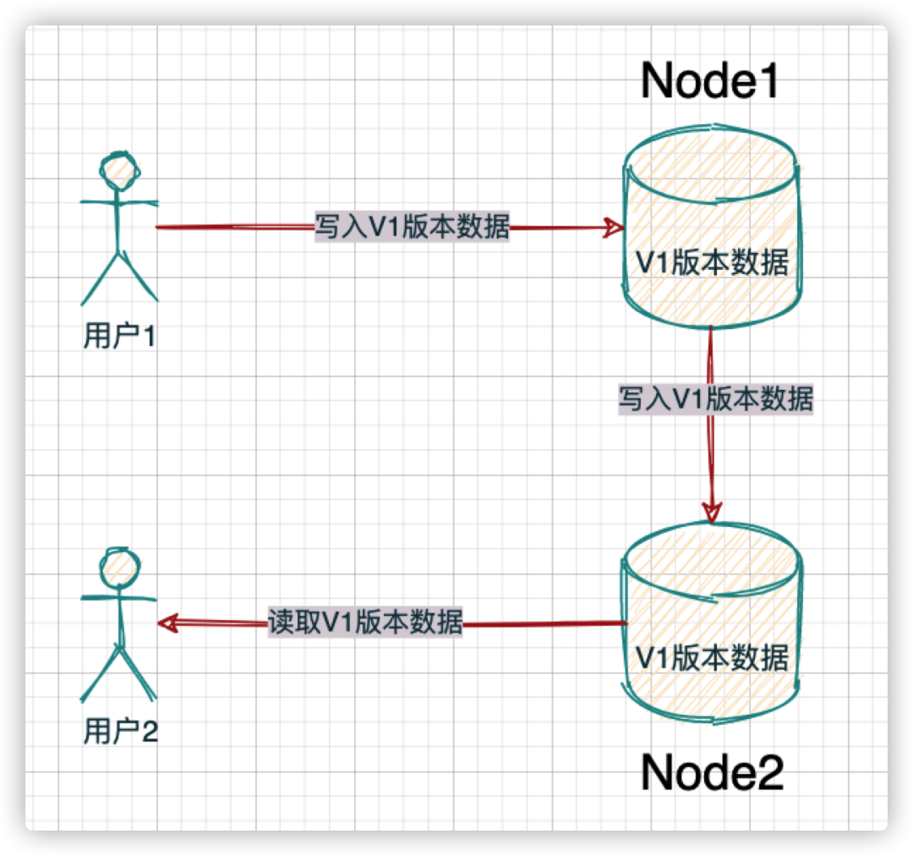

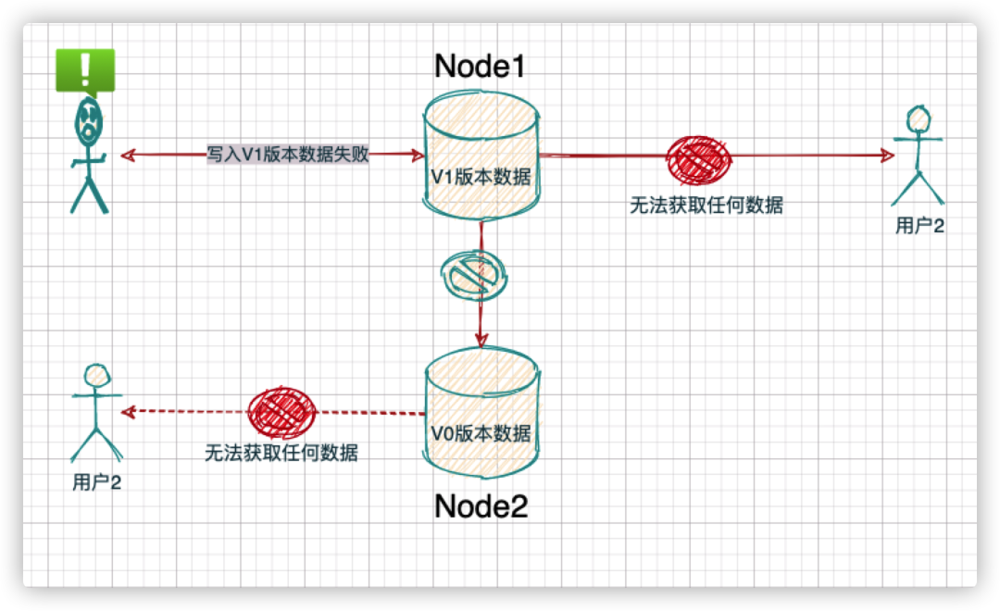

#### A可用性：

系统内的节点们接收到了无论是写请求还是读请求，``都要能处理并给回响应结果``

只是它有两点必须满足的条件：

条件 1：返回结果必须在``合理的时间``以内，这个合理的时间是根据业务来定的。

条件 2：需要``系统内能正常接收请求的所有节点``都``返回结果``这包含了两重含义：

1. 如果节点不能正常接收请求了，比如宕机了，系统崩溃了，而其他节点依然能正常接收请求，那么，我们说系统依然是可用的，也就是说，``部分宕机没事儿，不影响可用性指标。``
2. 如果节点能正常接收请求，但是发现节点内部数据有问题，那么也必须返回结果，哪怕返回的结果是有问题的。比如，系统有两个节点，其中有一个节点数据是三天前的，另一个节点是两分钟前的，如果，一个读请求跑到了包含了三天前数据的那个节点上，抱歉，``这个节点不能拒绝，必须返回这个三天前的数据``，即使它可能不太合理。

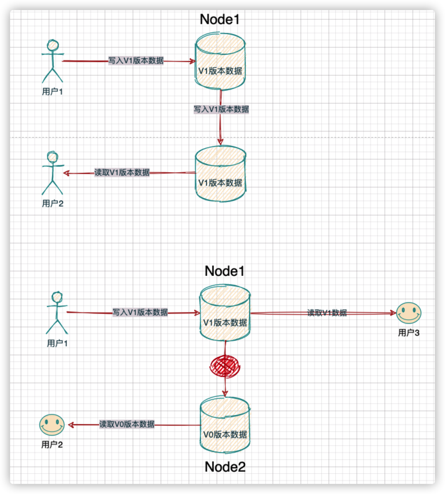

#### P分区容忍性

分区：

分布式的存储系统会有很多的节点，这些节点都是通过网络进行通信。而网络是不可靠的，当节点和节点之间的通信出现了问题，此时，就称当前的分布式存储系统出现了分区。但是，值得一提的是，分区并不一定是由网络故障引起的，也可能是因为机器故障。

``只要在分布式系统中，节点通信出现了问题，那么就出现了分区。``

##### 分区容忍性:

​	如果出现了分区问题，我们的分布式存储系统还需要继续运行。不能因为出现了分区问题，整个分布式节点全部就不做事情了。

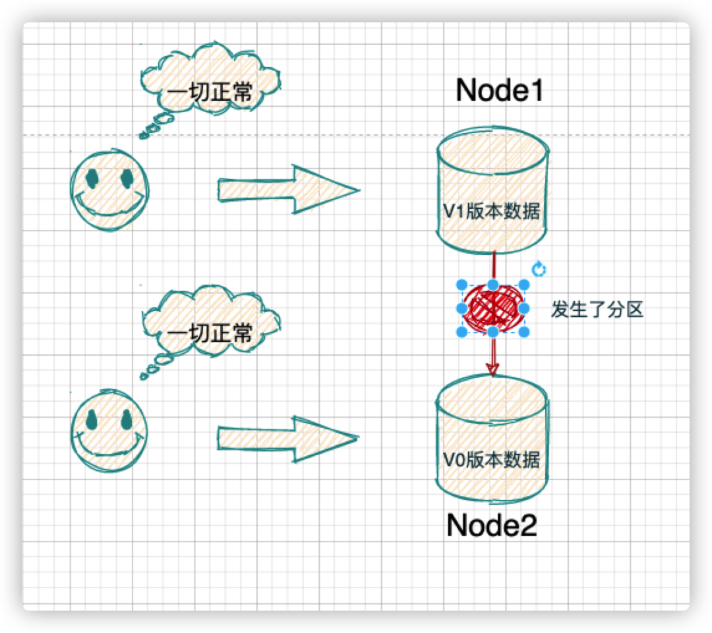

### CAP总结

CAP 就是告诉程序员们当分布式系统出现内部问题了，你要做两种选择：

- 要么让外部服务迁就你CP，像银行。
- 要么迁就外部服务AP，像外包公司。

让外部服务迁就我们，我有问题了整个系统就不可以用了，即优先一致性。

迁就外部服务就是我们不能因为我们自己的问题让外部服务的业务运行受到影响，所以要优先可用性。

zookeeper：cp

Eureka：AP

**Zookeeper**保证CP

在ZooKeeper中，当master节点因为网络故障与其他节点失去联系时，剩余节点会重新进行leader选举，但是问题在于，选举leader需要一定时间, `且选举期间整个ZooKeeper集群都是不可用的`，这就导致在选举期间注册服务瘫痪。在云部署的环境下，因网络问题使得ZooKeeper集群失去master节点是大概率事件，虽然服务最终能够恢复，但是在选举时间内导致服务注册长期不可用是难以容忍的。

**Eureka**保证AP

Eureka优先保证可用性，Eureka各个节点是平等的，`某几个节点挂掉不会影响正常节点的工作`，剩余的节点依然可以提供注册和查询服务。而Eureka的客户端在向某个Eureka注册或时如果发现连接失败，则会自动切换至其它节点，只要有一台Eureka还在，就能保证注册服务可用(保证可用性)，只不过查到的信息可能不是最新的(不保证强一致性)。

所以Eureka在网络故障导致部分节点失去联系的情况下，只要有一个节点可用，那么注册和查询服务就可以正常使用，而不会像zookeeper那样使整个注册服务瘫痪，Eureka优先保证了可用性。

* 环境信息
  * `SpringBoot` 2.5.7
  * `SpringCloud` 2020.0.4
  * `SpringCloud Alibaba`
* pom.xml添加启动器依赖
* application.yml填写配置文件
* Application引导类，添加新的注解
* 启动，测试

## Eureka `注册中心`

Eureka是一个服务治理组件，它主要包括``服务注册``和``服务发现``，主要用来``搭建服务注册中心``。

Eureka 采用了C-S（客户端/服务端）的设计架构，

Eureka 是一个基于 REST 的服务

### Eureka服务器端

* pom.xml

```xml
<dependency>
    <groupId>org.springframework.cloud</groupId>
    <artifactId>spring-cloud-starter-netflix-eureka-server</artifactId>
</dependency>
```

* application.yml

```yml
# 注册中心的端口
server:
  port: 6001
eureka:
  client:
    service-url:
      # 注册中心的地址
      defaultZone: http://localhost:6001/eureka
    # 注册中心无需拉去服务地址列表
    # 默认值是true
    fetch-registry: false
    # 注册中心无需注册自己到节点中
    # 默认值是true
    register-with-eureka: false
```

* 引导类

```java
//开启注册中心服务器端
@EnableEurekaServer
@SpringBootApplication
public class EurekaServer6001Application {

    public static void main(String[] args) {
        SpringApplication.run(EurekaServer6001Application.class, args);
    }

}
```

* 启动测试
  * 访问 `http://localhost:6001`

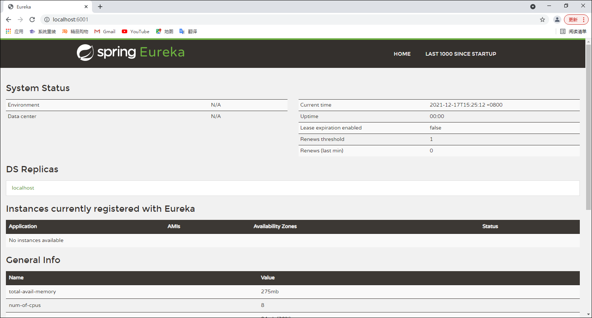


### Eureka客户端

#### 1. 消费者

* pom.xml

```xml
<!--    注册中心客户端启动依赖    -->
<dependency>
    <groupId>org.springframework.cloud</groupId>
    <artifactId>spring-cloud-starter-netflix-eureka-client</artifactId>
</dependency>
```

* application.yml

```yml
server:
  port: 8001
spring:
  application:
    # 注册到注册中心的微服务名称
    name: 001-eureka-client-consumer
eureka:
  client:
    service-url:
      # 注册中心地址
      defaultZone: http://localhost:6001/eureka
    # 拉去注册中心服务列表
    fetch-registry: true
    # 注册到微注册中心服务节点中
    register-with-eureka: true
  instance:
    # 使用ip地址注册服务
    prefer-ip-address: true
```

* 引导类

```java
//开启注册中心客户端
@EnableEurekaClient
@SpringBootApplication
public class EurekaClient8001Application {

    public static void main(String[] args) {
        SpringApplication.run(EurekaClient8001Application.class, args);
    }

}
```


#### 提供者

* pom.xml

```xml
<!--    注册中心客户端启动依赖    -->
<dependency>
    <groupId>org.springframework.cloud</groupId>
    <artifactId>spring-cloud-starter-netflix-eureka-client</artifactId>
</dependency>
```

* application.yml

```yml
server:
  port: 7001
spring:
  application:
    # 注册到注册中心的微服务名称
    name: 001-eureka-client-provider
eureka:
  client:
    service-url:
      # 注册中心地址
      defaultZone: http://localhost:6001/eureka
  instance:
    # 使用ip地址注册服务
    prefer-ip-address: true
```

* 引导类

```java
@EnableEurekaClient
@SpringBootApplication
public class EurekaClient7001Application {

    public static void main(String[] args) {
        SpringApplication.run(EurekaClient7001Application.class, args);
    }

}
```

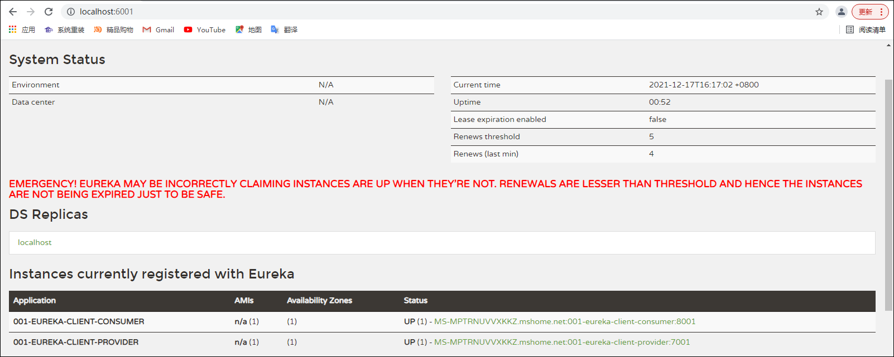


####  `RestTemplate` 远程调用

消费者调用提供者

* ConsumerController

```java
@RestController
@RequestMapping("/consumer")
public class ConsumerController {

    /*
        RestTemplate：Spring封装的远程调用的模板对象，发送http的restful api请求操作
            post、delete、put、get：不同的请求方式，代表不同的增删改查
            方法名称
                getForEntity(String url,Class responseType)：返回值ResponseEntity<T>
                getForEntity(String url,Class responseType,Object... objs)：返回值ResponseEntity<T>
                getForEntity(String url,Class responseType,Map params)：返回值ResponseEntity<T>
                    参数列表：
                        参数1，url请求地址
                        参数2，响应的字节码类型
                        参数3，封装的参数，可以用可变参数封装，也可以通过Map集合的键值对进行封装
                    返回值：ResponseEntity
                        获取提供者返回的结果
                        获取提供者返回的响应头
                        获取提供者返回的响应状态码
                        获取提供者返回的响应状态码对应的值

                getForObject(String url,Class responseType)：返回值<T>
                getForObject(String url,Class responseType,Object... objs)：返回值<T>
                getForObject(String url,Class responseType,Map params)：返回值<T>
                    参数列表：
                        参数1，url请求地址
                        参数2，响应的字节码类型
                        参数3，封装的参数，可以用可变参数封装，也可以通过Map集合的键值对进行封装
                    返回值：T
                        提供者返回的具体数据

                postForEntity(String url,Object request,Class responseType)：返回值ResponseEntity<T>
                postForEntity(String url,Object request,Class responseType,Object... objs)：返回值ResponseEntity<T>
                postForEntity(String url,Object request,Class responseType,Map params)：返回值ResponseEntity<T>
                    参数列表：
                        参数1，url请求地址
                        参数2，封装到请求体中的数据
                        参数3，响应的字节码类型
                        参数4，封装的参数，可以用可变参数封装，也可以通过Map集合的键值对进行封装
                    返回值：ResponseEntity
                        获取提供者返回的结果
                        获取提供者返回的响应头
                        获取提供者返回的响应状态码
                        获取提供者返回的响应状态码对应的值
                postForObject：返回值<T>
                postForObject(String url,Object request,Class responseType)：返回值<T>
                postForObject(String url,Object request,Class responseType,Object... objs)：返回值<T>
                postForObject(String url,Object request,Class responseType,Map params)：返回值<T>
                    参数列表：
                        参数1，url请求地址
                        参数2，封装到请求体中的数据
                        参数3，响应的字节码类型
                        参数4，封装的参数，可以用可变参数封装，也可以通过Map集合的键值对进行封装
                    返回值：T
                        提供者返回的具体数据

                put(String url,Object request,Class responseType)：返回值void，如果进行修改，想要获取提供者的返回值，请使用post方式
                put(String url,Object request,Object... objs)：返回值void，如果进行修改，想要获取提供者的返回值，请使用post方式
                put(String url,Object request,Map params)：返回值void，如果进行修改，想要获取提供者的返回值，请使用post方式
                    参数列表：
                        参数1，url请求地址
                        参数2，封装到请求体中的数据
                        参数3，封装的参数，可以用可变参数封装，也可以通过Map集合的键值对进行封装

                delete(String url)：返回值void，如果进行删除，想要获取提供者的返回值，请使用get方式
                delete(String url,Object... objs)：返回值void，如果进行删除，想要获取提供者的返回值，请使用get方式
                delete(String url,Map params)：返回值void，如果进行删除，想要获取提供者的返回值，请使用get方式
                    参数列表：
                        参数1，url请求地址
                        参数2，封装的参数，可以用可变参数封装，也可以通过Map集合的键值对进行封装
     */
    @Autowired
    private RestTemplate restTemplate;

    /**
     * 消费者工程，都是get方式接收
     * 通过不同的restTemplate的请求发送，在提供者进行get/post/put/delete方式的接收
     * 方便消费者进行测试，也可以通过postMan进行测试
     *
     * @return
     */
    @GetMapping("/01")
    public R consumer01() {

        //访问提供者地址
        String url = "http://localhost:7001/provider/01";

        ResponseEntity<R> entity = restTemplate.getForEntity(url, R.class);

        System.out.println("提供者返回的响应头 :::>>> " + entity.getHeaders());
        System.out.println("提供者返回的响应结果 :::>>> " + entity.getBody());
        System.out.println("提供者返回的响应状态码 :::>>> " + entity.getStatusCode());
        System.out.println("提供者返回的响应状态码值 :::>>> " + entity.getStatusCodeValue());

        R r = entity.getBody();

        //为后续的负载均衡做铺垫
        r.put("consumer", 8001);

        return r;
    }


    @GetMapping("/02")
    public R consumer02() {

        String url = "http://localhost:7001/provider/02/{id}/{username}";

        Map<String, Object> paramsMap = new HashMap<>();
        paramsMap.put("id", 111);
        paramsMap.put("username", "张三...");

        R r = restTemplate.getForObject(url, R.class, paramsMap);

        //为后续的负载均衡做铺垫
        r.put("consumer", 8001);

        return r;
    }

    @GetMapping("/03")
    public R consumer03(){

        String url = "http://localhost:7001/provider/03/{id}/{username}?age=18&desc=我是李四";

        Map<String, Object> paramsMap = new HashMap<>();
        paramsMap.put("id", 222);
        paramsMap.put("username", "李四...");

        R r = restTemplate.getForObject(url, R.class, paramsMap);

        //为后续的负载均衡做铺垫
        r.put("consumer", 8001);

        return r;

    }

    @GetMapping("/04")
    public R consumer04(){

        String url = "http://localhost:7001/provider/04/{id}/{username}?age=22&desc=我是王五";

        Map<String,Object> request = new HashMap<>();
        Map<String,Object> paramsMap = new HashMap<>();

        request.put("loginName","wangwu");
        request.put("loginPwd","www.wangwu.com");

        paramsMap.put("id",333);
        paramsMap.put("username","王五");

        ResponseEntity<R> entity = restTemplate.postForEntity(url, request, R.class, paramsMap);

        System.out.println("提供者返回的响应头 :::>>> " + entity.getHeaders());
        System.out.println("提供者返回的响应结果 :::>>> " + entity.getBody());
        System.out.println("提供者返回的响应状态码 :::>>> " + entity.getStatusCode());
        System.out.println("提供者返回的响应状态码值 :::>>> " + entity.getStatusCodeValue());

        R r = entity.getBody();

        //为后续的负载均衡做铺垫
        r.put("consumer", 8001);

        return r;

    }


    @GetMapping("/05")
    public R consumer05(){

        String url = "http://localhost:7001/provider/05/{id}/{username}?age=22&desc=我是赵六";

        Map<String,Object> request = new HashMap<>();
        Map<String,Object> paramsMap = new HashMap<>();

        request.put("loginName","zhaoliu");
        request.put("loginPwd","www.zhaoliu.com");

        paramsMap.put("id",444);
        paramsMap.put("username","赵六");

        R r = restTemplate.postForObject(url, request, R.class, paramsMap);

        //为后续的负载均衡做铺垫
        r.put("consumer", 8001);

        return r;

    }


    @GetMapping("/06")
    public R consumer06(){

        String url = "http://localhost:7001/provider/06/{id}/{username}?age=22&desc=我是田七";

        Map<String,Object> request = new HashMap<>();
        Map<String,Object> paramsMap = new HashMap<>();

        request.put("loginName","tianqi");
        request.put("loginPwd","www.tianqi.com");

        paramsMap.put("id",555);
        paramsMap.put("username","田七");

        restTemplate.put(url,request,paramsMap);

        return R.ok();
    }


    @GetMapping("/07")
    public R consumer07(){

        String url = "http://localhost:7001/provider/07/{id}/{username}?age=22&desc=我是王八";

        Map<String,Object> paramsMap = new HashMap<>();

        paramsMap.put("id",666);
        paramsMap.put("username","王八");

        restTemplate.delete(url,paramsMap);

        return R.ok();

    }


}
```


* ProviderController

```java
@RestController
@RequestMapping("/provider")
public class ProviderController {

    /*
        远程访问的参数发送的方式
            http://localhost:7001/provider/01
                这种方式，直接接收即可
            http://localhost:7001/provider/01/{id}/{username}
                通过地址栏参数，进行封装
            http://localhost:7001/provider/01/{id}/{username}?age=18&desc=我是张三
                通过地址栏传递键值对参数
            http://localhost:7001/provider/01/{id}/{username}?age=18&desc=我是张三
                将部分参数，封装到了请求体当中
        远程访问的参数的接收方式
            http://localhost:7001/provider/01/{id}/{username}
                通过注解进行接收，@PathVariable(name="id")
            http://localhost:7001/provider/01/{id}/{username}?age=18&desc=我是张三
                通过注解进行接收，@PathVariable(name="id")
                通过注解接收键值对的参数，@RequestParams(name="age")
            http://localhost:7001/provider/01/{id}/{username}?age=18&desc=我是张三
                通过注解进行接收，@PathVariable(name="id")
                通过注解接收键值对的参数，@RequestParams(name="age")
                通过注解接收请求体中的数据，@RequestBody
     */

    @GetMapping("/01")
    public R provider01(){
        return R.ok(0,"远程调用成功...");
    }

    @GetMapping("/02/{id}/{username}")
    public R provider02(@PathVariable Integer id,@PathVariable(name = "username") String username){

        Map<String,Object> providerData = new HashMap<>();
        providerData.put("id",id);
        providerData.put("username",username);

        return R.ok(0,"远程调用成功...",providerData);
    }

    @GetMapping("/03/{id}/{username}")
    public R provider03(@PathVariable Integer id, @PathVariable String username,
                        @RequestParam String age, @RequestParam String desc){

        Map<String,Object> providerData = new HashMap<>();
        providerData.put("id",id);
        providerData.put("username",username);
        providerData.put("age",age);
        providerData.put("desc",desc);

        return R.ok(0,"远程调用成功...",providerData);
    }

    @PostMapping("/04/{id}/{username}")
    public R provider04(@PathVariable Integer id,
                        @PathVariable String username,
                        @RequestParam String age,
                        @RequestParam String desc,
                        @RequestBody  Map<String,Object> requestBody){

        Map<String,Object> providerData = new HashMap<>();
        providerData.put("id",id);
        providerData.put("username",username);
        providerData.put("age",age);
        providerData.put("desc",desc);
        providerData.put("requestBody",requestBody);

        return R.ok(0,"远程调用成功...",providerData);

    }

    @PostMapping("/05/{id}/{username}")
    public R provider05(@PathVariable Integer id,
                        @PathVariable String username,
                        @RequestParam String age,
                        @RequestParam String desc,
                        @RequestBody  Map<String,Object> requestBody){

        Map<String,Object> providerData = new HashMap<>();
        providerData.put("id",id);
        providerData.put("username",username);
        providerData.put("age",age);
        providerData.put("desc",desc);
        providerData.put("requestBody",requestBody);

        return R.ok(0,"远程调用成功...",providerData);
    }

    @PutMapping("/06/{id}/{username}")
    public R provider06(@PathVariable Integer id,
                        @PathVariable String username,
                        @RequestParam String age,
                        @RequestParam String desc,
                        @RequestBody  Map<String,Object> requestBody){

        Map<String,Object> providerData = new HashMap<>();
        providerData.put("id",id);
        providerData.put("username",username);
        providerData.put("age",age);
        providerData.put("desc",desc);
        providerData.put("requestBody",requestBody);

        System.out.println("id :::>>> "+id);
        System.out.println("username :::>>> "+username);
        System.out.println("age :::>>> "+age);
        System.out.println("desc :::>>> "+desc);
        System.out.println("requestBody :::>>> "+requestBody);

        return R.ok(0,"远程调用成功...",providerData);
    }


    @DeleteMapping("/07/{id}/{username}")
    public R provider07(@PathVariable Integer id, @PathVariable String username,
                        @RequestParam String age, @RequestParam String desc){

        Map<String,Object> providerData = new HashMap<>();
        providerData.put("id",id);
        providerData.put("username",username);
        providerData.put("age",age);
        providerData.put("desc",desc);

        System.out.println("id :::>>> "+id);
        System.out.println("username :::>>> "+username);
        System.out.println("age :::>>> "+age);
        System.out.println("desc :::>>> "+desc);

        return R.ok(0,"远程调用成功...",providerData);
    }
}
```

* 重点
  * 如何进行请求的发送
    * getForEntity...
    * getForObject...
    * postForEntity...
    * postForObject...
    * put...
    * delete...
  * 如何接收请求中的参数
    * 地址栏中的参数 `@PathVariable`
    * 地址栏中的键值对 `@RequestParam`
    * 请求体重的参数 `@RequestBody`


### Eureka集群

#### 服务器端集群

* Eureka6001和Eureka6002两台节点

* 相互进行注册

  * 6001 application.yml

  * ```yml
    server:
      port: 6001
    eureka:
      client:
        service-url:
          # defaultZone: http://localhost:6001/eureka
          defaultZone: http://eureka6002:6002/eureka
        fetch-registry: false
        register-with-eureka: false
    ```

  * 6002 application.yml

  * ```yml
    server:
      port: 6002
    eureka:
      client:
        service-url:
          # 单节点注册
          # defaultZone: http://localhost:6002/eureka
          # 集群节点注册
          defaultZone: http://eureka6001:6001/eureka
        register-with-eureka: false
        fetch-registry: false
    ```

* 关联本地ip与域名

  * `C:\Windows\System32\drivers\etc\hosts`

  * ```text
    127.0.0.1 eureka6001
    127.0.0.1 eureka6002
    ```

* 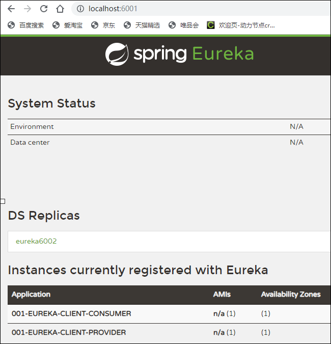

* 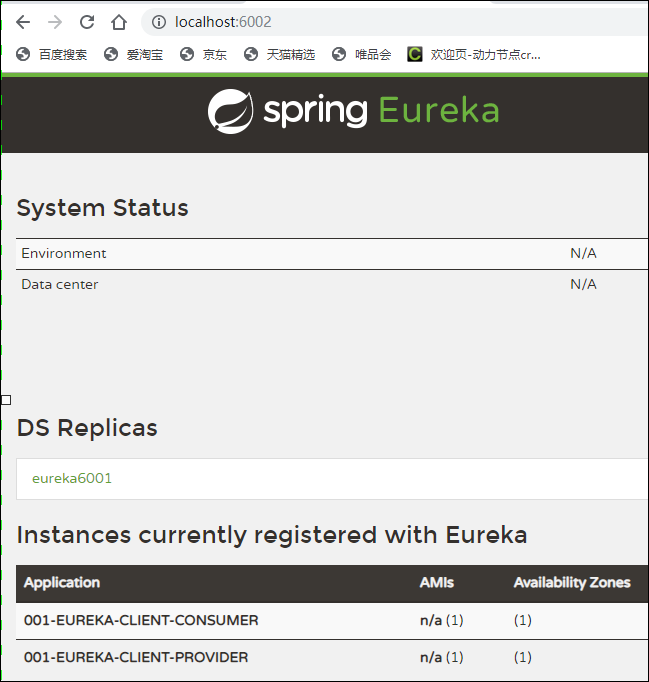

* 客户端多个服务器端的节点注册

  * 8001 application.yml

  * ```yml
    server:
      port: 8001
    spring:
      application:
        name: 001-eureka-client-consumer
    eureka:
      client:
        service-url:
          defaultZone: http://localhost:6001/eureka, http://localhost:6002/eureka
        fetch-registry: true
        register-with-eureka: true
      instance:
        prefer-ip-address: true
    ```

  * 7001 application.yml

  * ```yml
    server:
      port: 7001
    spring:
      application:
        name: 001-eureka-client-provider
    eureka:
      client:
        service-url:
          defaultZone: http://localhost:6001/eureka, http://localhost:6002/eureka
    ```


#### 客户端集群

* provider7001和provider7002两个节点

  * 7001 application.yml

  * ```yml
    server:
      port: 7001
    spring:
      application:
        # name: 001-eureka-client-provider
        name: eureka-client-provider
    eureka:
      client:
        service-url:
          defaultZone: http://localhost:6001/eureka, http://localhost:6002/eureka
    ```

  * 7002 application.yml

  * ```yml
    server:
      port: 7002
    spring:
      application:
        name: eureka-client-provider
    eureka:
      client:
        service-url:
          defaultZone: http://localhost:6001/eureka, http://localhost:6002/eureka
    ```

* 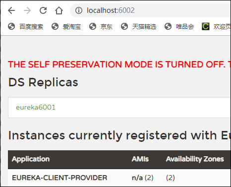

### 关闭自我保护机制

#### 服务器端

* application.yml

```yml
server:
  port: 6002
eureka:
  client:
    service-url:
      defaultZone: http://eureka6001:6001/eureka
    register-with-eureka: false
    fetch-registry: false
  server:
    enable-self-preservation: false
```

#### 客户端

* application.yml

```yml
server:
  port: 7002
spring:
  application:
    name: eureka-client-provider
eureka:
  client:
    service-url:
      defaultZone: http://localhost:6001/eureka, http://localhost:6002/eureka
  instance:
    lease-renewal-interval-in-seconds: 5
    lease-expiration-duration-in-seconds: 5
```


## Ribbon `负载均衡`

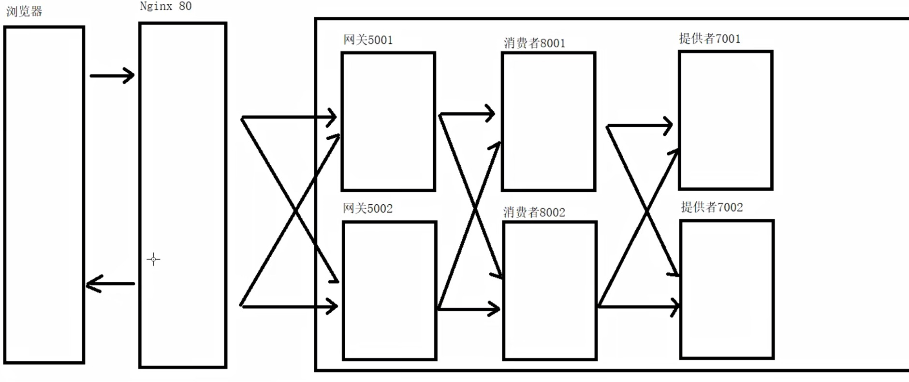

### RestTemplate `负载均衡`

* 将原来的Url的ip和端口，替换为微服务的名称

```java
//替换前
String url = "http://localhost:7001/provider/01";
//替换后
String url = "http://EUREKA-CLIENT-PROVIDER/provider/01";
```

* 搭建了提供者的集群 `7001` `7002`
* 在RestTemplate初始化时，添加一个注解@LoadBalanced

```java
//开启注册中心客户端
@EnableEurekaClient
@SpringBootApplication
public class EurekaClient8001Application {

    @Bean
    @LoadBalanced //负载均衡
    public RestTemplate getRestTemplate(){
        return new RestTemplate();
    }

    public static void main(String[] args) {
        SpringApplication.run(EurekaClient8001Application.class, args);
    }

}
```


### Feign `负载均衡`

* 见下方


### Gateway `负载均衡`

* 见下方


## Feign `远程调用`

### 入门案例

#### 消费者

* pom.xml

```xml
<dependency>
    <groupId>org.springframework.cloud</groupId>
    <artifactId>spring-cloud-starter-openfeign</artifactId>
</dependency>
```

* 引导类

```java
//开启Feign远程调用
@EnableFeignClients
//开启Eureka的客户端
@EnableEurekaClient
@SpringBootApplication
public class EurekaClient8002Application {

    public static void main(String[] args) {
        SpringApplication.run(EurekaClient8002Application.class, args);
    }

}
```


* 控制器

```java
@RestController
@RequestMapping("/consumer")
public class ConsumerController {

    /*
        如何定义一个Feign的远程调用接口呢？
            1. 创建一个接口
                命名方式：xxxFeignService
            2. 该接口添加一个注解，@FeignClient(name="远程调用的微服务名称")
                将当前接口创建动态代理对象，交给Spring容器进行管理
            3. 定义提供者接口的控制器方法(从提供者方，复制粘贴过来)
                控制器请求路径，必须一致
                参数列表必须一致
                返回值必须一致

            在使用Feign对象进行远程调用时，是直接使用Feign对象调用定义的方法
                执行时，会对该方法进行增强，就是发送http restful 请求操作
                    知道了调用的微服务的名称，知道了调用的ip地址和端口号
                    知道了请求调用的接口地址
                    知道了请求调用的接口地址的参数列表和返回值

            Feign对比RestTemplate的Put和Delete方式的操作
                RestTemplate的Put和Delete方式的请求，没有返回值，无法接收返回的参数
                Feign的Put和Delete方式的请求，是可以接收返回值的

            Feign对Hystrix熔断支持
                熔断器：在远程调用时，有一方报出异常，异常的信息，则会显示到浏览器当中
                       可以通过熔断方法，可以将信息，自定义返回，json等等
                       如果遇到超时异常，则可以快速的熔断，返回结果信息，不再阻塞在当前线程，防止线程堆积导致雪崩效应
                @FeignClient(
                             name="调用的微服务名称",
                             path="发送请求拼接的前缀路径",
                             fallback="熔断器的字节码类型")
                        创建的熔断器需要实现Feign的接口实现类
                        添加Hystrix起步依赖
                        熔断的方法，必须和调用的方法的参数列表返回值、方法名称一致
                            出现异常时，可以迅速，找到熔断类中的方法进行返回，熔断信息
     */
    @Autowired
    private ProviderFeignService service;

    @GetMapping("/01")
    public R consumer01(){
        //发送Get方式，无参
        R r = service.provider01();
        r.put("consumer",8002);
        return r;
    }

    @GetMapping("/02")
    public R consumer02(){
        //发送Get方式，RestFul
        R r = service.provider02(111, "张3");
        r.put("consumer",8002);
        return r;
    }

    @GetMapping("/03")
    public R consumer03(){
        //发送Get方式，RestFul + 键值对
        R r = service.provider03(222, "李4", "33", "我是李4");
        r.put("consumer",8002);
        return r;
    }

    @GetMapping("/04")
    public R consumer04(){
        //发送Post方式，RestFul + 键值对 + 请求体
        Map<String,Object> requestBody = new HashMap<>();
        requestBody.put("loginName","wangwu");
        requestBody.put("loginPwd","123456");

        R r = service.provider04(333, "王5", "44", "我是王5", requestBody);
        r.put("consumer",8002);
        return r;
    }

    @GetMapping("/05")
    public R consumer05(){
        //发送Post方式，RestFul + 键值对 + 请求体
        Map<String,Object> requestBody = new HashMap<>();
        requestBody.put("loginName","ZhaoLiu");
        requestBody.put("loginPwd","123123");

        R r = service.provider04(444, "赵6", "55", "我是赵6", requestBody);
        r.put("consumer",8002);
        return r;
    }

    @GetMapping("/06")
    public R consumer06(){
        //发送Put方式，RestFul + 键值对 + 请求体
        Map<String,Object> requestBody = new HashMap<>();
        requestBody.put("loginName","TianQi");
        requestBody.put("loginPwd","321321");

        R r = service.provider06(555, "田7", "66", "我是田7", requestBody);
        r.put("consumer",8002);
        return r;
    }

    @GetMapping("/07")
    public R consumer07(){
        //发送Delete方式，RestFul + 键值对
        R r = service.provider07(666, "钱8", "77", "我是钱8");
        r.put("consumer",8002);
        return r;
    }

}
```

* Feign

```java
@FeignClient(name = "EUREKA-CLIENT-PROVIDER",path = "/provider")
public interface ProviderFeignService {

    @GetMapping("/01")
    // @GetMapping("/provider/01")
    public R provider01();

    //以RestFul方式进行参数传递
    @GetMapping("/02/{id}/{username}")
    public R provider02(@PathVariable(name = "id") Integer id,@PathVariable String username);

    @GetMapping("/03/{id}/{username}")
    public R provider03(@PathVariable(name = "id") Integer id,
                        @PathVariable String username,
                        @RequestParam String age,
                        @RequestParam String desc);

    @PostMapping("/04/{id}/{username}")
    public R provider04(@PathVariable Integer id,
                        @PathVariable String username,
                        @RequestParam String age,
                        @RequestParam String desc,
                        @RequestBody Map<String,Object> requestBody);

    @PostMapping("/05/{id}/{username}")
    public R provider05(@PathVariable Integer id,
                        @PathVariable String username,
                        @RequestParam String age,
                        @RequestParam String desc,
                        @RequestBody Map<String,Object> requestBody);

    @PutMapping("/06/{id}/{username}")
    public R provider06(@PathVariable Integer id,
                        @PathVariable String username,
                        @RequestParam String age,
                        @RequestParam String desc,
                        @RequestBody Map<String,Object> requestBody);

    @DeleteMapping("/07/{id}/{username}")
    public R provider07(@PathVariable Integer id,
                        @PathVariable String username,
                        @RequestParam String age,
                        @RequestParam String desc);
}
```


#### 提供者

* 控制器

```java
@RestController
@RequestMapping("/provider")
public class ProviderController {

    /*
        远程访问的参数发送的方式
            http://localhost:7001/provider/01
                这种方式，直接接收即可
            http://localhost:7001/provider/01/{id}/{username}
                通过地址栏参数，进行封装
            http://localhost:7001/provider/01/{id}/{username}?age=18&desc=我是张三
                通过地址栏传递键值对参数
            http://localhost:7001/provider/01/{id}/{username}?age=18&desc=我是张三
                将部分参数，封装到了请求体当中
        远程访问的参数的接收方式
            http://localhost:7001/provider/01/{id}/{username}
                通过注解进行接收，@PathVariable(name="id")
            http://localhost:7001/provider/01/{id}/{username}?age=18&desc=我是张三
                通过注解进行接收，@PathVariable(name="id")
                通过注解接收键值对的参数，@RequestParams(name="age")
            http://localhost:7001/provider/01/{id}/{username}?age=18&desc=我是张三
                通过注解进行接收，@PathVariable(name="id")
                通过注解接收键值对的参数，@RequestParams(name="age")
                通过注解接收请求体中的数据，@RequestBody
     */

    @GetMapping("/01")
    public R provider01(){
        int i=1/0;
        return R.ok(0,"远程调用成功...");
    }

    @GetMapping("/02/{id}/{username}")
    public R provider02(@PathVariable Integer id,@PathVariable(name = "username") String username){

        Map<String,Object> providerData = new HashMap<>();
        providerData.put("id",id);
        providerData.put("username",username);

        return R.ok(0,"远程调用成功...",providerData);
    }

    @GetMapping("/03/{id}/{username}")
    public R provider03(@PathVariable Integer id, @PathVariable String username,
                        @RequestParam String age, @RequestParam String desc){

        Map<String,Object> providerData = new HashMap<>();
        providerData.put("id",id);
        providerData.put("username",username);
        providerData.put("age",age);
        providerData.put("desc",desc);

        return R.ok(0,"远程调用成功...",providerData);
    }

    @PostMapping("/04/{id}/{username}")
    public R provider04(@PathVariable Integer id,
                        @PathVariable String username,
                        @RequestParam String age,
                        @RequestParam String desc,
                        @RequestBody  Map<String,Object> requestBody){

        Map<String,Object> providerData = new HashMap<>();
        providerData.put("id",id);
        providerData.put("username",username);
        providerData.put("age",age);
        providerData.put("desc",desc);
        providerData.put("requestBody",requestBody);

        return R.ok(0,"远程调用成功...",providerData);

    }

    @PostMapping("/05/{id}/{username}")
    public R provider05(@PathVariable Integer id,
                        @PathVariable String username,
                        @RequestParam String age,
                        @RequestParam String desc,
                        @RequestBody  Map<String,Object> requestBody){

        Map<String,Object> providerData = new HashMap<>();
        providerData.put("id",id);
        providerData.put("username",username);
        providerData.put("age",age);
        providerData.put("desc",desc);
        providerData.put("requestBody",requestBody);

        return R.ok(0,"远程调用成功...",providerData);
    }

    @PutMapping("/06/{id}/{username}")
    public R provider06(@PathVariable Integer id,
                        @PathVariable String username,
                        @RequestParam String age,
                        @RequestParam String desc,
                        @RequestBody  Map<String,Object> requestBody){

        Map<String,Object> providerData = new HashMap<>();
        providerData.put("id",id);
        providerData.put("username",username);
        providerData.put("age",age);
        providerData.put("desc",desc);
        providerData.put("requestBody",requestBody);

        System.out.println("id :::>>> "+id);
        System.out.println("username :::>>> "+username);
        System.out.println("age :::>>> "+age);
        System.out.println("desc :::>>> "+desc);
        System.out.println("requestBody :::>>> "+requestBody);

        return R.ok(0,"远程调用成功...",providerData);
    }


    @DeleteMapping("/07/{id}/{username}")
    public R provider07(@PathVariable Integer id, @PathVariable String username,
                        @RequestParam String age, @RequestParam String desc){

        Map<String,Object> providerData = new HashMap<>();
        providerData.put("id",id);
        providerData.put("username",username);
        providerData.put("age",age);
        providerData.put("desc",desc);

        System.out.println("id :::>>> "+id);
        System.out.println("username :::>>> "+username);
        System.out.println("age :::>>> "+age);
        System.out.println("desc :::>>> "+desc);

        return R.ok(0,"远程调用成功...",providerData);
    }
}
```


### Feign集成Hystrix

* pom.xml

```xml
<dependency>
    <groupId>org.springframework.cloud</groupId>
    <artifactId>spring-cloud-starter-openfeign</artifactId>
</dependency>

<!--    熔断器起步依赖    -->
<dependency>
    <groupId>org.springframework.cloud</groupId>
    <artifactId>spring-cloud-starter-netflix-hystrix</artifactId>
    <version>2.2.9.RELEASE</version>
</dependency>
```

* application.yml

```yml
server:
  port: 8002
spring:
  application:
    name: 002-eureka-client-consumer
eureka:
  client:
    service-url:
      defaultZone: http://localhost:6001/eureka, http://localhost:6002/eureka
  instance:
    prefer-ip-address: true
    lease-renewal-interval-in-seconds: 30
    lease-expiration-duration-in-seconds: 90
feign:
  # 新版本circuitbreaker，旧版本hystrix属性
  circuitbreaker:
    enabled: true
```

* Feign接口实现类

```java
@Component
@Slf4j
public class ProviderFeignHystrix implements ProviderFeignService {
    @Override
    public R provider01() {
        log.info("provider01...执行了...");
       
        
    }

    @Override
    public R provider02(Integer id, String username) {
        return R.err(0,"服务器当前访问人数较多，请稍后再试...provider02");
    }

    @Override
    public R provider03(Integer id, String username, String age, String desc) {
        return R.err(0,"服务器当前访问人数较多，请稍后再试...provider03");
    }

    @Override
    public R provider04(Integer id, String username, String age, String desc, Map<String, Object> requestBody) {
        return R.err(0,"服务器当前访问人数较多，请稍后再试...provider04");
    }

    @Override
    public R provider05(Integer id, String username, String age, String desc, Map<String, Object> requestBody) {
        return R.err(0,"服务器当前访问人数较多，请稍后再试...provider05");
    }

    @Override
    public R provider06(Integer id, String username, String age, String desc, Map<String, Object> requestBody) {
        return R.err(0,"服务器当前访问人数较多，请稍后再试...provider06");
    }

    @Override
    public R provider07(Integer id, String username, String age, String desc) {
        return R.err(0,"服务器当前访问人数较多，请稍后再试...provider07");
    }
}
```

* Feign接口

```java
@FeignClient(name = "EUREKA-CLIENT-PROVIDER",path = "/provider",fallback = ProviderFeignHystrix.class)
public interface ProviderFeignService {
    ...
}
```


## Hystrix `熔断器`

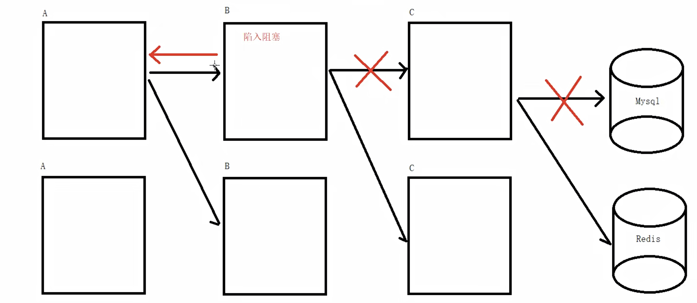

### 入门案例

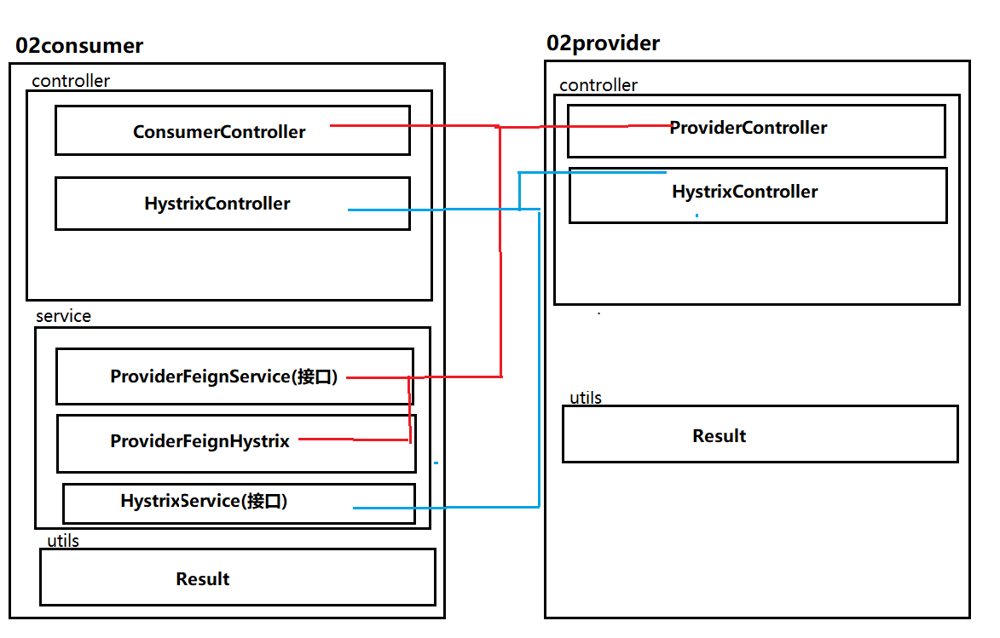

(，上面已展示红色线条涉及的部分，所以下面代码仅展示蓝色线条涉及的部分)

* pom.xml

```xml
<!--    熔断器起步依赖    -->
<dependency>
    <groupId>org.springframework.cloud</groupId>
    <artifactId>spring-cloud-starter-netflix-hystrix</artifactId>
    <version>2.2.9.RELEASE</version>
</dependency>
```

* 引导类

```java
//开启熔断器
@EnableHystrix
//开启Feign远程调用
@EnableFeignClients
//开启Eureka的客户端
@EnableEurekaClient
@SpringBootApplication
public class EurekaClient8002Application {

    public static void main(String[] args) {
        SpringApplication.run(EurekaClient8002Application.class, args);
    }

}
```

* 控制器 `消费者`

```java
@RestController
@RequestMapping("/consumer/hystrix")
public class HystrixController {

    @Autowired
    private HystrixFeignService service;

    /*
        01方法：访问时，提供者方报出除0异常，由消费者方进行服务熔断降级
        02方法：访问时，提供者方陷入阻塞状态(线程睡5秒)，然后返回结果
            消费者方就会进行服务器的熔断降级，默认Hystrix的超时熔断时间是1秒钟
            公司中，调用第三方接口时，很容易就会超过1秒钟的请求响应时间，默认1秒钟的时间太短了
            如果没有添加@HystrixCommand注解时，就会抛出一个超时的异常
            可以通过自定义服务器熔断降级的参数来实现，自定义的时间熔断设置
        03方法：触发断路器功能
            当断路器状态为关闭时，所有请求允许访问，不论是否发生异常。
            当断路器的时间窗口周期内，发生了超过指定比例的异常时，就会将断路器的状态设置为打开的状态
                此时任何的请求，都不允许通过访问。不论当前的请求是否产生异常。
     */

    @GetMapping("/01")
    @HystrixCommand(fallbackMethod = "fallbackMethodHystrix01")
    public R hystrix01(){
        return service.hystrix01();
    }

    public R fallbackMethodHystrix01(){
        return R.err(0,"消费者工程及时熔断提供着方的请求...fallbackMethodHystrix01");
    }

    @GetMapping("/02")
    @HystrixCommand(
            fallbackMethod = "fallbackMethodHystrix02",
            //自定义服务熔断降级的参数设置
            commandProperties = {
                    //自定义服务器熔断降级的时间设置，默认是1秒，毫秒值为单位
                    @HystrixProperty(name = "execution.isolation.thread.timeoutInMilliseconds",value = "2000")
            }
    )
    public R hystrix02(){
        return service.hystrix02();
    }

    public R fallbackMethodHystrix02(){
        return R.err(0,"消费者工程及时熔断提供着方的请求...fallbackMethodHystrix02");
    }

    @GetMapping("/03/{id}")
    @HystrixCommand(
            fallbackMethod = "fallbackMethodHystrix03",
            commandProperties = {
                    //开启断路器
                    @HystrixProperty(name = "circuitBreaker.enabled",value = "true"),
                    //设置时间窗口周期，在当前的时间窗口周期内，进行统计异常比例数据
                    @HystrixProperty(name = "circuitBreaker.sleepWindowInMilliseconds",value = "5000"),
                    //时间窗口周期内，接收的最小请求数
                    @HystrixProperty(name = "circuitBreaker.requestVolumeThreshold",value = "10"),
                    //设置异常比例，取值为0-100，代表 0% ~ 100%
                    @HystrixProperty(name= "circuitBreaker.errorThresholdPercentage",value = "50")
            }
    )
    public R hystrix03(@PathVariable Integer id){
        return service.hystrix03(id);
    }

    /*
        当控制器中指定的熔断方法的参数列表或返回值和原方法不一致时:
            FallbackDefinitionException:
                fallback method wasn't found:
                    fallbackMethodHystrix03([class java.lang.Integer])
     */
    public R fallbackMethodHystrix03(Integer id){
        return R.err(0,"当前请求出现异常，拒绝连接...fallbackMethodHystrix03 "+id);
    }

}
```

* 控制器 `提供者`

```java
@RestController
@RequestMapping("/provider/hystrix")
public class HystrixController {

    /**
     * 模拟运行时异常
     * @return
     */
    @GetMapping("/01")
    public R hystrix01(){
        int i=1/0;
        return R.ok();
    }

    /**
     * 模拟超时异常
     * @return
     */
    @GetMapping("/02")
    public R hystrix02() throws InterruptedException {
        Thread.sleep(5000);
        return R.ok();
    }

    @GetMapping("/03/{id}")
    public R hystrix03(@PathVariable Integer id){

        if(id <= 0){
            int i=1/0;
            return R.err(1,"报错了...");
        }

        return R.ok();

    }
}
```

Service`消费者中远程调用提供者`

```shell
@FeignClient(name="EUREKA-CLIENT-PROVIDER",path = "/provider")
public interface HystrixService {

    /**Feign集成Hystrix的测试方法*/
    @GetMapping("/feign/hystrix/01")
    public Result Providerfh01();

    /**Hystrix测试报出异常的方法*/
    @GetMapping("/hystrix/01")
    public Result hystrix01();

    /**Hystrix测试报出超时异常的方法*/
    @GetMapping("/hystrix/02")
    public Result hystrix02();

    /**Hystrix测试断路器的方法*/
    @GetMapping("/hystrix/03/{id}")
    public Result hystrix03(@PathVariable("id") Integer id);

}
```

断路器

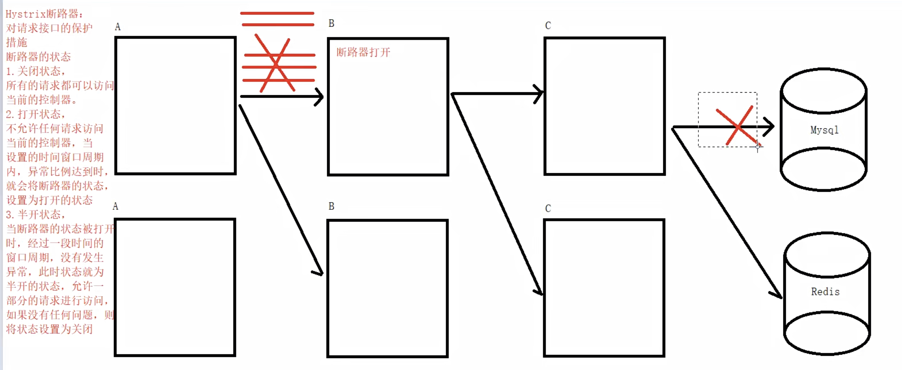

### Hystrix参数列表

```java
@HystrixCommand(fallbackMethod = "str_fallbackMethod",
  groupKey = "strGroupCommand",
  commandKey = "strCommard",
  threadPoolKey = "strThreadPool",
  commandProperties = {
     //设置隔离策略,THREAD表示线程池SEMAPHORE:信号地隔离
     @HystrixProperty(name = "execution.isolation. strategy", value = "THREAD"),
     //当隔离策略选择信号地隔离的时候，用来没置信号地的大小（最大并发数)
     @HystrixProperty(name = "execution.isolation. semaphore.maxConcurrentRequests", value = "10"),
     //配置命令执行的超时时间
     @HystrixProperty(name = "execution.isolation.thread.timeoutinMilliseconds", value = "10"),
     //悬否启用超时时间
     @HystrixProperty(name = "execution.timeout. enabled", value = "true"),
     //执行超时的时候是否中断
     @HystrixProperty(name = "execution.isolation.thread.interruptOnTimeout", value = "true"),
     //执行被取消的时候是否中断
     @HystrixProperty(name = "execution.isolation.thread. interruptOnCancel", value = "true"),
     //允许回调方法执行的最大并发数
     @HystrixProperty(name = "fallback.isolation.semaphore.maxConcurrentRequests", value = "10"),
     //服务降级是否启用，是否执行回湖函数
     @HystrixProperty(name = "fallback.enabled", value = "true"),
     @HystrixProperty(name = "circuitBreaker.enabled", value = "true"),
     //该属性用来设置在演动时间窗中，断路器熔断的最小请求数。例如,默认该值为20的时候,
     //如果滚动时间窗(默认10秒)内仅收到10个请求,即使这10个请求都失败了,断路器也不会打开。
     @HystrixProperty(name = "circuitBreaker.requestVolumeThreshold", value = "20"),
     //该属性用来设置在模动时间窗中，表示在滚动时间窗中，在请求数量超过
     // circuitBreaker. requestVolumeThreshold的情况下,如果错误请求数的百分比超过50,
     //就把断路器设置为“打开"状态，否则就设置为“关闭"状态。
     @HystrixProperty(name = "circuitBreaker.errorThresholdPercentage", value = "50"),
     //该属性用来设置当断路器打开之后的休眠时间窗。休眠时间窗结束之后,
     //会将断路器置为“半开"状态，尝式熔断的请求命令，如果依然失败就将断路器继续设置为“打开"状态,
     //如果成功就设置为“关闭"状态。
     @HystrixProperty(name = "circuitBreaker.sleepWindowInMilliseconds", value = "5000"),
     //断路器强制打开
     @HystrixProperty(name = "circuitBreaker.forceOpen", value = "false"),
     //断路器强制关闭
     @HystrixProperty(name = "circuitBreaker.forceClosed", value = "false"),
     //滚动时间窗设置，该时间用于断路器判断健康度时需要收集信息的持续时间
     @HystrixProperty(name = "metrics.rollingStats.timeinMilliseconds", value = "10000"),
     //该属性用来设置凝动时间窗统计指标信息时划分"镑"的数量,断路器在收集指标信息的时候会根据//设置的时间窗长度拆分成多个“裙"来翼计各度量值，每个"裙"记录了一段时间内的采集指标。//比如10秒内拆分成10个“裤”收集这样，所以timeinilliseconds 必须能被numBuckets 整除。 否则会抛异常
     @HystrixProperty(name = "metrics.rollingStats.numBuckets", value = "10"),
     //动时间窗设置，该时间用于断路器判断健康度时需要收集信息的持续时间
     @HystrixProperty(name = "metrics.rollingStats.timeinMilliseconds", value = "10000"),
     //该属性用来设置模动时间窗统计指标信息时划分"榜"的数量,断路器在收集指标信息的时候会根据
     //设置的时间窗长度拆分成多个“裤"来累计各度量值，每个"榜”记录了一段时间内的采集指标。
     //比如10秒内拆分成10个"榜"收集这样,所以timeinMilliseconds必须能被numBuckets整除。否则会抛异常
     @HystrixProperty(name = "metrics.rollingStats. numBuckets", value = "10"),
     //该属性用来设置对命令执行的延迟是否使用百升位数来跟踪和计算。如果设置为false,那么所有的概要统计都将返回-1.
     @HystrixProperty(name = "metrics.rollingPercentile. enabled", value = "false"),
     //该属性用来设置百分位统计的凝动窗口的持续时间，单位为喜秒。
     @HystrixProperty(name = "metrics.rollingPercentile.timeInMilliseconds", value = "6000e"),
     //该属性用央设置百分位统计模动窗口中使用“榜”的数量
     @HystrixProperty(name = "metrics.rollingPercentile. numBuckets", value = "60000"),
     //该属性用来设置在执行过程中每个“桶”中保留的最大执行次数。如果在模动时间窗内发生超过该设定值的执行况数,
     //就从最初的位置开始重写。例如,将该值设置为100,滚动窗口为10秒,若在10秒内一个“捅”中发生了500次执行
     //那么该“桶”中只保留最后的100,次执行的统计。另外,增加该值的大小将会增加内存量的消耗,并增加排序百分位数所需的计算时间。
     @HystrixProperty(name = "metrics.rollingPercentile. bucketSize", value = "100"),
     //该属性用来设置采集影响断路器状态的健康快照(请求的成功、错误百分比)的间隔等待时间。
     @HystrixProperty(name = "metrics. healthSnapshot.intervalinMilliseconds", value = "500"),
     //悬否开启请求缓存
     @HystrixProperty(name = "requestCache. enabled", value = "true"),
     // HystrixCommand的执行和事件悬否打印日志到HystrixRequestLog中
     @HystrixProperty(name = "requestLog.enabled", value = "true"),
     @HystrixProperty(name = "metrics.rollingPercentile.bucketSize", value = "100"),
     //该属性用夹设置采集影响断路器状态的健康快照（请求的成功、错误百分比)的间隔等待时间。
     @HystrixProperty(name = "metrics. healthSnapshot.intervalinMilliseconds", value = "500"),
     //是否开启请求缓存
     @HystrixProperty(name = "requestCache.enabled", value = "true"),
     // Hystrixcommand的执行和事件是否打印日志到HystrixRequestLog中
     @HystrixProperty(name = "requestLog. enabled", value = "true"),
},
  threadPoolProperties = {
     //该参数用来设置执行命令线程地的核心线程数，该值也就是命令执行的最大并发量
     @HystrixProperty(name = "coreSize", value = "10"),
     //该参数用来设置线程池的最大队列大小。当没置为-1时，线程池将使用SynchronousQueue实现的队列
     //否则将使用LinkedBlockingQueue实现的队列。
     @HystrixProperty(name = "maxQueuesize", value = "-1"),
     //该参数用来为队列设置拒绝阈值。通过该参数，即使队列没有达到最大值也能拒绝请求。
     //该参数主要是对LinkedBlockingQueue队列的补充,因为LinkedBlockingQueue
     //队列不能动态修改它的对象大小，而通过该属性就可以调整拒绝请求的队列大小了。
     @HystrixProperty(name = "queueSizeRejectionThreshold", value = "5")
})
```


### Hystrix公共的熔断降级方法

* 控制器的类上添加 `@DefaultProperties`
  * `defaultFallback`属性，代表默认的熔断降级方法
* 控制器的方法上添加 `@HystrixCommand`

```java
@RestController
@RequestMapping("/consumer")
@DefaultProperties(defaultFallback = "defaultFallbackMethod")
public class ConsumerController {

    /*
            Feign对Hystrix熔断支持
                熔断器：在远程调用时，有一方报出异常，异常的信息，则会显示到浏览器当中
                       可以通过熔断方法，可以将信息，自定义返回，json等等
                       如果遇到超时异常，则可以快速的熔断，返回结果信息，不再阻塞在当前线程，防止线程堆积导致雪崩效应
                @FeignClient(
                             name="调用的微服务名称",
                             path="发送请求拼接的前缀路径",
                             fallback="熔断器的字节码类型")
                        创建的熔断器需要实现Feign的接口实现类
                        添加Hystrix起步依赖
                        熔断的方法，必须和调用的方法的参数列表返回值、方法名称一致
                            出现异常时，可以迅速，找到熔断类中的方法进行返回，熔断信息

        集成Hystrix
            1. pom.xml中添加了起步依赖
            2. 引导类上添加新的注解，@EnableHystrix
            3. 控制器的方法上添加，@HystrixCommand
                fallbackMethod：服务熔断降级降级的方法名称
                    参数列表和返回值必须和原方法一致
     */
    @Autowired
    private ProviderFeignService service;

    /*
        @DefaultProperties(defaultFallback = "defaultFallbackMethod")
            公共的服务降级的方法，防止类爆炸问题
            能够被访问默认的降级方法，必须要求，所有访问的控制器方法的参数列表和返回值必须和默认的降级方法一致
            需要将使用默认降级方法的控制器上，添加一个注解@HystrixCommand

        熔断方法优先级：
            1. Feign集成Hystrix(最高)
            2. 自定义调用Hystrix熔断方法(其次)
            3. 返回默认的熔断方法(最低)
     */
    public R defaultFallbackMethod(){
        return R.err(1,"默认的服务熔断降级的方法");
    }

    @GetMapping("/01")
    //默认的熔断降级方法
    @HystrixCommand
    //自定义的熔断降级方法
    //@HystrixCommand(fallbackMethod = "fallbackConsumer01")
    public R consumer01(){
        //发送Get方式，无参
        R r = service.provider01();
        r.put("consumer",8002);
        return r;
    }

    public R fallbackConsumer01(){
        return R.err(1,"当前服务器网络繁忙，请稍后再试...fallbackConsumer01");
    }

    @GetMapping("/02")
    @HystrixCommand
    public R consumer02(){
        //发送Get方式，RestFul
        R r = service.provider02(111, "张3");
        r.put("consumer",8002);
        return r;
    }

    @GetMapping("/03")
    @HystrixCommand
    public R consumer03(){
        //发送Get方式，RestFul + 键值对
        R r = service.provider03(222, "李4", "33", "我是李4");
        r.put("consumer",8002);
        return r;
    }

    @GetMapping("/04")
    @HystrixCommand
    public R consumer04(){
        //发送Post方式，RestFul + 键值对 + 请求体
        Map<String,Object> requestBody = new HashMap<>();
        requestBody.put("loginName","wangwu");
        requestBody.put("loginPwd","123456");

        R r = service.provider04(333, "王5", "44", "我是王5", requestBody);
        r.put("consumer",8002);
        return r;
    }

    @GetMapping("/05")
    @HystrixCommand
    public R consumer05(){
        //发送Post方式，RestFul + 键值对 + 请求体
        Map<String,Object> requestBody = new HashMap<>();
        requestBody.put("loginName","ZhaoLiu");
        requestBody.put("loginPwd","123123");

        R r = service.provider04(444, "赵6", "55", "我是赵6", requestBody);
        r.put("consumer",8002);
        return r;
    }

    @GetMapping("/06")
    @HystrixCommand
    public R consumer06(){
        //发送Put方式，RestFul + 键值对 + 请求体
        Map<String,Object> requestBody = new HashMap<>();
        requestBody.put("loginName","TianQi");
        requestBody.put("loginPwd","321321");

        R r = service.provider06(555, "田7", "66", "我是田7", requestBody);
        r.put("consumer",8002);
        return r;
    }

    @GetMapping("/07")
    @HystrixCommand
    public R consumer07(){
        //发送Delete方式，RestFul + 键值对
        R r = service.provider07(666, "钱8", "77", "我是钱8");
        r.put("consumer",8002);
        return r;
    }

}
```


## Hystrix Dashboard `熔断器仪表盘`

#### 客户端8002

* pom.xml

```xml
<!--    熔断器起步依赖    -->
<dependency>
    <groupId>org.springframework.cloud</groupId>
    <artifactId>spring-cloud-starter-netflix-hystrix</artifactId>
    <version>2.2.9.RELEASE</version>
</dependency>
<!--    健康检查起步依赖    -->
<dependency>
    <groupId>org.springframework.boot</groupId>
    <artifactId>spring-boot-starter-actuator</artifactId>
</dependency>
```

* application.yml

```yml
management:
  endpoints:
    web:
      # 健康检查的根路径地址设置，默认为 /actuator
      base-path: /actuator
      exposure:
        # 开放的端点
        # ‘*’ 开放所有的端点
        # 指定端点进行开放，Set集合，默认开放的只有info、health端点
        # include: 'health'
        # include: '*'
        # 开放部分的端点
        include:
          - 'health'
          - 'hystrix.stream'
          - 'logfile'
# 日志信息的配置
logging:
  charset:
    # 设置日志信息的编码
    file: UTF-8
  file:
    # 设置日志信息存储的文件名称
    name: ${spring.application.name}.log
    # 存储的文件路径
    path: 'D:\course\stage6\codes\logs\002-eureka-client-consumer\'
```


#### 服务器端 `Dashboard`

* pom.xml

```xml
<dependency>
    <groupId>org.springframework.cloud</groupId>
    <artifactId>spring-cloud-starter-netflix-hystrix-dashboard</artifactId>
    <version>2.2.9.RELEASE</version>
</dependency>
```

* application.yml

```yml
spring:
  application:
    name: 003-hystrix-dashboard
server:
  port: 9001
eureka:
  client:
    service-url: 
      defaultZone: http://localhost:6001/eureka, http://localhost:6002/eureka
```

* 引导类

```java
@EnableEurekaClient
@SpringBootApplication
//开启Hystrix仪表盘
@EnableHystrixDashboard
public class HystrixDashboard9001Application {

    public static void main(String[] args) {
        SpringApplication.run(HystrixDashboard9001Application.class, args);
    }

}
```

* 测试，查看仪表盘后台的监控首页面

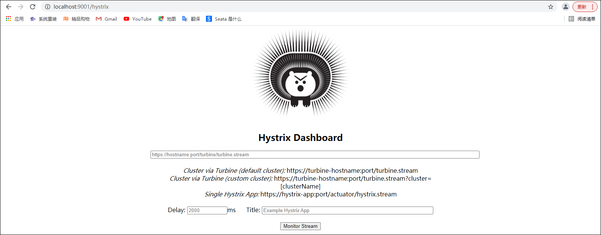

* 仪表盘监控微服务

  * 输入监控微服务地址：`http://localhost:8002/actuator/hystrix.stream`

* 没有监控到微服务

  * 在仪表盘中没有将```微服务```添加到信任列表中

  * application.yml `9001 Dashboard`

  * ```yml
    hystrix:
      dashboard:
        proxy-stream-allow-list:
          - 'localhost'
    ```

* 查看仪表盘的控制台，是否需要添加到信任列表中

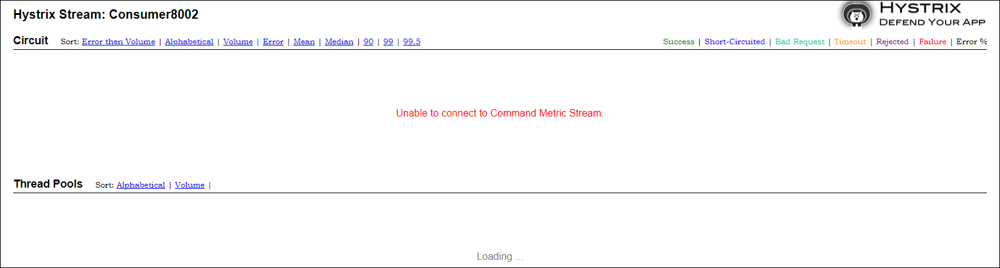

* 仪表盘已经可以监控到微服务的信息
  * 仪表盘是懒加载的，所以必须发送请求才会触发
  * 加载的仪表盘的监控的微服务的方法，必须是添加了`@HystrixCommand`的注解的

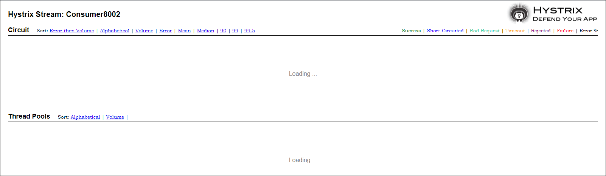

* 发送请求，进行监控微服务

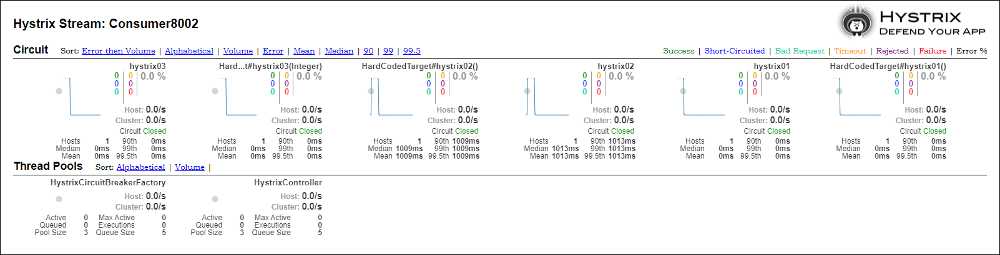

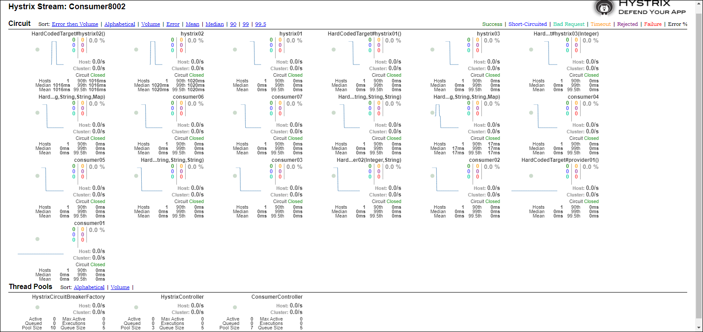


## Zuul `网关`

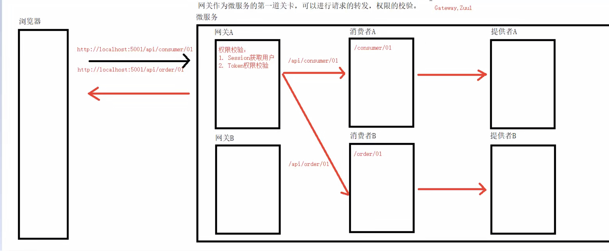

目前学习的小框架总结

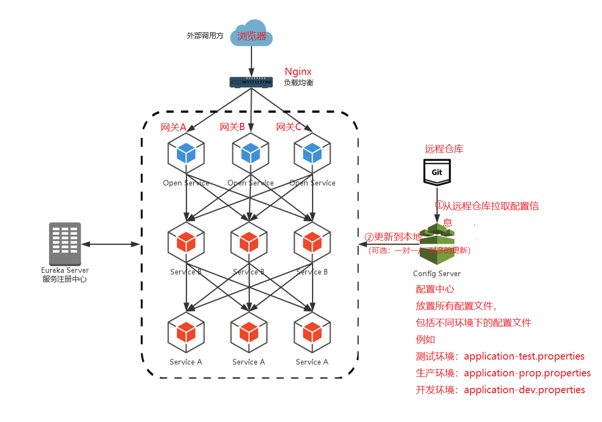

### 入门案例

* pom.xml

```xml
<parent>
    <groupId>org.springframework.boot</groupId>
    <artifactId>spring-boot-starter-parent</artifactId>
    <version>2.4.2</version>
    <relativePath/>
</parent>

<dependency>
    <groupId>org.springframework.cloud</groupId>
    <artifactId>spring-cloud-starter-netflix-zuul</artifactId>
    <version>2.2.9.RELEASE</version>
</dependency>
```

* 引导类

```java
//开启网关代理
@EnableZuulProxy
@EnableEurekaClient
@SpringBootApplication
public class Zuul5001Application {

    public static void main(String[] args) {
        SpringApplication.run(Zuul5001Application.class, args);
    }

}
```


#### 网关路由

* application.yml

```yml
server:
  port: 5001
eureka:
  client:
    service-url:
      defaultZone: http://localhost:6001/eureka, http://localhost:6002/eureka
  instance:
    lease-renewal-interval-in-seconds: 30
    lease-expiration-duration-in-seconds: 90
spring:
  application:
    name: 003-zuul
# Zuul网关配置
zuul:
  # 路由相关的配置内容
  # Map<String, ZuulProperties.ZuulRoute> routes
  #   ZuulRoute：
  #     private String id; 唯一标识，可以省略
  #     private String path; 拦截的url，支持通配规则，*、**，只支持单个的url拦截规则
  #     private String serviceId; 转发微服务的名称
  #     private String url; 转发微服务的地址
  #     private boolean stripPrefix = true; 是否截取拦截前缀，默认是true，去掉拦截的前缀
  routes:
    toBaidu:
      path: /
      url: https://www.baidu.com
    # 当出现相同的拦截路径时，后加载的会将先加载的覆盖
    toBaiduNews:
      # 不支持多个路径的拦截规则
      # path: /, /guonei, /guoji
      path: /
      url: http://news.baidu.com
    toBaiduNewsGuonei:
      path: /guonei
      url: http://news.baidu.com
    toBaiduNewsGuoji:
      path: /guoji
      url: http://news.baidu.com
    toConsumer8002:
      path: /api/**
      # path: /consumer/**
      url: http://localhost:8002
      # 去掉拦截的前缀路径
      # 浏览器发送的请求：http://localhost:5001/consumer/consumer/02
      # 去掉拦截的前缀路径后，将请求进行转发：http://localhost:5001/consumer/02
      # 路由到消费者工程：http://localhost:8002/consumer/02
      stripPrefix: true
      # 不会去除掉拦截的前缀路径，http://localhost:5001/consumer/02
      # 路由到消费者工程：http://localhost:8002/consumer/02
      # stripPrefix: false
```


#### 过滤器

```java
@Component
public class CustomFilter extends ZuulFilter {
    //过滤器类型，pre、post、error...
    @Override
    public String filterType() {
        return "pre";
    }

    //过滤器的优先级，数字越小，优先级越高。支持负数
    @Override
    public int filterOrder() {
        return 0;
    }

    //是否启用过滤器
    @Override
    public boolean shouldFilter() {
        return true;
    }

    //过滤器的业务逻辑
    //过滤器的返回值，是任意类型，代表继续向下转发请求操作
    @Override
    public Object run() throws ZuulException {

    System.out.println("过滤器启动----正在执行------");

          /**
            权限校验，要求必须传递Token参数，否则没有权限
                Token：令牌，令牌是被加密的，按照公司中规定的加密算法，进行加密。
                   可逆的加密算法：AES、DES、RSA，通过明文进行加密，可以通过指定的算法进行转换成明文。
                   不可逆的加密算法：MD5，加密后的数据不能够转换为明文数据


            公司中的权限校验操作：
                1. 使用框架的方式，Shiro/SpringSecurity，都可以关联数据库进行操作
                    在权限校验时，会通过数据库将当前用户的角色信息和权限信息全部查询出来
                    角色信息：代表当前用户的属性标识，比如管理员、经理、销售员...
                    权限信息：代表当前用户具体的操作。
                        比如管理员，可以访问任意的请求。
                        比如销售员，只可以订单的查询、新增操作。
                        比如经理，可以对订单进行增删改查操作，可以对销售员进行新增、修改、查询或删除操作
                2. 通过令牌进行权限校验，只需要准备加密和解密、验证的算法即可，工具类。
                    例如P2P金融或电商，这些都是属于互联网项目，所有的用户的角色基本都相同
                    可以通过一些标识进行设置，加密一个字符串，可能是User对象
                        {
                            id=xxx,
                            username=xxx,
                            password='',
                            roles=[{roleName=xxx,roleDesc=xxx,id=xxx}...],
                            permissions=[{permissionName=xxx,permissionDesc=xxx,permissionUrl=xxx,id=xxx}...]
                        }
                        qwejklrjklqwheripouyhiow3h4jkl1blakjsdfhiouyhwe45kjl1hr
                        
                3. 通过Session存储用户对象信息，每台服务器只能部署一个项目，尤其是分布式的项目，将一个项目拆分成多个
                    Crm,直接就可以
                    Crm,拆分成市场活动、用户模块、线索模块...每台服务器都有独立的JVM中的Session容器
                    需要将用户在每台Session中都能够存储吗？
                        此时如果使用Session进行存储时，会出现Session无法共享的问题
                        需要使用第三方的插件来解决Session共享的问题，SpringSession进行解决
                    SpringSession：
                        它通过Spring整合Redis，提供一个公共的容器进行存储，所有的服务器都可以向redis获取同一个用户对象
                        这样就解决了用户的session共享的问题了
         */

        //获取请求上下文对象
        RequestContext currentContext = RequestContext.getCurrentContext();
        //获取当前请求对象请求参数中的token数据（用户的身份令牌）
        String token = currentContext.getRequest().getParameter("token");

        //如果没有传递token或传递的是不合法的token规则
        if(token == null || token.length() == 0){
            //通过response响应数据

            String json = "{\"code\":1,\"msg\":\"当前请求异常token，请登录后重试...\"}";
            //设置响应体的数据
            currentContext.setResponseBody(json);
            //是否通过Zuul响应
            currentContext.setSendZuulResponse(false);
            //设置响应头信息：以html或文本响应编码格式为utf-8
            currentContext.addZuulResponseHeader("content-type", "text/html;charset=utf-8");
            //设置响应编码为401，表示权限不足
            currentContext.setResponseStatusCode(401);
        }
        else {
            System.out.println("用户携带了身份令牌,需要进一步验证这个身份是否真的合法");
        }
        //校验通过，进行转发操作
        return null;
        //http://localhost:5001/api/consumer/03?token=111  -->{"msg":"远程调用成功","code":0,"data":{"id":2002,"age":"22","username":"yueyue","desc":"我是yueyue"},"provider":7001,"consumer":8002}
        //http://localhost:5001/api/consumer/03 --> {"code":1,"msg":"当前请求异常token，请登录后重试..."}
    }
}
```


## Gateway `网关`

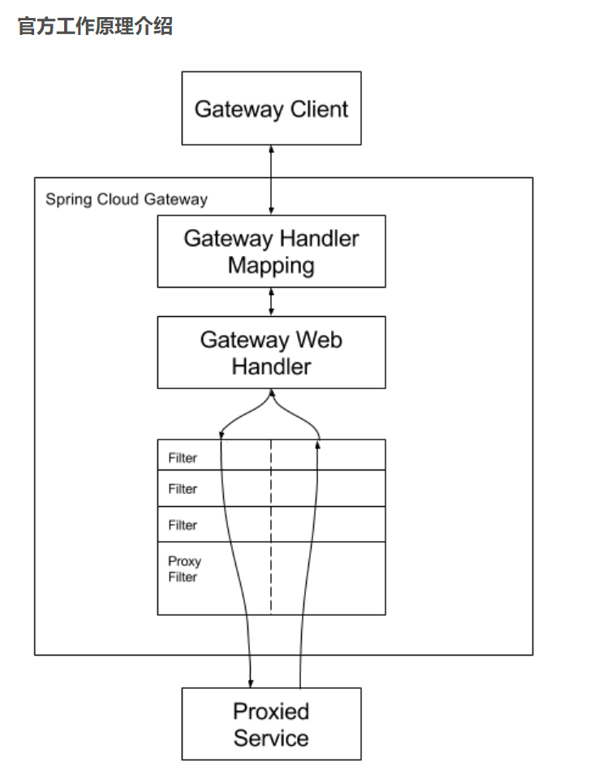

客户端向spring-cloud-gateway请求网关映射处理程序(gateway handler mapping)，如果确认请求与路由匹配，则将请求发送到web处理程序(gateway web handler)，web处理程序通过特定于该请求的过滤器链处理请求，图中filters被虚线划分的原因是filters可以在发送代理请求之前(pre filter)或之后执行逻辑(post filter)。先执行所有pre filter逻辑，然后进行请求代理。在请求代理执行完后，执行post filter逻辑。


### 组件介绍

* 网关路由
  * Zuul：拦截`单个`url规则、默认`去除`拦截前缀、重复的url规则，`后面的会将前面覆盖`
  * Gateway：拦截`多个`url规则、默认`不去除`拦截前缀、重复url规则，`前面的会将后面覆盖`
* 断言 `11个`
  * 断言的条件必须全部满足，才会路由转发
    * 所有的断言规则，必须全部为真，才能够进行请求转发
  * 只要断言为假，就会返回404状态码
* 过滤器
  * 过滤器工厂 `31个`
  * 全局过滤器 `9个`
  * 自定义过滤器
    * SpringSession
    * Token `Jwt`

### 入门案例

* pom.xml

```xml
<!--网关的起步依赖-->
<dependency>
    <groupId>org.springframework.cloud</groupId>
    <artifactId>spring-cloud-starter-gateway</artifactId>
</dependency>
<!--网关的负载均衡的起步依赖-->
<dependency>
    <groupId>org.springframework.cloud</groupId>
    <artifactId>spring-cloud-starter-loadbalancer</artifactId>
</dependency>
```

#### 路由转发操作

* application.yml

```yml
server:
  port: 5002
eureka:
  client:
    service-url:
      defaultZone: http://localhost:6001/eureka, http://localhost:6002/eureka
  instance:
    lease-renewal-interval-in-seconds: 30
    lease-expiration-duration-in-seconds: 90
spring:
  application:
    name: 003-gateway
  cloud:
    # Gateway网关配置信息
    gateway:
      # 网关路由配置，包含断言、过滤器、请求转发
      # List<RouteDefinition> routes
      #   RouteDefinition
      #       private String id;
      #       @NotEmpty
      #       @Valid
      #       private List<PredicateDefinition> predicates = new ArrayList();
      #           @NotNull
      #           private String name;
      #           private Map<String, String> args = new LinkedHashMap();
      #       @Valid
      #       private List<FilterDefinition> filters = new ArrayList();
      #           @NotNull
      #           private String name;
      #           private Map<String, String> args = new LinkedHashMap();
      #       @NotNull
      #       private URI uri;
      routes:
          # 路由的唯一标识
        - id: toBaidu
          # 断言规则
          predicates:
            # 校验路径拦截规则
            # 当相同路径声明时，先加载的会将后加载的覆盖，谁先加载就用谁
            - Path=/
          # 请求转发的url地址
          uri: https://www.baidu.com
        - id: toBaiduNews
          predicates:
            # 定义多个路径的拦截规则
            - Path=/, /guonei, /guoji
          uri: https://news.baidu.com/
        - id: toConsumers
          predicates:
            # 拦截规则，可以通过通配符，进行加载
            # 转发的规则：http://localhost:5002/consumer/02  ->  http://localhost:8002/consumer/02
            - Path=/consumer/**
          uri: http://localhost:8002

```

* 引导类

```java
@EnableEurekaClient
@SpringBootApplication
public class Gateway5002Application {

    public static void main(String[] args) {
        SpringApplication.run(Gateway5002Application.class, args);
    }

}
```

#### 断言操作

* application.yml

```yml
server:
  port: 5002
eureka:
  client:
    service-url:
      defaultZone: http://localhost:6001/eureka, http://localhost:6002/eureka
  instance:
    lease-renewal-interval-in-seconds: 30
    lease-expiration-duration-in-seconds: 90
spring:
  application:
    name: 003-gateway
  cloud:
    # Gateway网关配置信息
    gateway:
      # 网关路由配置，包含断言、过滤器、请求转发
      # List<RouteDefinition> routes
      #   RouteDefinition
      #       private String id;
      #       @NotEmpty
      #       @Valid
      #       private List<PredicateDefinition> predicates = new ArrayList();
      #           @NotNull
      #           private String name;
      #           private Map<String, String> args = new LinkedHashMap();
      #       @Valid
      #       private List<FilterDefinition> filters = new ArrayList();
      #           @NotNull
      #           private String name;
      #           private Map<String, String> args = new LinkedHashMap();
      #       @NotNull
      #       private URI uri;
      routes:
          # 路由的唯一标识
        - id: toBaidu
          # 断言规则
          predicates:
            # 校验路径拦截规则
            # 当相同路径声明时，先加载的会将后加载的覆盖，谁先加载就用谁
            - Path=/
          # 请求转发的url地址
          uri: https://www.baidu.com
        - id: toBaiduNews
          predicates:
            # 定义多个路径的拦截规则
            - Path=/, /guonei, /guoji
          uri: https://news.baidu.com/
        - id: toConsumers
          # 全部断言规则为真，才可以进行路由访问操作
          # 如果断言规则为假，会范围404页面
          predicates:
            # 拦截规则，可以通过通配符，进行加载
            # 转发的规则：http://localhost:5002/consumer/02  ->  http://localhost:8002/consumer/02
            - Path=/consumer/**
            # 指定时间之后，允许访问的断言规则
             - After=2021-12-23T14:44:47.789-07:00[Asia/Shanghai]
            # 指定时间之前，允许访问的断言规则
            # - Before=2021-12-23T14:51:47.789-07:00[Asia/Shanghai]
            # 指定时间之间，允许访问的断言规则
            # - Between=2021-12-23T14:51:47.789-07:00[Asia/Shanghai], 2021-12-23T15:00:47.789-07:00[Asia/Shanghai]
            # 指定Cookie的断言规则
             - Cookie=abc, bcd
            # 指定请求头的断言规则
             - Header=X-Request-Id, abc
            # 指定请求方式的断言规则
             - Method=GET, POST
            # 指定请求参数的断言规则，只能以地址栏的键值对方式进行校验
            - Query=aaa, bbb
          uri: http://localhost:8002
```

断言规则之cookie：测试：用postman

直接get请求-->404

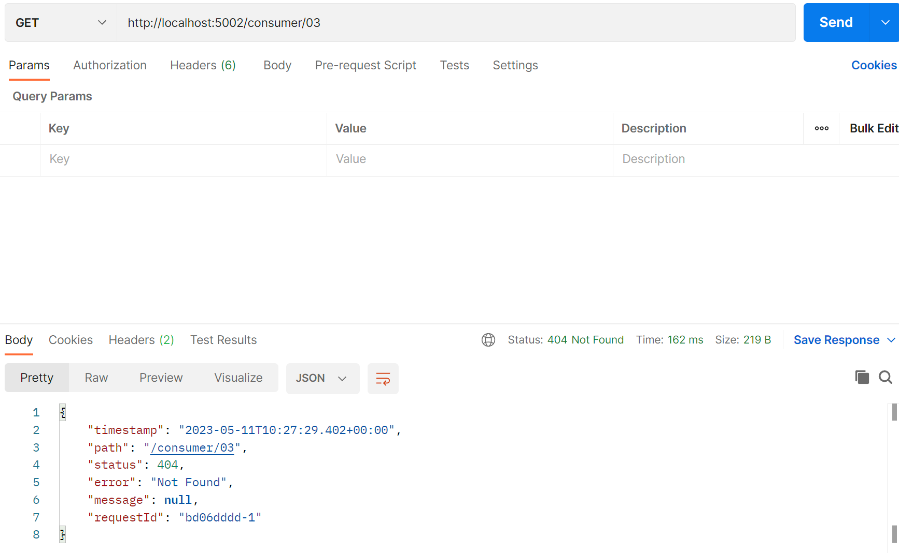

-----

添加cookie，key是abc，value是bcd

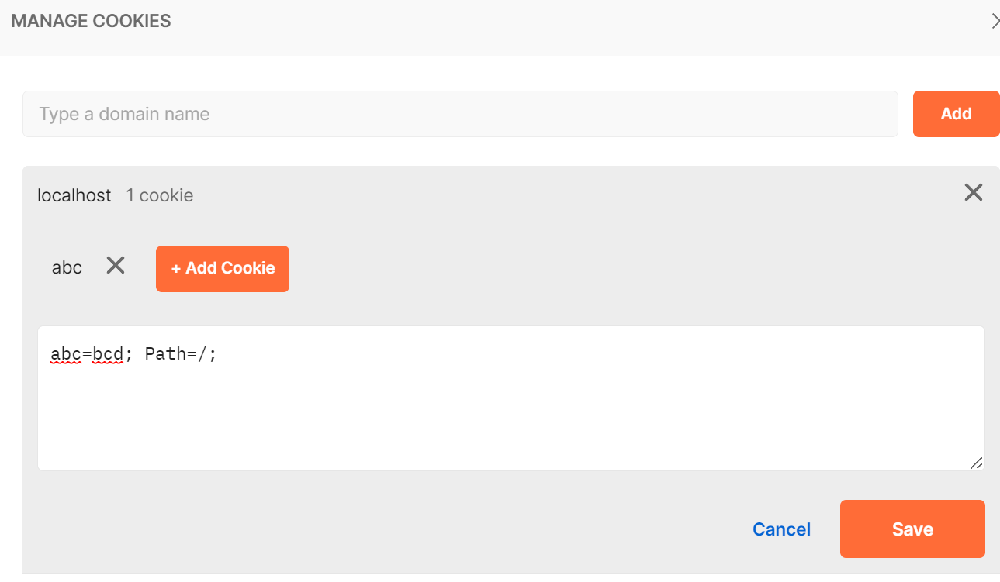

再次请求-->成功：

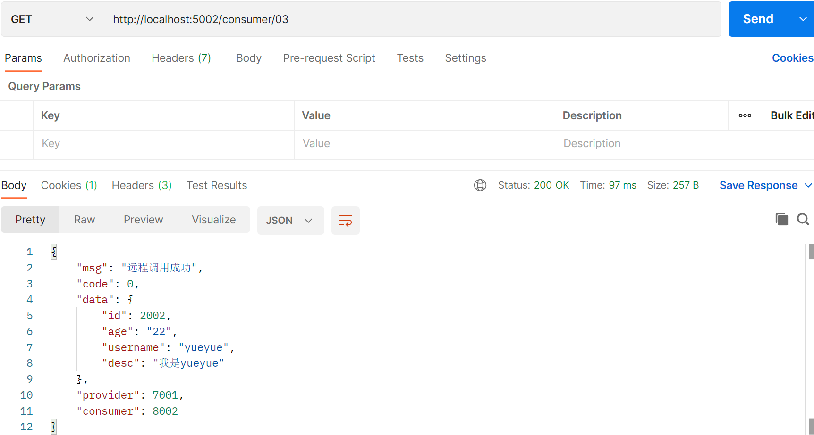

断言规则之Header（请求头）    测试：用postman

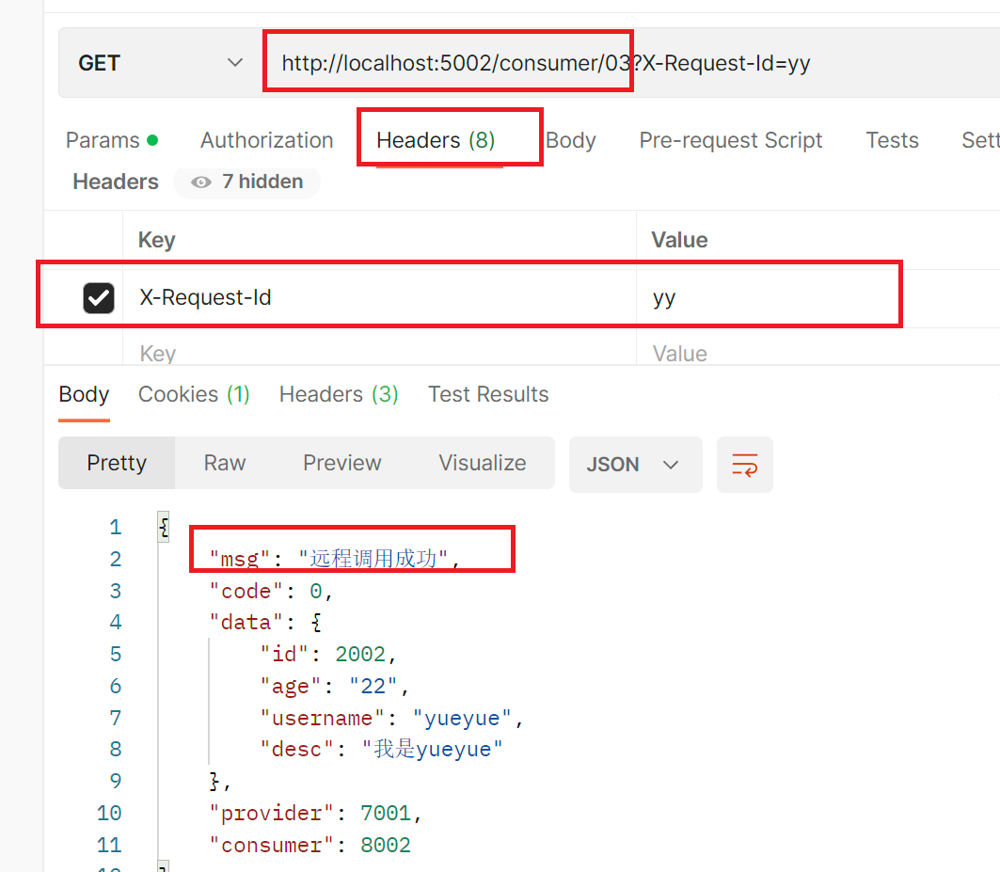

断言规则之Params（参数）   测试：用postman

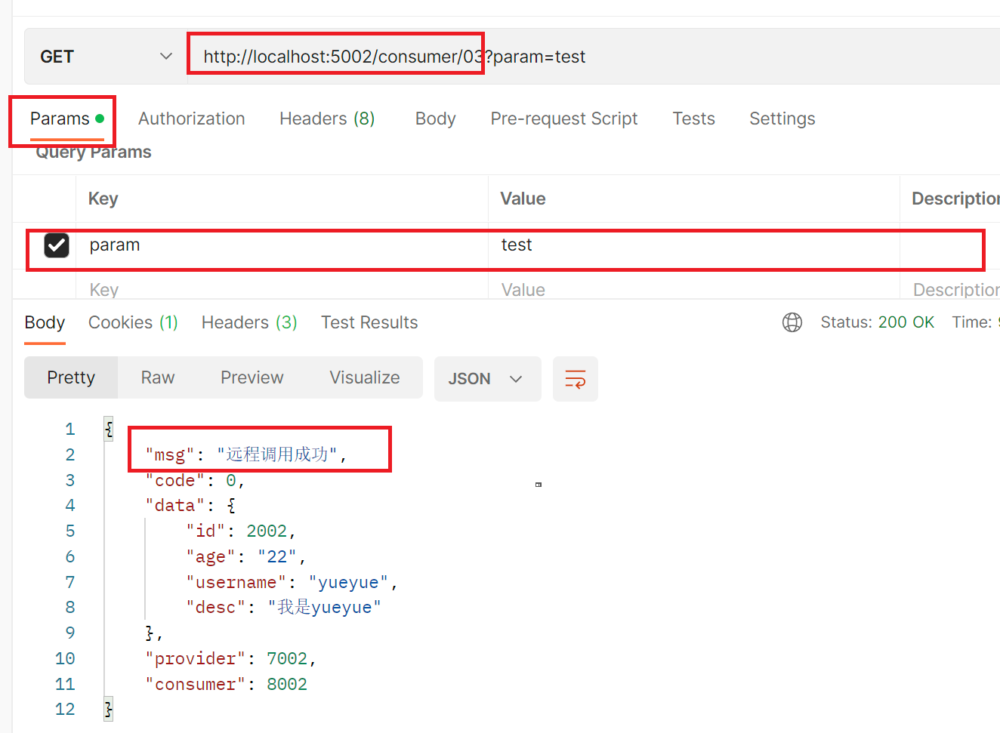

断言--请求转发的url地址--负载均衡访问

```shell
# 负载均衡访问规则：（lb即load balanced负载均衡）
# ① lb://ip+端口负载： uri=lb://localhost：8002
# ② lb://微服务名称(通过http://localhost:6001查出微服务名称)  ：
uri: lb://eureka-client-consumer
```

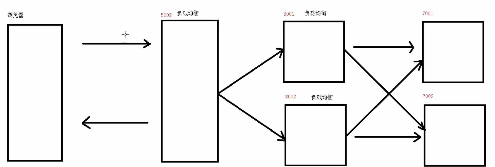

#### 过滤器操作

* pom.xml
  * 网关的过滤器，通过限流操作，需要结合Redis进行使用存储令牌数据

```xml
<dependency>
    <groupId>org.springframework.boot</groupId>
    <artifactId>spring-boot-starter-data-redis</artifactId>
</dependency>
```

* application.yml

```yml
server:
  port: 5002
eureka:
  client:
    service-url:
      defaultZone: http://localhost:6001/eureka, http://localhost:6002/eureka
  instance:
    lease-renewal-interval-in-seconds: 30
    lease-expiration-duration-in-seconds: 90
spring:
  redis:
    host: localhost
    port: 6379
    database: 0
  application:
    name: 003-gateway
  cloud:
    # Gateway网关配置信息
    gateway:
      # 网关路由配置，包含断言、过滤器、请求转发
      # List<RouteDefinition> routes
      #   RouteDefinition
      #       private String id;
      #       @NotEmpty
      #       @Valid
      #       private List<PredicateDefinition> predicates = new ArrayList();
      #           @NotNull
      #           private String name;
      #           private Map<String, String> args = new LinkedHashMap();
      #       @Valid
      #       private List<FilterDefinition> filters = new ArrayList();
      #           @NotNull
      #           private String name;
      #           private Map<String, String> args = new LinkedHashMap();
      #       @NotNull
      #       private URI uri;
      routes:
          # 路由的唯一标识
        - id: toBaidu
          # 断言规则
          predicates:
            # 校验路径拦截规则
            # 当相同路径声明时，先加载的会将后加载的覆盖，谁先加载就用谁
            - Path=/
          # 请求转发的url地址
          uri: https://www.baidu.com
          
        - id: toBaiduNews
          predicates:
            # 定义多个路径的拦截规则
            - Path=/, /guonei, /guoji
          uri: https://news.baidu.com/
          
        - id: toConsumers
          # 全部断言规则为真，才可以进行路由访问操作
          # 如果断言规则为假，会范围404页面
          predicates:
            # 拦截规则，可以通过通配符，进行加载
            # 转发的规则：http://localhost:5002/consumer/02  ->  http://localhost:8002/consumer/02
            - Path=/consumer/**, /api/**
            # 指定时间之后，允许访问的断言规则
            # - After=2021-12-23T14:44:47.789-07:00[Asia/Shanghai]
            # 指定时间之前，允许访问的断言规则
            # - Before=2021-12-23T14:51:47.789-07:00[Asia/Shanghai]
            # 指定时间之间，允许访问的断言规则
            # - Between=2021-12-23T14:51:47.789-07:00[Asia/Shanghai], 2021-12-23T15:00:47.789-07:00[Asia/Shanghai]
            # 指定Cookie的断言规则
            # - Cookie=abc, bcd
            # 指定请求头的断言规则
            # - Header=X-Request-Id, abc
            # 指定请求方式的断言规则
            # - Method=GET, POST
            # 指定请求参数的断言规则，只能以地址栏的键值对方式进行校验
            # - Query=aaa, bbb
          # 负载均衡访问规则
          # lb://ip+端口负载，均衡访问
          # lb://微服务名称
          # lb:load balanced负载均衡
          # uri: http://localhost:8002
          uri: lb://eureka-client-consumer
          
          # 过滤器工厂
          filters:
            # 添加请求头的过滤器
            - AddRequestHeader=X-Request-Header, blue
            # 添加请求参数的过滤器
            - AddRequestParameter=bbb, ccc
            # 添加响应头，在浏览器中进行查看
            - AddResponseHeader=ccc, ddd
            # 添加前缀访问路径
            # - PrefixPath=/api
            # 去除访问前缀的过滤器，1代表去除1级路径，2代表去除两级路径
            # http://localhost:5002/api/consumer/02 -> http://localhost:5002/consumer/02
            # - StripPrefix=1
            # 路径重写的过滤器
            # http://localhost:5002/api/abc/02 -> http://localhost:5002/consumer/02
            # - RewritePath=/api/abc/?(?<segment>.*), /consumer/$\{segment}
            # 设置响应码的过滤器
            # - SetStatus=401
            
            # 通过网关和Redis结合，根据令牌桶算法，对请求进行限流操作
            # 当请求过多，被限流时，返回的是429的响应码
            - name: RequestRateLimiter
              args:
                # 当令牌生成时，获取的请求会被存储到Redis中，当请求执行完成，Redis会清理掉之前存入的数据
                # 每秒钟令牌生成速率
                redis-rate-limiter.replenishRate: 1
                # 令牌桶的容量
                redis-rate-limiter.burstCapacity: 2
                # 每次请求获取的令牌数，默认就是1个
                redis-rate-limiter.requestedTokens: 1
                # @xxx，必须是Spring容器中包含的对象，也就是我们KeyResolver在容器中的名称，只能有一个
                key-resolver: "#{@userKeyResolver}"
```

 通过网关和Redis结合，根据令牌桶算法，对请求进行限流操作

原理：

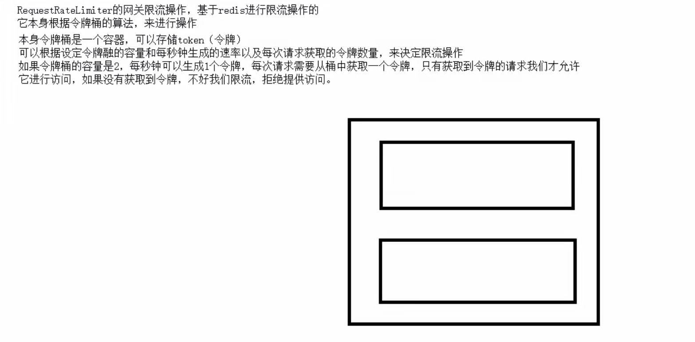

```shell
  # 通过网关和Redis结合，根据令牌桶算法，对请求进行限流操作
            # 当请求过多，被限流时，返回的是429的响应码
            - name: RequestRateLimiter
              args:
                # 当令牌生成时，获取的请求会被存储到Redis中，当请求执行完成，Redis会清理掉之前存入的数据
                # 每秒钟令牌生成速率
                redis-rate-limiter.replenishRate: 1
                # 令牌桶的容量
                redis-rate-limiter.burstCapacity: 2
                # 每次请求获取的令牌数，默认就是1个
                redis-rate-limiter.requestedTokens: 1
```

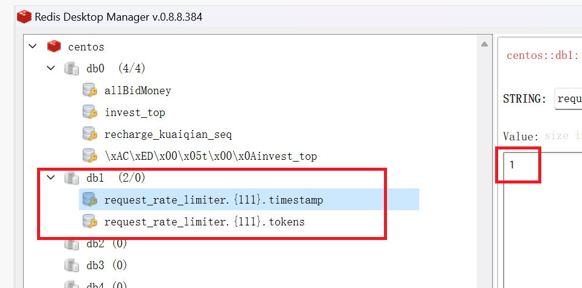

#### 自定义过滤器

##### token校验

```java
@Slf4j
@Configuration
public class CustomFilter implements GlobalFilter, Ordered {


    @Override
    public Mono<Void> filter(ServerWebExchange exchange, GatewayFilterChain chain) {
        log.info("过滤器执行了...");

        //最简单的权限拦截操作
        String token = exchange.getRequest().getQueryParams().getFirst("token");

        if(token == null){
            return errorInfo(exchange,1,"Token校验失败...");
        }

        //放行操作，访问后续的过滤器或访问请求转发到网关操作
        return chain.filter(exchange);
    }

    /**
     * 过滤器的优先级
     *      数字越小，优先级越高
     *          int HIGHEST_PRECEDENCE = -2147483648;
     *          int LOWEST_PRECEDENCE  = 2147483647;
     * @return
     */
    @Override
    public int getOrder() {
        return 0;
    }

    public Mono<Void> errorInfo(ServerWebExchange exchange, Integer code, String message) {

        //封装返回值结果集
        Map<String, Object> errorMap = new HashMap<>();
        errorMap.put("code", code);
        errorMap.put("message", message);
        errorMap.put("data", null);


        return Mono.defer(() -> {
            byte[] bytes = null;
            try {
                bytes = new ObjectMapper().writeValueAsBytes(errorMap);
            } catch (JsonProcessingException e) {
                e.printStackTrace();
            }

            ServerHttpResponse response = exchange.getResponse();
            response.getHeaders().add("Content-Type", MediaType.APPLICATION_PROBLEM_JSON_UTF8.toString());
            DataBuffer wrap = response.bufferFactory().wrap(bytes);
            return response.writeWith(Flux.just(wrap));
        });

    }


}
```


##### SpringSession的校验

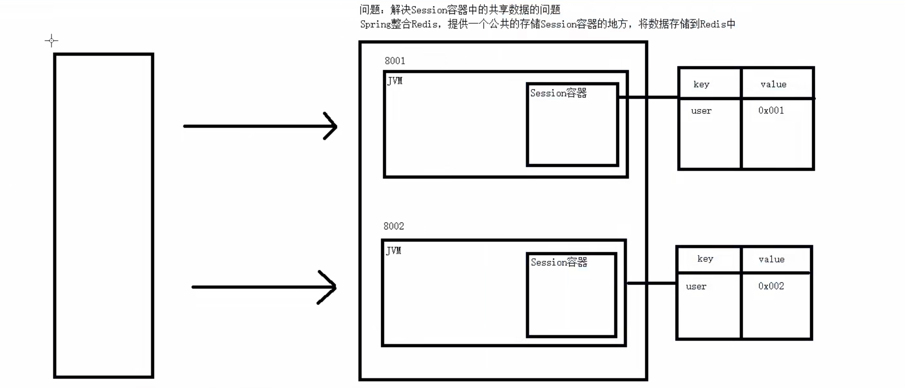

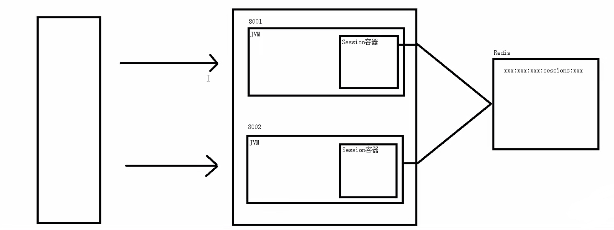

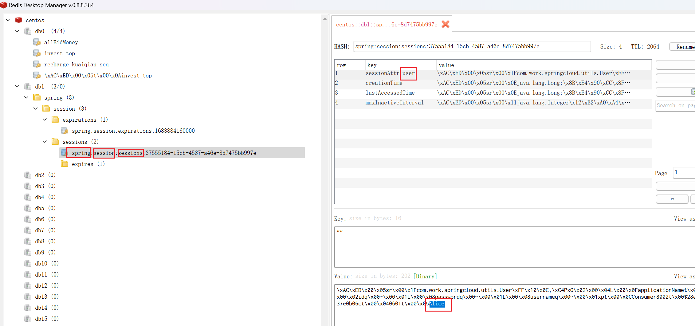

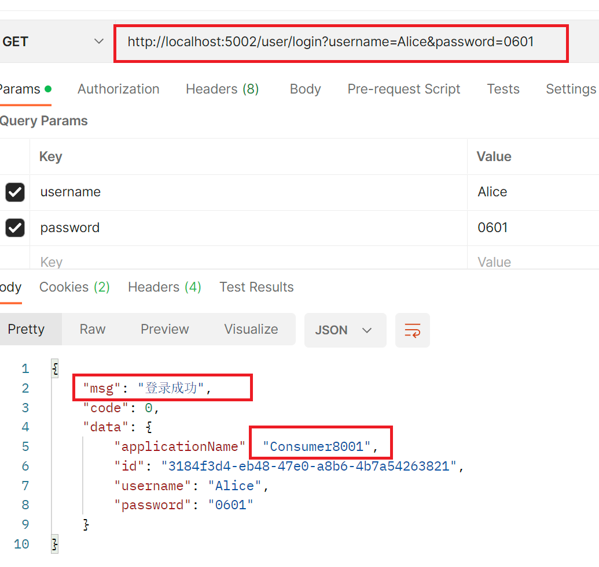

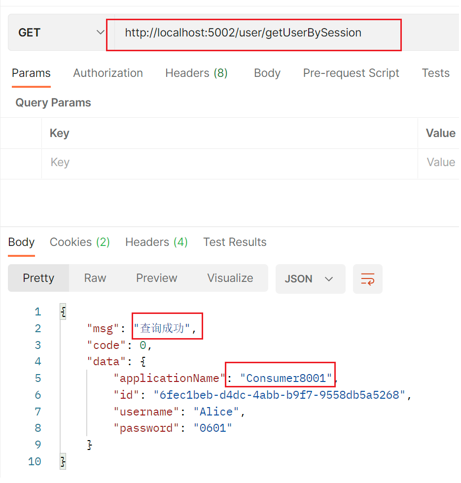

* 网关过滤器

```java
@Slf4j
@Component
public class UserCustomFilter implements GlobalFilter, Ordered {

    @Override
    public Mono<Void> filter(ServerWebExchange exchange, GatewayFilterChain chain) {


        String uri = exchange.getRequest().getURI().toString();
        log.info("uri : {}",uri);

        if(uri.contains("/user/login")){
            log.info("登录操作...");
            //放行
            return chain.filter(exchange);
        }else{
            //正常进行请求转发操作
            log.info("正常进行后续请求转发操作");
        }

        return chain.filter(exchange);
    }

    @Override
    public int getOrder() {
        return 0;
    }


    public Mono<Void> errorInfo(ServerWebExchange exchange, Integer code, String message) {

        //封装返回值结果集(map)
        Map<String, Object> errorMap = new HashMap<>();
        errorMap.put("code", code);
        errorMap.put("message", message);
        errorMap.put("data", null);

        //可读性较差，不需要深入理解
        return Mono.defer(() -> {
            //map转byte数组
            byte[] bytes = null;
            try {
                bytes = new ObjectMapper().writeValueAsBytes(errorMap);
            } catch (JsonProcessingException e) {
                e.printStackTrace();
            }
            //获取response对象
            ServerHttpResponse response = exchange.getResponse();
            //设置当前响应头
            response.getHeaders().add("Content-Type", MediaType.APPLICATION_PROBLEM_JSON_UTF8.toString());
            //byte数组转换为DataBuffer
            DataBuffer wrap = response.bufferFactory().wrap(bytes);
            //返回最终结果
            return response.writeWith(Flux.just(wrap));
        });
    }
}
```


* 控制器

```java
@RestController
@RequestMapping("/user")
public class UserController {

    @RequestMapping("/login")
    public Result login(String username, String password, HttpSession session){

        if(username.equals("Alice") && password.equals("0601")){
            //将用户存入到Session中
            User user = new User()
                    .setId(UUID.randomUUID().toString())
                    .setUsername(username)
                    .setPassword(password)
                    .setApplicationName("Consumer8002");
            session.setAttribute("user",user);
            //登录成功
            return Result.success(0,"登录成功",user);
        }
        //登陆失败
        return Result.error(1,"登录失败，用户名或密码错误...Consumer8002");

    }

    //    @RequestMapping("/getUserByRequest")
//    public Result getUser(HttpServletRequest request){
//        String token = request.getHeader("token");
//        //解析token数据
//        String data = JwtUtils.vaildToken(token);
//        String t = "{ \"token\" :"+token+", \"data\" : "+data +" }";
//        return Result.success(0,"查询成功",t);
//    }
    @RequestMapping("/getUserBySession")
    public Result getUser(HttpSession session){
        //通过SpringSession获取登录对象
        User user = ((User)session.getAttribute("user"));
        if(user == null){ return Result.error(1,"当前用户未登录...");}
        return Result.success(0,"查询成功",user);
    }

}
```

User类

```shell
@Data
@Accessors(chain = true)
public class User implements Serializable {
    private String applicationName;
    private String id;
    private String username;
    private String password;
}
```

上述两者在`consumer8001`中同等复制一份

副记：

权限校验方法：

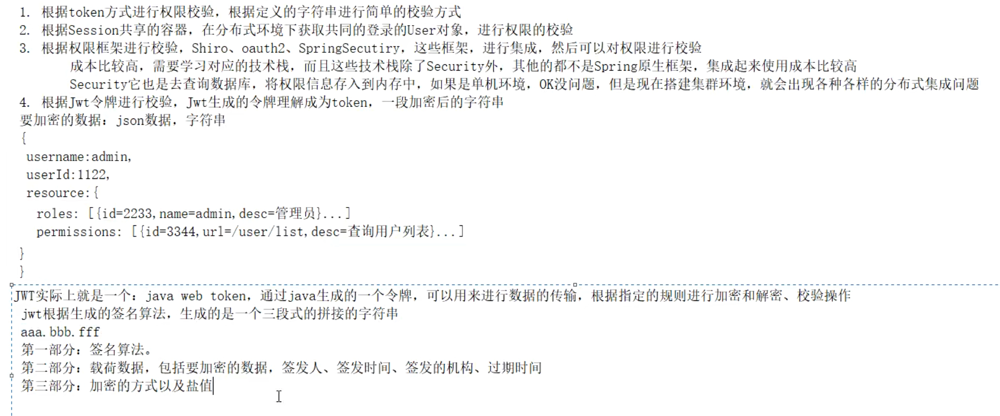

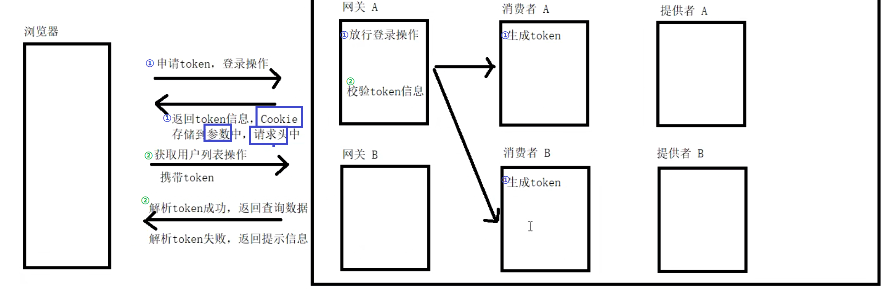


##### Jwt过滤器

* common-api模块
* pom.xml

```xml
<!--Jwt-->
<dependency>
    <groupId>com.nimbusds</groupId>
    <artifactId>nimbus-jose-jwt</artifactId>
    <version>6.0</version>
</dependency>
```

* 工具类

```java
@Component
public class JwtUtils {

    /**创建秘钥*/
    private static final byte[] SECRET = "6MNSobBRCHGIO0fS6MNSobBRCHGIO0fS".getBytes();

    /** 过期时间1个小时*/
    private static final long EXPIRE_TIME = 1000 * 60 * 60;


    /**生成Token*/
    public static String buildJWT(String account) {
        try {
            /**1.创建一个32-byte的密匙*/
            MACSigner macSigner = new MACSigner(SECRET);
            /**2. 建立payload 载体*/
            JWTClaimsSet claimsSet = new JWTClaimsSet.Builder()
                    .subject("bjpowernode")
                    .issuer("http://www.bjpowernode.com")
                    .expirationTime(new Date(System.currentTimeMillis() + EXPIRE_TIME))
                    .claim("ACCOUNT",account)
                    .build();

            /**3. 建立签名*/
            SignedJWT signedJWT = new SignedJWT(new JWSHeader(JWSAlgorithm.HS256), claimsSet);
            signedJWT.sign(macSigner);

            /**4. 生成token*/
            String token = signedJWT.serialize();
            return token;
        } catch (KeyLengthException e) {
            e.printStackTrace();
        } catch (JOSEException e) {
            e.printStackTrace();
        }
        return null;
    }


    /**校验token*/
    public static String vaildToken(String token ) {
        try {
            SignedJWT jwt = SignedJWT.parse(token);
            JWSVerifier verifier = new MACVerifier(SECRET);
            //校验是否有效
            if (!jwt.verify(verifier)) {
                throw new Exception("Token 无效");
            }

            //校验超时
            Date expirationTime = jwt.getJWTClaimsSet().getExpirationTime();
            if (new Date().after(expirationTime)) {
                throw new Exception( "Token 已过期");
            }

            //获取载体中的数据
            Object account = jwt.getJWTClaimsSet().getClaim("ACCOUNT");
            //是否有openUid
            if (Objects.isNull(account)){
                throw new Exception( "账号为空");
            }
            return account.toString();
        } catch (ParseException e) {
            e.printStackTrace();
        } catch (JOSEException e) {
            e.printStackTrace();
        } catch (Exception e) {
            e.printStackTrace();
        }
        return null;
    }


    public static void main(String[] args) throws IOException {

        User user = new User()
                .setId(UUID.randomUUID().toString())
                .setUsername("yueyue")
                .setPassword("1127")
                .setApplicationName("token");

        //user : User{username='yueyue', password='1127'}
        System.out.println("user : "+user);

        String data = new ObjectMapper().writeValueAsString(user);
        //json : {"username":"yueyue","password":"1127"}
        System.out.println("json : "+data);

       /*
       * token :
       * eyJhbGciOiJIUzI1NiJ9
       * .
       * eyJzdWIiOiJianBvd2Vybm9kZSIsIkFDQ09VTlQiOiJ7XCJpZFwiOlwiYmRiM2Q4YmMtNThjYy00YmI3LTllY2QtMjM4Y2I4NDYzOTk3XCIsXCJ1c2VybmFtZVwiOlwieXVleXVlXCIsXCJwYXNzd29yZFwiOlwiMTEyN1wiLFwiYXBwbGljYXRpb25OYW1lXCI6XCJ0b2tlblwifSIsImlzcyI6Imh0dHA6XC9cL3d3dy5ianBvd2Vybm9kZS5jb20iLCJleHAiOjE2ODM4OTE1MjV9
       * .
       * k7DuSzXp2n__hny9fv_5Wu2ECsEFKERmnptF5YE9pns
       *
       * */
        String token = buildJWT(data);
        System.out.println("token : "+token);

        //rawData : {"username":"yueyue","password":"1127"}
        String rawData = vaildToken(token);
        System.out.println("rawData : "+rawData);

    }
```

* 过滤器

```java
@Slf4j
@Configuration
public class JwtCustomFilter implements GlobalFilter, Ordered {

    @Autowired
    private JwtUtils jwtUtils;

    @Override
    public Mono<Void> filter(ServerWebExchange exchange, GatewayFilterChain chain) {

        //可以通过参数或请求头进行传递token(jwt)数据
        String tokenParam = exchange.getRequest().getQueryParams().getFirst("token");

        String uri = exchange.getRequest().getURI().toString();

        //登录操作，申请jwt令牌操作
        if(uri.contains("/user/login")){
            return chain.filter(exchange);
        }

        if(tokenParam == null || tokenParam.length() == 0){
            //没有通过参数进行传递，获取请求头中的token数据
            tokenParam = exchange.getRequest().getHeaders().getFirst("token");
            //没有传递token
            if(tokenParam == null || tokenParam.length() == 0){
                return errorInfo(exchange,1,"token解析失败...");
            }else{
                log.info("Jwt的密文数据：{}",tokenParam);
                //解析token数据
                String data = JwtUtils.vaildToken(tokenParam);
                log.info("Jwt的明文数据：{}",data);

            }
        }
        return chain.filter(exchange);
    }

    @Override
    public int getOrder() {
        return 0;
    }

    public Mono<Void> errorInfo(ServerWebExchange exchange, Integer code, String message) {

        //封装返回值结果集
        Map<String, Object> errorMap = new HashMap<>();
        errorMap.put("code", code);
        errorMap.put("message", message);
        errorMap.put("data", null);


        return Mono.defer(() -> {
            byte[] bytes = null;
            try {
                bytes = new ObjectMapper().writeValueAsBytes(errorMap);
            } catch (JsonProcessingException e) {
                e.printStackTrace();
            }

            ServerHttpResponse response = exchange.getResponse();
            response.getHeaders().add("Content-Type", MediaType.APPLICATION_PROBLEM_JSON_UTF8.toString());
            DataBuffer wrap = response.bufferFactory().wrap(bytes);
            return response.writeWith(Flux.just(wrap));
        });

    }
}
```

* 控制器

```java
@RestController
@RequestMapping("/user")
public class UserController {

    @RequestMapping("/login")
    public Result login(String username, String password, HttpSession session){

        if(username.equals("Alice") && password.equals("0601")){
            //将用户存入到Session中
            User user = new User()
                    .setId(UUID.randomUUID().toString())
                    .setUsername(username)
                    .setPassword(password)
                    .setApplicationName("Consumer8001");
            session.setAttribute("user",user);
            //登录成功
            return Result.success(0,"登录成功",user);
        }
        //登陆失败
        return Result.error(1,"登录失败，用户名或密码错误...Consumer8002");

    }

    @RequestMapping("/getUserByJwtToken")
    public Result getUser(HttpServletRequest request){
        String token = request.getHeader("token");

        //if(token == null){ return Result.error(1,"当前用户未登录-------token...");}
        //解析token数据
        String data = JwtUtils.vaildToken(token);
        String t = "{ \"token\" :"+token+", \"data\" : "+data +" }";
        return Result.success(0,"查询成功",t);
    }


    @RequestMapping("/getUserBySession")
    public Result getUser(HttpSession session){
        //通过SpringSession获取登录对象
        User user = ((User)session.getAttribute("user"));
        if(user == null){ return Result.error(1,"当前用户未登录-------springSession...");}
        return Result.success(0,"查询成功",user);
    }

}
```

结果：

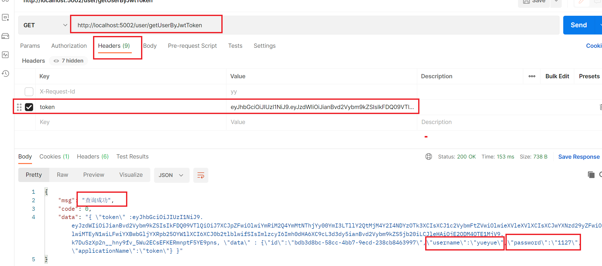

* 


#### 负载均衡

* pom.xml

```xml
<!--    网关起步依赖    -->
<dependency>
    <groupId>org.springframework.cloud</groupId>
    <artifactId>spring-cloud-starter-gateway</artifactId>
</dependency>
<!--    负载均衡起步依赖    -->
<dependency>
    <groupId>org.springframework.cloud</groupId>
    <artifactId>spring-cloud-starter-loadbalancer</artifactId>
</dependency>
```

* application.yml

```yml
server:
  port: 5002
eureka:
  client:
    service-url:
      defaultZone: http://localhost:6001/eureka, http://localhost:6002/eureka
  instance:
    lease-renewal-interval-in-seconds: 30
    lease-expiration-duration-in-seconds: 90
spring:
  application:
    name: 003-gateway
  cloud:
    # Gateway网关配置信息
    gateway:
      routes:
        - id: toConsumers
          # 全部断言规则为真，才可以进行路由访问操作
          # 如果断言规则为假，会范围404页面
          predicates:
            - Path=/consumer/**
          # 负载均衡访问规则
          # lb://ip+端口负载，均衡访问
          # lb://微服务名称
          # lb:load balanced负载均衡
          # uri: http://localhost:8002
          uri: lb://eureka-client-consumer
```


## Config `配置中心`

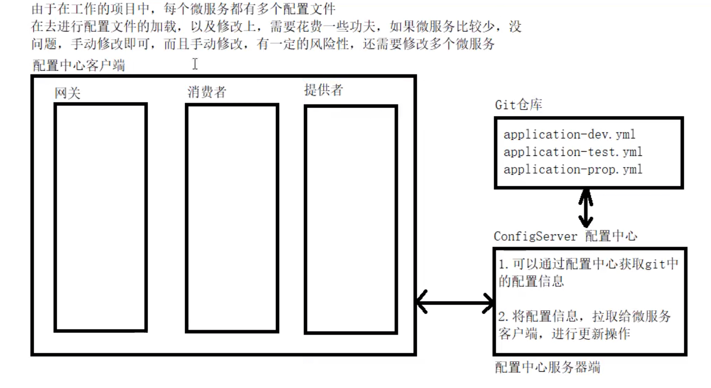

### 配置中心 `服务器端`

* pom.xml

```xml
<!--    配置中心服务器端的起步依赖    -->
<dependency>
    <groupId>org.springframework.cloud</groupId>
    <artifactId>spring-cloud-config-server</artifactId>
</dependency>
```

* application.yml

```yml
server:
  port: 10001
spring:
  application:
    name: 003-config-server
  cloud:
    # 配置中心的信息
    config:
      server:
        git:
          # git仓库的远程地址
          uri: https://gitee.com/lmx1989/sz2109.git
          # git仓库的用户名称
          # username:
          # git仓库的密码
          # password:
          # 默认加载远程仓库的分支
          # 通过http的方式，在浏览器或web端访问获取配置文件的信息
          # http://localhost:10001/{application}/{profile}[/{label}]
          # http://localhost:10001/{application}-{profile}.yml                -> 加载的是默认分支下的yml配置文件
          # http://localhost:10001/{label}/{application}-{profile}.yml        -> 加载的是指定分支下的配置文件
          # http://localhost:10001/{application}-{profile}.properties         -> 加载的是默认分支下的properties配置文件
          # http://localhost:10001/{label}/{application}-{profile}.properties -> 加载的是指定分支下的配置文件
          # 比如：在sz2109仓库config分支下application-dev.yml/application-dev.yml
          # label 代表，分支名称，如果没有指定，则使用default-label
          # application 代表，配置文件的前缀
          # profile 代表，配置文件的环境
          # 配置文件的后缀名，默认加载的就是yml和properties
          default-label: config
    compatibility-verifier:
      # 设置启动加载的SpringBoot默认的环境
      compatible-boot-versions: 2.5.7
      # 设置启动后不检查默认环境的加载
      enabled: false
```

* 引导类

```java
//开启配置中心服务器端
@EnableConfigServer
@SpringBootApplication
public class ConfigServer10001Application {

    public static void main(String[] args) {
        SpringApplication.run(ConfigServer10001Application.class, args);
    }

}
```

* 启动，测试是否能够加载到远程仓库的配置文件

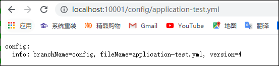


### 配置中心 `客户端`

* pom.xml

```xml
<!--配置中心客户端起步依赖-->
<dependency>
    <groupId>org.springframework.cloud</groupId>
    <artifactId>spring-cloud-starter-config</artifactId>
</dependency>
<!--健康检查的起步依赖-->
<dependency>
     <groupId>org.springframework.boot</groupId>
     <artifactId>spring-boot-starter-actuator</artifactId>
</dependency>
<!--使用系统级别的配置文件加载的起步依赖-->
<dependency>
    <groupId>org.springframework.cloud</groupId>
    <artifactId>spring-cloud-starter-bootstrap</artifactId>
</dependency>
```

* application.yml `用户级别的配置文件`

```yml
# application.yml是用户级别的配置文件
server:
  port: 5002
eureka:
  client:
    service-url:
      defaultZone: http://localhost:6001/eureka, http://localhost:6002/eureka
  instance:
    lease-renewal-interval-in-seconds: 30
    lease-expiration-duration-in-seconds: 90

spring:
  config:
    import: optional:configserver:http://localhost:10001
    
  main:
    web-application-type: reactive
    
  redis:
    host: localhost
    port: 6379
    database: 0
  application:
    name: 003-gateway
  cloud:
    # Gateway网关配置信息
    gateway:
      # 网关路由配置，包含断言、过滤器、请求转发
      # List<RouteDefinition> routes
      #   RouteDefinition
      #       private String id;
      #       @NotEmpty
      #       @Valid
      #       private List<PredicateDefinition> predicates = new ArrayList();
      #           @NotNull
      #           private String name;
      #           private Map<String, String> args = new LinkedHashMap();
      #       @Valid
      #       private List<FilterDefinition> filters = new ArrayList();
      #           @NotNull
      #           private String name;
      #           private Map<String, String> args = new LinkedHashMap();
      #       @NotNull
      #       private URI uri;
      routes:
          # 路由的唯一标识
        - id: toBaidu
          # 断言规则
          predicates:
            # 校验路径拦截规则
            # 当相同路径声明时，先加载的会将后加载的覆盖，谁先加载就用谁
            - Path=/
          # 请求转发的url地址
          uri: https://www.baidu.com
        - id: toBaiduNews
          predicates:
            # 定义多个路径的拦截规则
            - Path=/, /guonei, /guoji
          uri: https://news.baidu.com/
        - id: toConsumers
          # 全部断言规则为真，才可以进行路由访问操作
          # 如果断言规则为假，会范围404页面
          predicates:
            # 拦截规则，可以通过通配符，进行加载
            # 转发的规则：http://localhost:5002/consumer/02  ->  http://localhost:8002/consumer/02
            - Path=/consumer/**, /api/**, /user/**
            # 指定时间之后，允许访问的断言规则
            - After=2021-12-23T14:44:47.789-07:00[Asia/Shanghai]
            # 指定时间之前，允许访问的断言规则
            # - Before=2021-12-23T14:51:47.789-07:00[Asia/Shanghai]
            # 指定时间之间，允许访问的断言规则
            # - Between=2021-12-23T14:51:47.789-07:00[Asia/Shanghai], 2021-12-23T15:00:47.789-07:00[Asia/Shanghai]
            # 指定Cookie的断言规则
            - Cookie=abc, bcd
            # 指定请求头的断言规则
            - Header=X-Request-Id, abc
            # 指定请求方式的断言规则
            - Method=GET, POST
            # 指定请求参数的断言规则，只能以地址栏的键值对方式进行校验
            - Query=aaa, bbb
          # 负载均衡访问规则
          # lb://ip+端口负载，均衡访问
          # lb://微服务名称
          # lb:load balanced负载均衡
          # uri: http://localhost:8002
          uri: lb://eureka-client-consumer
          # 过滤器工厂
          filters:
            # 添加请求头的过滤器
            - AddRequestHeader=X-Request-Header, blue
            # 添加请求参数的过滤器
            - AddRequestParameter=bbb, ccc
            # 添加响应头，在浏览器中进行查看
            - AddResponseHeader=ccc, ddd
            # 添加前缀访问路径
            # - PrefixPath=/api
            # 去除访问前缀的过滤器，1代表去除1级路径，2代表去除两级路径
            # http://localhost:5002/api/consumer/02 -> http://localhost:5002/consumer/02
            # - StripPrefix=1
            # 路径重写的过滤器
            # http://localhost:5002/api/abc/02 -> http://localhost:5002/consumer/02
            # - RewritePath=/api/abc/?(?<segment>.*), /consumer/$\{segment}
            # 设置响应码的过滤器
            - SetStatus=401
            # 通过网关和Redis结合，根据令牌桶算法，对请求进行限流操作
            # 当请求过多，被限流时，返回的是429的响应码
            - name: RequestRateLimiter
              args:
                # 当令牌生成时，获取的请求会被存储到Redis中，当请求执行完成，Redis会清理掉之前存入的数据
                # 每秒钟令牌生成速率
                redis-rate-limiter.replenishRate: 1
                # 令牌桶的容量
                redis-rate-limiter.burstCapacity: 2
                # 每次请求获取的令牌数，默认就是1个
                redis-rate-limiter.requestedTokens: 1
                # @xxx，必须是Spring容器中包含的对象，也就是我们KeyResolver在容器中的名称，只能有一个
                key-resolver: "#{@userKeyResolver}"
```


* bootstrap.yml `系统级别的配置文件`

```yml
# 系统级别的配置文件，优先级要高于application.yml
# 通常系统级别的配置文件，加载一些需要优先加载的配置信息，比如：配置中心的内容
# 在配置中心中包含的属性会被优先使用，如果本地也有一份，那么则以配置中心的为主
spring:
  cloud:
    # 配置中心客户端信息
    config:
      # 配置中心的地址
      uri: http://localhost:10001/
      # git的用户名
      # username:
      # git的密码
      # password:
      # 远程仓库的分支名称
      label: config
      # label: config_copy
      # 配置文件的前缀名称
      name: application
      # 配置文件的环境名称
      # profile: dev
      profile: test
      # profile: prop
```

* 控制器

```java
@RestController
public class ConfigInfoController {

    /*
     *  当网关启动时，会加载远程仓库中的配置信息
     *      配置文件中加载了application-dev.yml的config.info属性
     *      注入到本地中，返回到浏览器中加载
     */
    @Value("${config.info}")
    private String configInfo;

    @GetMapping("/getConfigInfo")
    @ResponseBody
    public R getConfigInfo(){
        return R.ok(0,"获取成功...",configInfo);
    }

}
```

* 启动时，加载配置中心的配置文件

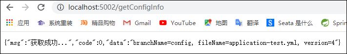


### 自动更新配置信息

* 控制器上添加新的注解 `@RefreshScope`

```java
@RestController
@RefreshScope//自动更新配置内容的注解
public class ConfigInfoController {

    /*
     *  当网关启动时，会加载远程仓库中的配置信息
     *      配置文件中加载了application-dev.yml的config.info属性
     *      注入到本地中，返回到浏览器中加载
     */
    @Value("${config.info}")
    private String configInfo;

    @GetMapping("/getConfigInfo")
    public R getConfigInfo(){
        return R.ok(0,"获取成功...",configInfo);
    }

}
```

* `application.yml` 或 `bootstrap.yml` 开放端点
  * 或者至少开放一个 `refresh` 的端点

```yml
management:
  endpoints:
    web:
      exposure:
        include: '*'
```

* 发送`Post`请求(使用postman)
  * http://localhost:5002/actuator/refresh
    
    * 一对一的配置更新
    
      之后再访问http://localhost:5002/getConfigInfo时发现已经自动更新

### 配置文件的抽取

* bootstrap.yml `本地`

```yml
# 系统级别的配置文件，优先级要高于application.yml
# 通常系统级别的配置文件，加载一些需要优先加载的配置信息，比如：配置中心的内容
# 在配置中心中包含的属性会被优先使用，如果本地也有一份，那么则以配置中心的为主
spring:
  cloud:
    # 配置中心客户端信息
    config:
      # 配置中心的地址
      uri: http://localhost:10001/
      # git的用户名
      # username:
      # git的密码
      # password:
      # 远程仓库的分支名称
      label: config
      # label: config_copy
      # 配置文件的前缀名称
      name: application
      # 配置文件的环境名称
      # profile: dev
      profile: test
      # profile: prop
```


* application.yml `本地`

```yml
spring:
  config:
    import: optional:configserver:http://localhost:10001
management:
  endpoints:
    web:
      exposure:
        include: '*'
```


* application.yml `git远程`
  * 远程的配置文件的层级关系和本地的配置文件的层级关系是不同的
    * 远程每个层级关系是4个空格
    * 本地每个层级关系是2个空格

```yml
config:
    info: branchName=config, fileName=application-test.yml, version=4
server:
    port: 5002
eureka:
    client:
        service-url:
            defaultZone: http://localhost:6001/eureka, http://localhost:6002/eureka
    instance:
        lease-renewal-interval-in-seconds: 30
        lease-expiration-duration-in-seconds: 90
spring:
    main:
        web-application-type: reactive
    redis:
        host: localhost
        port: 6379
        database: 0
    application:
        name: 003-gateway
    cloud:
        gateway:
            routes:
                - id: toBaidu
                  predicates:
                    - Path=/
                  uri: https://www.baidu.com
                - id: toBaiduNews
                  predicates:
                    - Path=/, /guonei, /guoji
                  uri: https://news.baidu.com/
                - id: toConsumers
                  predicates:
                    - Path=/consumer/**, /api/**, /user/**
                    - After=2021-12-23T14:44:47.789-07:00[Asia/Shanghai]
                    - Cookie=abc, bcd
                    - Header=X-Request-Id, abc
                    - Method=GET, POST
                    - Query=aaa, bbb
                  uri: lb://eureka-client-consumer
                  filters:
                    - AddRequestHeader=X-Request-Header, blue
                    - AddRequestParameter=bbb, ccc
                    - AddResponseHeader=ccc, ddd
                    - SetStatus=401
                    - name: RequestRateLimiter
                      args:
                        redis-rate-limiter.replenishRate: 1
                        redis-rate-limiter.burstCapacity: 2
                        redis-rate-limiter.requestedTokens: 1
                        key-resolver: "#{@userKeyResolver}"
```

* 测试时，注意，我们如果开放了网关的限流操作，请开启Redis和在浏览器发送请求时，传递user参数

## Bus `消息总线`

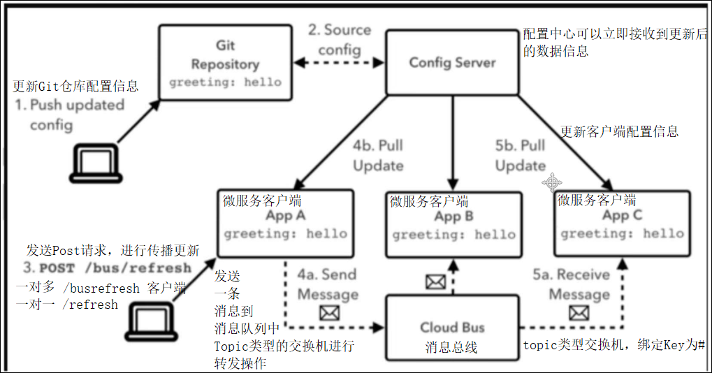

### 入门案例

#### 配置中心

* pom.xml

```xml
<!--消息总线整合rabbitmq的起步依赖-->
<dependency>
    <groupId>org.springframework.cloud</groupId>
    <artifactId>spring-cloud-starter-bus-amqp</artifactId>
    <version>3.0.1</version>
</dependency>

<!--    配置中心服务器端的起步依赖    -->
<dependency>
    <groupId>org.springframework.cloud</groupId>
    <artifactId>spring-cloud-config-server</artifactId>
    <version>3.0.5</version>
</dependency>
```

* application.yml

```yml
spring:
  rabbitmq:
    host: 192.168.116.137
    port: 5672
    username: root
    password: root
    virtual-host: /
management:
  endpoints:
    web:
      exposure:
        # 至少要开放一个 busrefresh
        include: '*'
```

#### 客户端

* pom.xml

```xml
<dependency>
    <groupId>org.springframework.cloud</groupId>
    <artifactId>spring-cloud-starter-config</artifactId>
</dependency>

<!--消息总线整合rabbitmq的起步依赖-->
<dependency>
    <groupId>org.springframework.cloud</groupId>
    <artifactId>spring-cloud-starter-bus-amqp</artifactId>
    <version>3.0.1</version>
</dependency>
```

* application.yml

```yml
spring:
  rabbitmq:
    host: 192.168.116.137
    port: 5672
    username: root
    password: root
    virtual-host: /
management:
  endpoints:
    web:
      exposure:
        include: '*'
```

5002批量复制两个共三个，用以测试集群更新

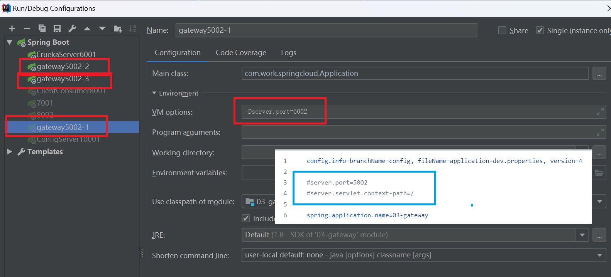

* 测试
  * 发送Post请求给客户端
    * http://localhost:5002/actuator/busrefresh
    * 一对多的更新
    * 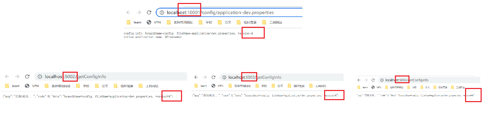

# SpringCloud Alibaba

## Nacos `注册中心` `配置中心`

`nacos约等于eureka+config`

### 注册中心

#### 服务器端

* 启动Nacos
  * startup.cmd -m standalone       `windows`
  * ./startup.sh -m standalone `linux`
  * sh startup.sh -m standalone `linux`
* 访问Nacos后台地址
  * http://localhost:8848/nacos
  * 用户名和密码都是 `nacos`

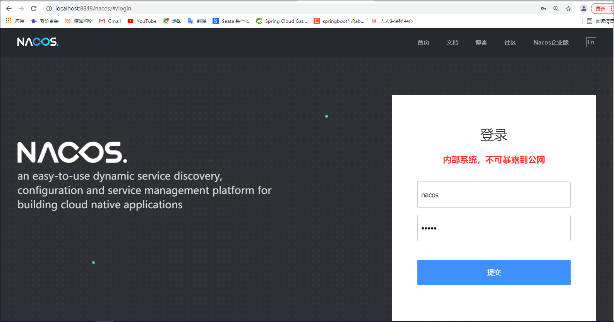

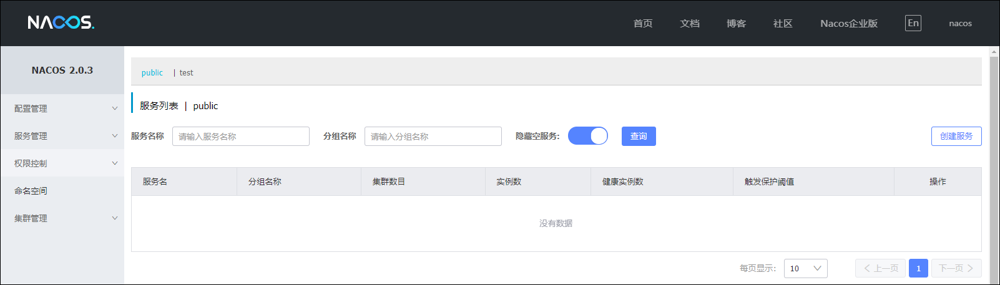

#### 客户端

* 创建客户端微服务工程
  * 消费者工程 `集群`
  * 提供者工程 `集群`
  * 网关工程 `集群`
* pom.xml

```xml
<!--
    SpringCloud Alibaba环境指定：
        SpringBoot环境：2.3.12.RELEASE
        SpringCloud环境：Hoxton.SR12
        SpringCloud Alibaba环境：2.2.7.RELEASE

-->
<parent>
    <groupId>org.springframework.boot</groupId>
    <artifactId>spring-boot-starter-parent</artifactId>
    <version>2.3.12.RELEASE</version>
    <relativePath/> <!-- lookup parent from repository -->
</parent>
<modules>
    <module>../006-nacos-consumer</module>
    <module>../006-nacos-provider</module>
    <module>../006-nacos-gateway</module>
</modules>

<properties>
    <java.version>1.8</java.version>
    <spring-cloud.version>Hoxton.SR12</spring-cloud.version>
    <spring-cloud-alibaba.version>2.2.7.RELEASE</spring-cloud-alibaba.version>
</properties>

<dependency>
    <groupId>com.alibaba.cloud</groupId>
    <artifactId>spring-cloud-starter-alibaba-nacos-discovery</artifactId>
</dependency>

<dependency>
    <groupId>org.projectlombok</groupId>
    <artifactId>lombok</artifactId>
    <version>1.18.22</version>
</dependency>
<dependency>
    <groupId>com.alibaba.cloud</groupId>
    <artifactId>spring-cloud-starter-alibaba-nacos-config</artifactId>
</dependency>

    <dependencyManagement>
        <dependencies>
            <dependency>
                <groupId>org.springframework.cloud</groupId>
                <artifactId>spring-cloud-dependencies</artifactId>
                <version>${spring-cloud.version}</version>
                <type>pom</type>
                <scope>import</scope>
            </dependency>

            <dependency>
                <groupId>com.alibaba.cloud</groupId>
                <artifactId>spring-cloud-alibaba-dependencies</artifactId>
                <version>${spring-cloud-alibaba.version}</version>
                <type>pom</type>
                <scope>import</scope>
            </dependency>
        </dependencies>
    </dependencyManagement>
```

* application.yml

```yml
server:
  port: 7005
spring:
  application:
    name: 006-nacos-provider
  cloud:
    nacos:
      discovery:
        server-addr: localhost:8848/
```

* 引导类

```java
//@EnableEurekaClient = 只能注册服务到Eureka的配置中心中
//@EnableDiscoveryClient = 可以注册服务到 Eureka 、 Zookeeper 、 Nacos 、 Consul等配置中心
@EnableDiscoveryClient
@SpringBootApplication
public class Nacos7005Application {

    public static void main(String[] args) {
        SpringApplication.run(Nacos7005Application.class, args);
    }

}
```


### 配置中心

#### 服务器端

* 同上

#### 客户端

* 以网关微服务为例
* pom.xml

```xml
<dependency>
    <groupId>org.springframework.cloud</groupId>
    <artifactId>spring-cloud-starter-gateway</artifactId>
</dependency>
<dependency>
    <groupId>org.springframework.cloud</groupId>
    <artifactId>spring-cloud-starter-loadbalancer</artifactId>
</dependency>
<dependency>
    <groupId>com.alibaba.cloud</groupId>
    <artifactId>spring-cloud-starter-alibaba-nacos-config</artifactId>
</dependency>
```

* application.yml

```yml
server:
  port: 5005
spring:
  application:
    name: 006-nacos-gateway
  cloud:
    nacos:
      discovery:
        # 加载Nacos注册中心地址
        server-addr: localhost:8848
    gateway:
      routes:
        - id: toConsumer
          predicates:
            - Path=/consumer/**
          uri: lb://006-nacos-consumer
        - id: toBaidu
          predicates:
            - Path=/
          uri: https://www.baidu.com
        - id: toBaiduNews
          predicates:
            - Path=/, /guonei, /guoji
          uri: https://news.baidu.com/
```

* bootstrap.yml

```yml
spring:
  cloud:
    nacos:
      config:
        # 加载Nacos配置中心地址
        server-addr: localhost:8848
        # 加载配置信息的命名空间
        # namespace: 8600ea68-008b-4d9e-8d50-d78b4b4803a0
        # 加载配置文件信息
        # application-dev.yaml = 前缀名称-环境.后缀名 = ${前缀名称}-${环境}.${后缀名}
        # ${spring.application.name}-${spring.profiles.active}.${spring.cloud.nacos.config.file-extension}
        # ${spring.cloud.nacos.config.prefix}-${spring.profiles.active}.${spring.cloud.nacos.config.file-extension}
        prefix: application
        # 配置文件的后缀名称
        file-extension: yaml
        # 配置文件的群组名称
        group: DEFAULT_GROUP
        # 加载多个配置文件，类似Maven的拆分和聚合操作
  profiles:
    active: dev
```

#### 配置文件的拆分和聚合

* application.yml

```yml
# 所有配置文件全部抽取到了Nacos配置中心中
#server:
#  port: 5005
#spring:
#  application:
#    name: 006-nacos-gateway
#  cloud:
#    nacos:
#      discovery:
#        # 加载Nacos注册中心地址
#        server-addr: localhost:8848
#    gateway:
#      routes:
#        - id: toConsumer
#          predicates:
#            - Path=/consumer/**
#          uri: lb://006-nacos-consumer
#        - id: toBaidu
#          predicates:
#            - Path=/
#          uri: https://www.baidu.com
#        - id: toBaiduNews
#          predicates:
#            - Path=/, /guonei, /guoji
#          uri: https://news.baidu.com/
```

* bootstrap.yml

```yml
spring:
  cloud:
    nacos:
      config:
        # 加载Nacos配置中心地址
        server-addr: localhost:8848
        # 加载配置信息的命名空间
        namespace: 8600ea68-008b-4d9e-8d50-d78b4b4803a0
        # 加载配置文件信息
        # application-dev.yaml = 前缀名称-环境.后缀名 = ${前缀名称}-${环境}.${后缀名}
        # ${spring.application.name}-${spring.profiles.active}.${spring.cloud.nacos.config.file-extension}
        # ${spring.cloud.nacos.config.prefix}-${spring.profiles.active}.${spring.cloud.nacos.config.file-extension}
        # prefix: application
        # 配置文件的后缀名称
        # file-extension: yaml
        # 配置文件的群组名称
        # group: DEFAULT_GROUP
        # 加载多个配置文件，类似Maven的拆分和聚合操作
        extension-configs:
          - dataId: application-base.yaml
            group: base
            refresh: true
          - dataId: application-server.yaml
            group: SERVER
            refresh: true
          - dataId: application-spring.yaml
            group: spring
            refresh: true
          - dataId: application-nacos.yaml
            group: nacos
            refresh: true
          - dataId: application-gateway.yaml
            group: gateway
            refresh: true
  # profiles:
  #   active: dev
```

远端：http://localhost:8848/nacos

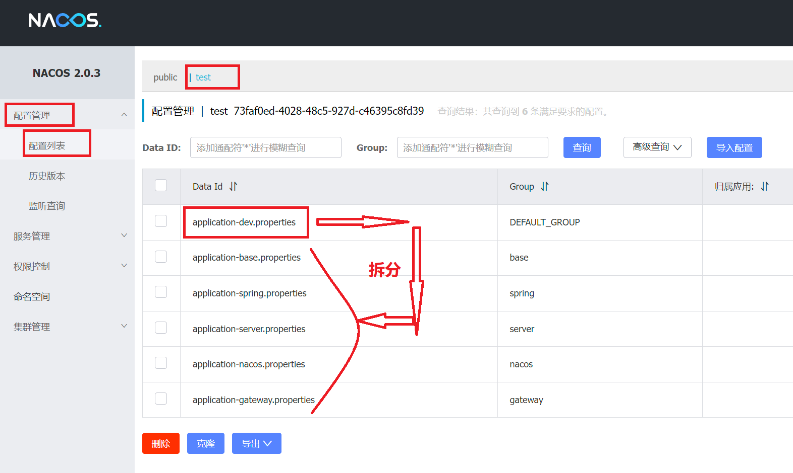

### 持久化操作


* 找到conf目录中的application.properties

  * spring.datasource.platform=mysql
  * db.num=1
  * db.url.0=jdbc:mysql://127.0.0.1:3306/nacos?characterEncoding=utf8&connectTimeout=1000&socketTimeout=3000&autoReconnect=true&useUnicode=true&useSSL=false&serverTimezone=UTC
  * db.user.0=nacos      
  * db.password.0=nacos  

* mysql创建数据库和表结构

  * 要求Mysql的版本必须为 `5.7+`

  * conf目录下nacos-mysql.sql

  * ```sql
    /*
     * Copyright 1999-2018 Alibaba Group Holding Ltd.
     *
     * Licensed under the Apache License, Version 2.0 (the "License");
     * you may not use this file except in compliance with the License.
     * You may obtain a copy of the License at
     *
     *      http://www.apache.org/licenses/LICENSE-2.0
     *
     * Unless required by applicable law or agreed to in writing, software
     * distributed under the License is distributed on an "AS IS" BASIS,
     * WITHOUT WARRANTIES OR CONDITIONS OF ANY KIND, either express or implied.
     * See the License for the specific language governing permissions and
     * limitations under the License.
     */
    
    /******************************************/
    /*   数据库全名 = nacos_config   */
    /*   表名称 = config_info   */
    /******************************************/
    CREATE TABLE `config_info` (
      `id` bigint(20) NOT NULL AUTO_INCREMENT COMMENT 'id',
      `data_id` varchar(255) NOT NULL COMMENT 'data_id',
      `group_id` varchar(255) DEFAULT NULL,
      `content` longtext NOT NULL COMMENT 'content',
      `md5` varchar(32) DEFAULT NULL COMMENT 'md5',
      `gmt_create` datetime NOT NULL DEFAULT CURRENT_TIMESTAMP COMMENT '创建时间',
      `gmt_modified` datetime NOT NULL DEFAULT CURRENT_TIMESTAMP COMMENT '修改时间',
      `src_user` text COMMENT 'source user',
      `src_ip` varchar(50) DEFAULT NULL COMMENT 'source ip',
      `app_name` varchar(128) DEFAULT NULL,
      `tenant_id` varchar(128) DEFAULT '' COMMENT '租户字段',
      `c_desc` varchar(256) DEFAULT NULL,
      `c_use` varchar(64) DEFAULT NULL,
      `effect` varchar(64) DEFAULT NULL,
      `type` varchar(64) DEFAULT NULL,
      `c_schema` text,
      PRIMARY KEY (`id`),
      UNIQUE KEY `uk_configinfo_datagrouptenant` (`data_id`,`group_id`,`tenant_id`)
    ) ENGINE=InnoDB DEFAULT CHARSET=utf8 COLLATE=utf8_bin COMMENT='config_info';
    
    /******************************************/
    /*   数据库全名 = nacos_config   */
    /*   表名称 = config_info_aggr   */
    /******************************************/
    CREATE TABLE `config_info_aggr` (
      `id` bigint(20) NOT NULL AUTO_INCREMENT COMMENT 'id',
      `data_id` varchar(255) NOT NULL COMMENT 'data_id',
      `group_id` varchar(255) NOT NULL COMMENT 'group_id',
      `datum_id` varchar(255) NOT NULL COMMENT 'datum_id',
      `content` longtext NOT NULL COMMENT '内容',
      `gmt_modified` datetime NOT NULL COMMENT '修改时间',
      `app_name` varchar(128) DEFAULT NULL,
      `tenant_id` varchar(128) DEFAULT '' COMMENT '租户字段',
      PRIMARY KEY (`id`),
      UNIQUE KEY `uk_configinfoaggr_datagrouptenantdatum` (`data_id`,`group_id`,`tenant_id`,`datum_id`)
    ) ENGINE=InnoDB DEFAULT CHARSET=utf8 COLLATE=utf8_bin COMMENT='增加租户字段';
    
    
    /******************************************/
    /*   数据库全名 = nacos_config   */
    /*   表名称 = config_info_beta   */
    /******************************************/
    CREATE TABLE `config_info_beta` (
      `id` bigint(20) NOT NULL AUTO_INCREMENT COMMENT 'id',
      `data_id` varchar(255) NOT NULL COMMENT 'data_id',
      `group_id` varchar(128) NOT NULL COMMENT 'group_id',
      `app_name` varchar(128) DEFAULT NULL COMMENT 'app_name',
      `content` longtext NOT NULL COMMENT 'content',
      `beta_ips` varchar(1024) DEFAULT NULL COMMENT 'betaIps',
      `md5` varchar(32) DEFAULT NULL COMMENT 'md5',
      `gmt_create` datetime NOT NULL DEFAULT CURRENT_TIMESTAMP COMMENT '创建时间',
      `gmt_modified` datetime NOT NULL DEFAULT CURRENT_TIMESTAMP COMMENT '修改时间',
      `src_user` text COMMENT 'source user',
      `src_ip` varchar(50) DEFAULT NULL COMMENT 'source ip',
      `tenant_id` varchar(128) DEFAULT '' COMMENT '租户字段',
      PRIMARY KEY (`id`),
      UNIQUE KEY `uk_configinfobeta_datagrouptenant` (`data_id`,`group_id`,`tenant_id`)
    ) ENGINE=InnoDB DEFAULT CHARSET=utf8 COLLATE=utf8_bin COMMENT='config_info_beta';
    
    /******************************************/
    /*   数据库全名 = nacos_config   */
    /*   表名称 = config_info_tag   */
    /******************************************/
    CREATE TABLE `config_info_tag` (
      `id` bigint(20) NOT NULL AUTO_INCREMENT COMMENT 'id',
      `data_id` varchar(255) NOT NULL COMMENT 'data_id',
      `group_id` varchar(128) NOT NULL COMMENT 'group_id',
      `tenant_id` varchar(128) DEFAULT '' COMMENT 'tenant_id',
      `tag_id` varchar(128) NOT NULL COMMENT 'tag_id',
      `app_name` varchar(128) DEFAULT NULL COMMENT 'app_name',
      `content` longtext NOT NULL COMMENT 'content',
      `md5` varchar(32) DEFAULT NULL COMMENT 'md5',
      `gmt_create` datetime NOT NULL DEFAULT CURRENT_TIMESTAMP COMMENT '创建时间',
      `gmt_modified` datetime NOT NULL DEFAULT CURRENT_TIMESTAMP COMMENT '修改时间',
      `src_user` text COMMENT 'source user',
      `src_ip` varchar(50) DEFAULT NULL COMMENT 'source ip',
      PRIMARY KEY (`id`),
      UNIQUE KEY `uk_configinfotag_datagrouptenanttag` (`data_id`,`group_id`,`tenant_id`,`tag_id`)
    ) ENGINE=InnoDB DEFAULT CHARSET=utf8 COLLATE=utf8_bin COMMENT='config_info_tag';
    
    /******************************************/
    /*   数据库全名 = nacos_config   */
    /*   表名称 = config_tags_relation   */
    /******************************************/
    CREATE TABLE `config_tags_relation` (
      `id` bigint(20) NOT NULL COMMENT 'id',
      `tag_name` varchar(128) NOT NULL COMMENT 'tag_name',
      `tag_type` varchar(64) DEFAULT NULL COMMENT 'tag_type',
      `data_id` varchar(255) NOT NULL COMMENT 'data_id',
      `group_id` varchar(128) NOT NULL COMMENT 'group_id',
      `tenant_id` varchar(128) DEFAULT '' COMMENT 'tenant_id',
      `nid` bigint(20) NOT NULL AUTO_INCREMENT,
      PRIMARY KEY (`nid`),
      UNIQUE KEY `uk_configtagrelation_configidtag` (`id`,`tag_name`,`tag_type`),
      KEY `idx_tenant_id` (`tenant_id`)
    ) ENGINE=InnoDB DEFAULT CHARSET=utf8 COLLATE=utf8_bin COMMENT='config_tag_relation';
    
    /******************************************/
    /*   数据库全名 = nacos_config   */
    /*   表名称 = group_capacity   */
    /******************************************/
    CREATE TABLE `group_capacity` (
      `id` bigint(20) unsigned NOT NULL AUTO_INCREMENT COMMENT '主键ID',
      `group_id` varchar(128) NOT NULL DEFAULT '' COMMENT 'Group ID，空字符表示整个集群',
      `quota` int(10) unsigned NOT NULL DEFAULT '0' COMMENT '配额，0表示使用默认值',
      `usage` int(10) unsigned NOT NULL DEFAULT '0' COMMENT '使用量',
      `max_size` int(10) unsigned NOT NULL DEFAULT '0' COMMENT '单个配置大小上限，单位为字节，0表示使用默认值',
      `max_aggr_count` int(10) unsigned NOT NULL DEFAULT '0' COMMENT '聚合子配置最大个数，，0表示使用默认值',
      `max_aggr_size` int(10) unsigned NOT NULL DEFAULT '0' COMMENT '单个聚合数据的子配置大小上限，单位为字节，0表示使用默认值',
      `max_history_count` int(10) unsigned NOT NULL DEFAULT '0' COMMENT '最大变更历史数量',
      `gmt_create` datetime NOT NULL DEFAULT CURRENT_TIMESTAMP COMMENT '创建时间',
      `gmt_modified` datetime NOT NULL DEFAULT CURRENT_TIMESTAMP COMMENT '修改时间',
      PRIMARY KEY (`id`),
      UNIQUE KEY `uk_group_id` (`group_id`)
    ) ENGINE=InnoDB DEFAULT CHARSET=utf8 COLLATE=utf8_bin COMMENT='集群、各Group容量信息表';
    
    /******************************************/
    /*   数据库全名 = nacos_config   */
    /*   表名称 = his_config_info   */
    /******************************************/
    CREATE TABLE `his_config_info` (
      `id` bigint(64) unsigned NOT NULL,
      `nid` bigint(20) unsigned NOT NULL AUTO_INCREMENT,
      `data_id` varchar(255) NOT NULL,
      `group_id` varchar(128) NOT NULL,
      `app_name` varchar(128) DEFAULT NULL COMMENT 'app_name',
      `content` longtext NOT NULL,
      `md5` varchar(32) DEFAULT NULL,
      `gmt_create` datetime NOT NULL DEFAULT CURRENT_TIMESTAMP,
      `gmt_modified` datetime NOT NULL DEFAULT CURRENT_TIMESTAMP,
      `src_user` text,
      `src_ip` varchar(50) DEFAULT NULL,
      `op_type` char(10) DEFAULT NULL,
      `tenant_id` varchar(128) DEFAULT '' COMMENT '租户字段',
      PRIMARY KEY (`nid`),
      KEY `idx_gmt_create` (`gmt_create`),
      KEY `idx_gmt_modified` (`gmt_modified`),
      KEY `idx_did` (`data_id`)
    ) ENGINE=InnoDB DEFAULT CHARSET=utf8 COLLATE=utf8_bin COMMENT='多租户改造';
    
    
    /******************************************/
    /*   数据库全名 = nacos_config   */
    /*   表名称 = tenant_capacity   */
    /******************************************/
    CREATE TABLE `tenant_capacity` (
      `id` bigint(20) unsigned NOT NULL AUTO_INCREMENT COMMENT '主键ID',
      `tenant_id` varchar(128) NOT NULL DEFAULT '' COMMENT 'Tenant ID',
      `quota` int(10) unsigned NOT NULL DEFAULT '0' COMMENT '配额，0表示使用默认值',
      `usage` int(10) unsigned NOT NULL DEFAULT '0' COMMENT '使用量',
      `max_size` int(10) unsigned NOT NULL DEFAULT '0' COMMENT '单个配置大小上限，单位为字节，0表示使用默认值',
      `max_aggr_count` int(10) unsigned NOT NULL DEFAULT '0' COMMENT '聚合子配置最大个数',
      `max_aggr_size` int(10) unsigned NOT NULL DEFAULT '0' COMMENT '单个聚合数据的子配置大小上限，单位为字节，0表示使用默认值',
      `max_history_count` int(10) unsigned NOT NULL DEFAULT '0' COMMENT '最大变更历史数量',
      `gmt_create` datetime NOT NULL DEFAULT CURRENT_TIMESTAMP COMMENT '创建时间',
      `gmt_modified` datetime NOT NULL DEFAULT CURRENT_TIMESTAMP COMMENT '修改时间',
      PRIMARY KEY (`id`),
      UNIQUE KEY `uk_tenant_id` (`tenant_id`)
    ) ENGINE=InnoDB DEFAULT CHARSET=utf8 COLLATE=utf8_bin COMMENT='租户容量信息表';
    
    
    CREATE TABLE `tenant_info` (
      `id` bigint(20) NOT NULL AUTO_INCREMENT COMMENT 'id',
      `kp` varchar(128) NOT NULL COMMENT 'kp',
      `tenant_id` varchar(128) default '' COMMENT 'tenant_id',
      `tenant_name` varchar(128) default '' COMMENT 'tenant_name',
      `tenant_desc` varchar(256) DEFAULT NULL COMMENT 'tenant_desc',
      `create_source` varchar(32) DEFAULT NULL COMMENT 'create_source',
      `gmt_create` bigint(20) NOT NULL COMMENT '创建时间',
      `gmt_modified` bigint(20) NOT NULL COMMENT '修改时间',
      PRIMARY KEY (`id`),
      UNIQUE KEY `uk_tenant_info_kptenantid` (`kp`,`tenant_id`),
      KEY `idx_tenant_id` (`tenant_id`)
    ) ENGINE=InnoDB DEFAULT CHARSET=utf8 COLLATE=utf8_bin COMMENT='tenant_info';
    
    CREATE TABLE `users` (
    	`username` varchar(50) NOT NULL PRIMARY KEY,
    	`password` varchar(500) NOT NULL,
    	`enabled` boolean NOT NULL
    );
    
    CREATE TABLE `roles` (
    	`username` varchar(50) NOT NULL,
    	`role` varchar(50) NOT NULL,
    	UNIQUE INDEX `idx_user_role` (`username` ASC, `role` ASC) USING BTREE
    );
    
    CREATE TABLE `permissions` (
        `role` varchar(50) NOT NULL,
        `resource` varchar(255) NOT NULL,
        `action` varchar(8) NOT NULL,
        UNIQUE INDEX `uk_role_permission` (`role`,`resource`,`action`) USING BTREE
    );
    
    INSERT INTO users (username, password, enabled) VALUES ('nacos', '$2a$10$EuWPZHzz32dJN7jexM34MOeYirDdFAZm2kuWj7VEOJhhZkDrxfvUu', TRUE);
    
    INSERT INTO roles (username, role) VALUES ('nacos', 'ROLE_ADMIN');
    
    ```

  * 将这个文件创建到数据库中，生成表结构，重启启动Nacos即可

### 集群配置

* 准备3台Linux服务器
  * 192.168.116.130
  * 192.168.116.131
  * 192.168.116.137
* 需要安装java环境
* 安装nacos `至少3台或3台以上`
  * nacos/conf/cluster.conf
  * 192.168.116.130:8848
  * 192.168.116.131:8848
  * 192.168.116.137:8848
* 使用的是nacos内置的数据源进行集群数据的加载
  * 单机命令启动：
    * sh startup.sh -m standalone
  * 集群命令启动
    * 内置数据源
      * sh startup.sh -p embedded
    * 外置数据源 `mysql`
      * sh startup.sh 

* 开放8848端口或关闭防火墙
  * 启动时，可能会连接比较久，大家稍微等待一下

## Sentinel `分布式流量防卫兵`

### 官网下载地址

* https://github.com/alibaba/Sentinel/releases/tag/1.8.3

### 官网WIKI

* https://github.com/alibaba/spring-cloud-alibaba/wiki/Sentinel

### 启动Sentinel

* 基本启动
  * java -jar sentinel-dashboard-1.8.3.jar
    
    * 默认端口是8080
    
      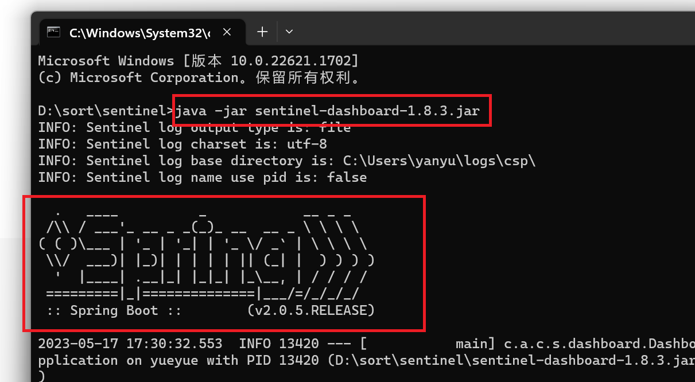
    
  * java -Dserver.port=xxx -jar sentinel-dashboard-1.8.3.jar
    
    * 自定义端口号等参数，启动
    
      访问localhost:8080
* 用户名和密码都是 `sentinel`

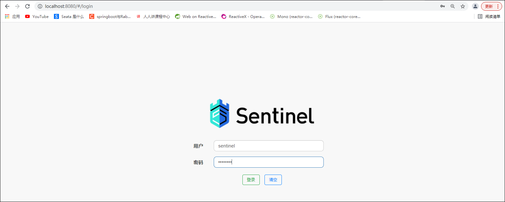

### 微服务集成Sentinel

* pom.xml

```xml
<!--Sentinel起步依赖-->
<dependency>
    <groupId>com.alibaba.cloud</groupId>
    <artifactId>spring-cloud-starter-alibaba-sentinel</artifactId>
</dependency>
```

* application.yml

```yml
server:
  port: 8005
spring:
  application:
    name: 006-nacos-consumer
  cloud:
    nacos:
      discovery:
        server-addr: localhost:8848/
    sentinel:
      transport:
        # Sentinel管理控制台的地址
        dashboard: localhost:8080
        # 微服务与Sentinel的通信端口
        port: 8179
management:
  endpoints:
    web:
      exposure:
        include: '*'
```

* Sentinel默认是`懒加载`的，所以我们先发送一个请求，才可以在管理控制台上，查看到我们监控的微服务
* 并且，所有的数据都是`基于内存`加载的，当`服务器重启`后，所有的流控规则和熔断规则，`需要重新设置`

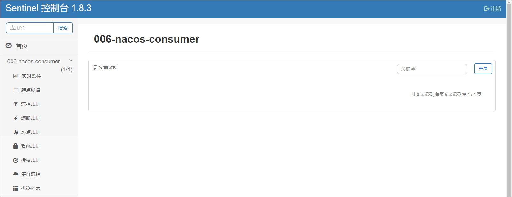


### 流控规则


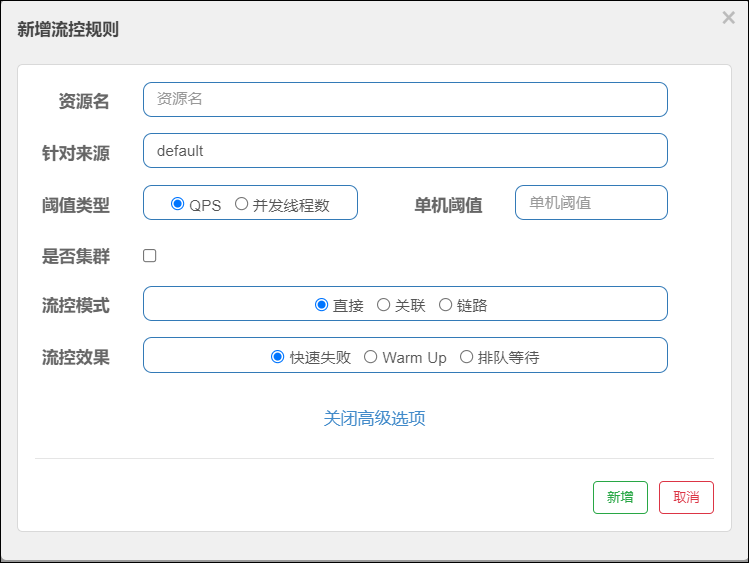

* 1. 资源名称
  
  * 资源名称默认为项目路径名称：例如：/consumer/01
  * 如果通过注解进行定义资源名称，可以直接使用
  
* 2. 阈值类型

  * 2.1 QPS

    * QPS：每秒钟的请求响应的数量
    * 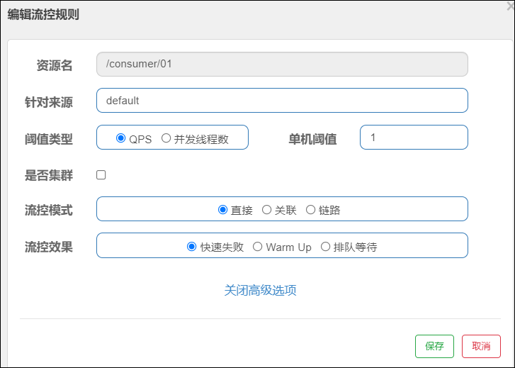
    * 以上配置表明：当每秒钟请求的数量超过1个时，就会抛出`限流异常`
  * 2.2 并发线程数

    * 以下配置表明：当前的请求，只有一个线程进行处理所有的请求，如果超出一个线程所执行的工作量，就会抛出`限流异常`

    * 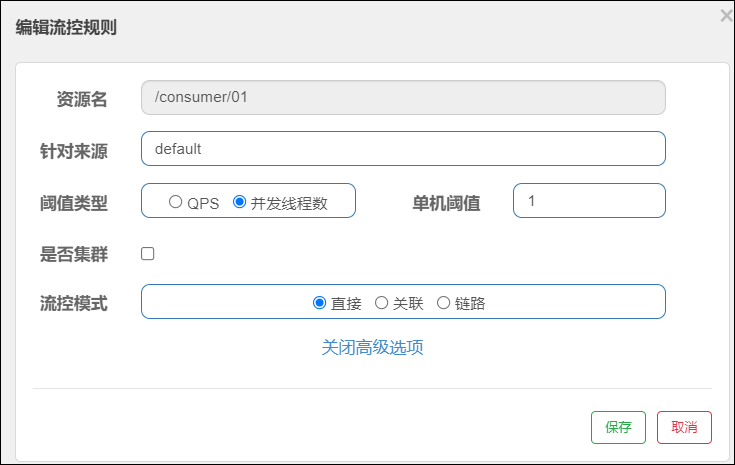

    * 类似只有一个窗口在办公，处理不过来的请求，都会被限流

    * 测试时，请使用Jmeter进行测试，否则是无法触发限流规则的

      D:\sort\apache-jmeter-5.4.1\bin下双击`jmeter.bat`

      配置如下：

      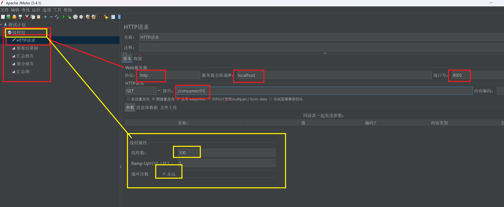

      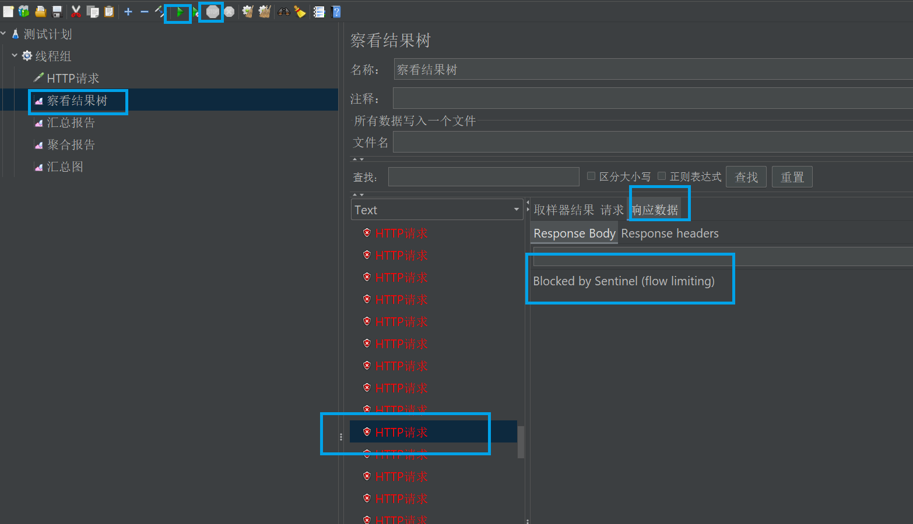

* 3. 单机阈值

  * 阈值，上限值

* 4. 流控模式
  
  * 4.1 直接
    
    * 直接通过 `流控效果` 进行操作
    
  * 4.2 关联
    
    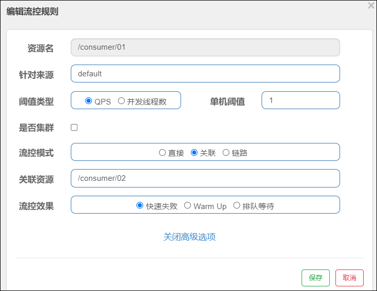
    
    * 当通过`资源名称`和`关联名称`进行操作时，`关联名称触发了限流规则，资源名称无法访问`
    
      
  
* 5. 流控效果
  
  * 5.1 快速失败
    * 直接失败，抛出降级异常、流控异常
  * 5.2 Warm Up
    * 冷启动(热身)
      * 当系统长期处于低水位的情况下，如果此时流量激增，很可能将整个系统拖垮
      * 在冷启动规定时间内，此时的触发的阈值只有原来阈值的三分之一，当冷启动的时间过去后，才会恢复原来的阈值
      * 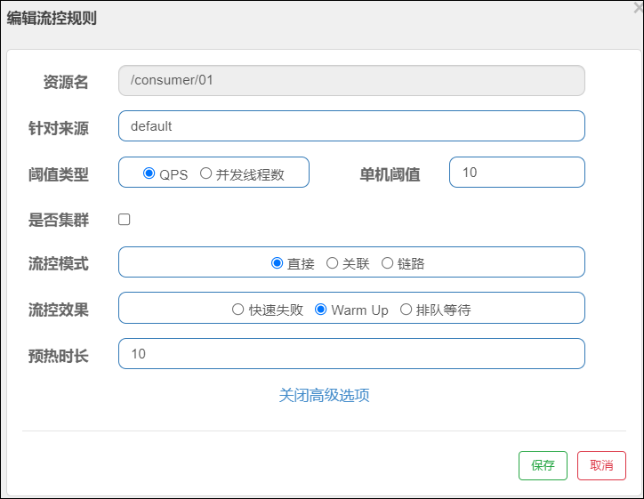
  * 5.3 排队等待
  * 让请求匀速的执行
  
  #### 限流异常：

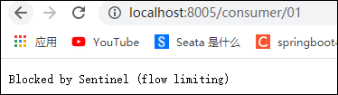

### 熔断规则

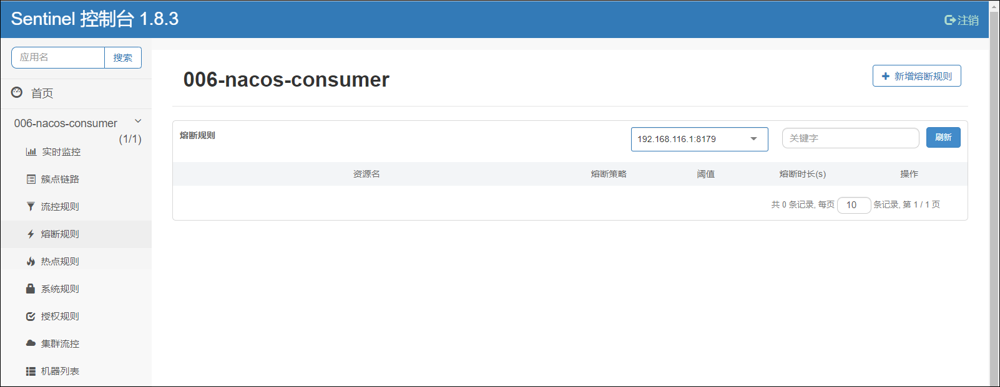

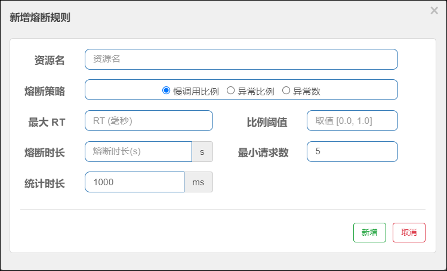

* 1. 熔断策略
  
  * 1.1 慢调用比例
    
    * 当请求响应的时间，超过了设置的RT `平均响应时间` 时，就会被认为是慢调用，满足规则时则会熔断降级方法
    * 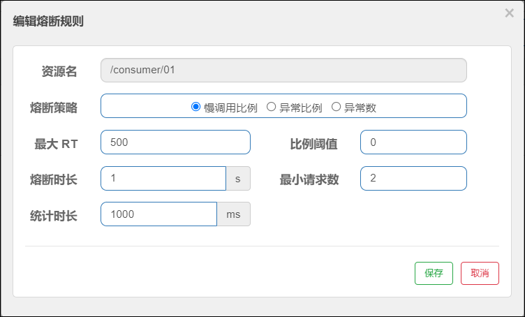
  * 1.2 异常比例
    
    * 按照出现异常的比例，进行服务的熔断
    * 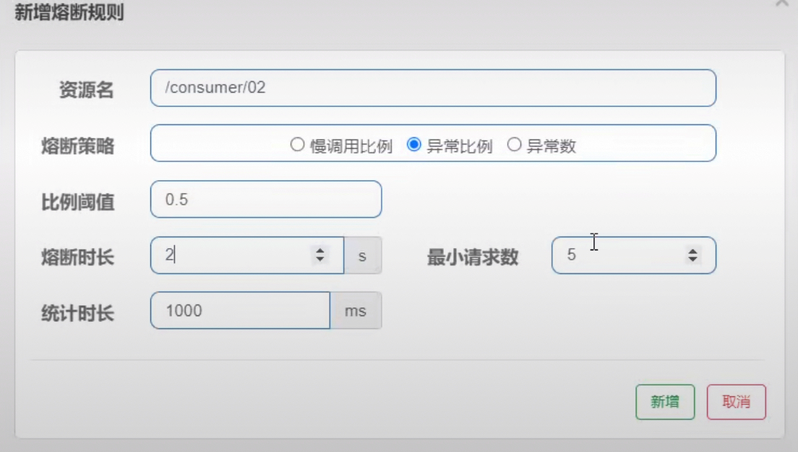
  * 1.3 异常数
    
    * 按照出现的异常数量，进行服务的熔断
    
      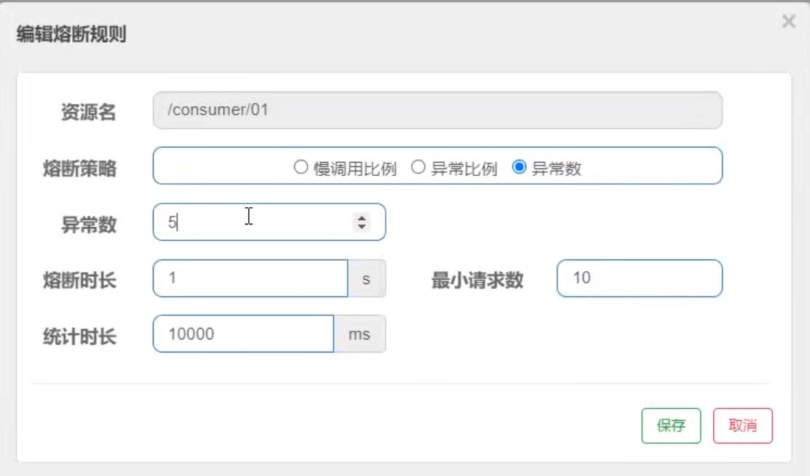
  * 2. 最大RT
    
    * 最大的响应时间，超过则为慢调用，`只有慢调用比例才会使用该值进行设置`
  * 3. 比例阈值
    
    * 设置 `0.0` ~ `1.0` 的区间值，代表 `0%` ~ `100%`
  * 4. 熔断时长
    
    * 熔断降级的时间，可以理解为`断路器的从开启到关闭的时间`
  * 5. 最小请求数
    
    * 至少发送多少次请求，才可以被记录统计
  * 6. 统计时长
    
    * 当前的规则`计时的时间`

## Seata `分布式事务`

### 分布式事务的角色介绍

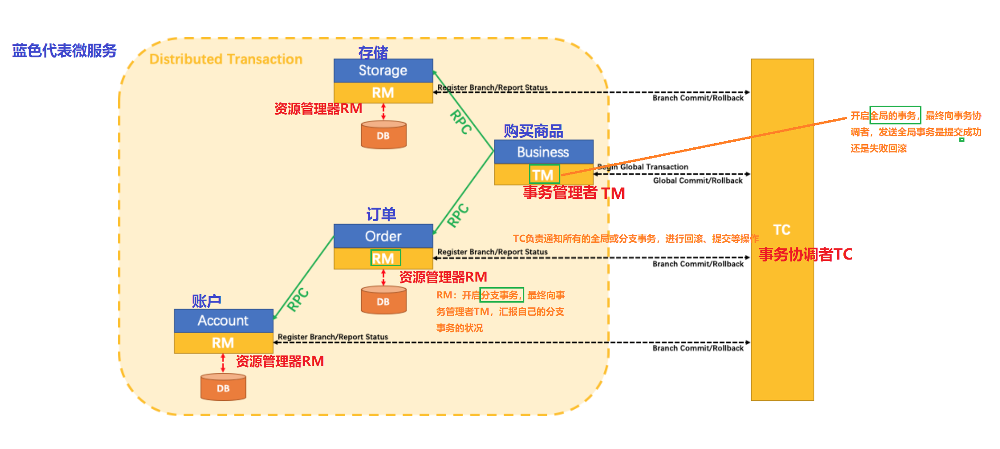

* TC
  * 事务协调者
    * 负责通知所有的全局或分支事务，进行回滚、提交等操作
* TM
  * 事务管理者
    * 开启全局的事务，最终向事务协调者，发送全局事务是提交成功还是失败回滚
* RM
  * 资源管理器
    
    * 开启分支事务，最终向事务管理者，汇报自己的分支事务的状况
    
      具体案例详见：https://seata.io/zh-cn/docs/user/quickstart.html

# SpringBoot

## Actuator `健康检查`

* 可以通过开放端点的方式，进行查看微服务或服务器的状态信息
  * 端点
    * 通过http请求的方式，在web端(浏览器)进行查看具体信息
    * 查看到微服务中的容器中的情况
    * 查看到微服务中的属性相关的情况
    * 查看到微服务中的服务器相关的信息
    * 查看到微服务中的所有的映射的控制的请求
    * ...
  * 端点是可以全部开放或选择开放的

### 入门案例

* pom.xml

```xml
<dependency>
    <groupId>org.springframework.boot</groupId>
    <artifactId>spring-boot-starter-actuator</artifactId>
</dependency>
```

* application.yml

```yml
management:
  endpoints:
    web:
      # 健康检查的根路径地址设置，默认为 /actuator
      base-path: /actuator
      exposure:
        # 开放的端点
        # ‘*’ 开放所有的端点
        # 指定端点进行开放，Set集合，默认开放的只有info、health端点
        # include: 'health'
        # include: '*'
        # 开放部分的端点
        include:
          - 'health'
```


## SpringSession `Session共享容器`

### 环境准备

* 8001 8002控制器

```java
package com.bjpowernode.springcloud.controller;

import com.bjpowernode.springcloud.domain.R;
import com.bjpowernode.springcloud.domain.User;
import org.springframework.stereotype.Controller;
import org.springframework.web.bind.annotation.RequestMapping;
import org.springframework.web.bind.annotation.RestController;

import javax.servlet.http.HttpSession;
import java.util.UUID;

/**
 * ClassName:UserController
 * Package:com.bjpowernode.springcloud.controller
 * Description: 描述信息
 *
 * @date:2021/12/24 17:27
 * @author:动力节点
 */
@RestController
@RequestMapping("/user")
public class UserController {

    @RequestMapping("/login")
    public R login(String username, String password, HttpSession session){

        if(username.equals("admin") && password.equals("123456")){

            //将用户存入到Session中
            User user = new User()
                    .setId(UUID.randomUUID().toString())
                    .setUsername(username)
                    .setPassword(password)
                    .setApplicationName("Consumer8002");

            session.setAttribute("user",user);

            //登录成功
            return R.ok(0,"登录成功",user);
        }

        return R.err(1,"登录失败，用户名或密码错误...Consumer8002");

    }

    @RequestMapping("/getUser")
    public R getUser(HttpSession session){

        User user = ((User)session.getAttribute("user"));

        if(user == null)
            return R.err(1,"当前用户未登录...");

        return R.ok(0,"查询成功",user);
    }

}
```


* gateway 过滤器

```java
package com.bjpowernode.springcloud.filter;

import com.bjpowernode.springcloud.domain.User;
import com.fasterxml.jackson.core.JsonProcessingException;
import com.fasterxml.jackson.databind.ObjectMapper;
import lombok.extern.slf4j.Slf4j;
import org.springframework.cloud.gateway.filter.GatewayFilterChain;
import org.springframework.cloud.gateway.filter.GlobalFilter;
import org.springframework.context.annotation.Configuration;
import org.springframework.core.Ordered;
import org.springframework.core.io.buffer.DataBuffer;
import org.springframework.http.MediaType;
import org.springframework.http.server.reactive.ServerHttpResponse;
import org.springframework.web.server.ServerWebExchange;
import reactor.core.publisher.Flux;
import reactor.core.publisher.Mono;

import java.net.URI;
import java.util.HashMap;
import java.util.Map;

/**
 * ClassName:UserCustomFilter
 * Package:com.bjpowernode.springcloud.filter
 * Description: 描述信息
 *
 * @date:2021/12/24 17:17
 * @author:动力节点
 */
@Slf4j
@Configuration
public class UserCustomFilter implements GlobalFilter, Ordered {

    @Override
    public Mono<Void> filter(ServerWebExchange exchange, GatewayFilterChain chain) {

        //在转发时，先校验Session中是否有用户对象
//        exchange.getSession().filter(webSession -> {
//            User user = webSession.getAttribute("user");
//
//            if(user == null){
//                return errorInfo(exchange,1,"没有登录，请重新登录");
//            }
//
//        });

        String uri = exchange.getRequest().getURI().toString();
        log.info("uri : {}",uri);

        if(uri.contains("/user/login")){
            log.info("登录操作...");
            return chain.filter(exchange);
        }else{
            //正常进行请求转发操作
        }

        return chain.filter(exchange);
    }

    @Override
    public int getOrder() {
        return 0;
    }

    public Mono<Void> errorInfo(ServerWebExchange exchange, Integer code, String message) {

        //封装返回值结果集
        Map<String, Object> errorMap = new HashMap<>();
        errorMap.put("code", code);
        errorMap.put("message", message);
        errorMap.put("data", null);


        return Mono.defer(() -> {
            byte[] bytes = null;
            try {
                bytes = new ObjectMapper().writeValueAsBytes(errorMap);
            } catch (JsonProcessingException e) {
                e.printStackTrace();
            }

            ServerHttpResponse response = exchange.getResponse();
            response.getHeaders().add("Content-Type", MediaType.APPLICATION_PROBLEM_JSON_UTF8.toString());
            DataBuffer wrap = response.bufferFactory().wrap(bytes);
            return response.writeWith(Flux.just(wrap));
        });

    }
}
```


## RabbitMQ `消息中间件`

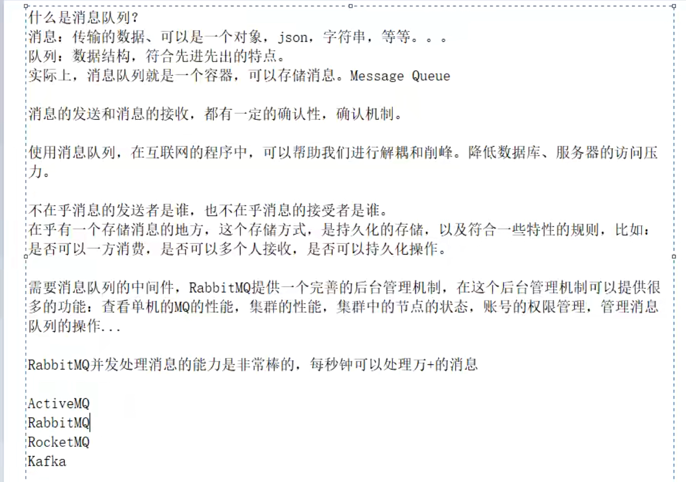

kafka：唯一支持大数据的MQ，可达数十万+/秒

RabbitMQ：唯一可以灵活路由（可一对一，一对多，一对一对多），处理最快的MQ

MQ怎么解耦？

正常远程调用（通过feign或RestTemplete）

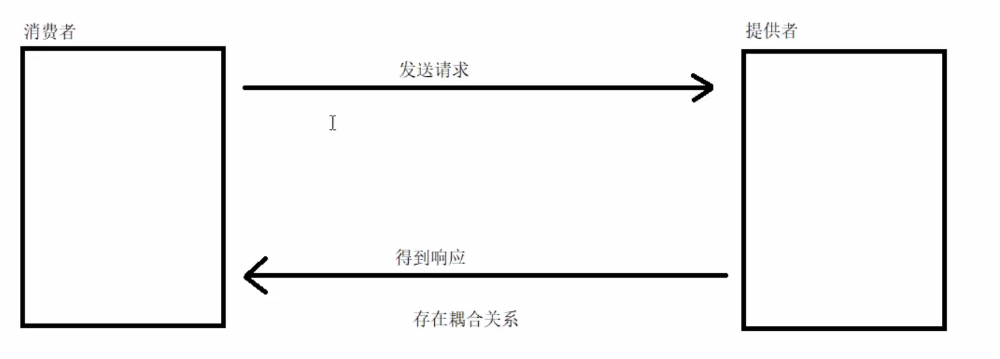

加入消息队列：

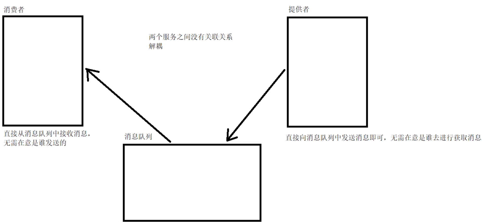


RabbitMQ 是一个由 `Erlang `语言开发的 AMQP 的开源实现。

`AMQP ：Advanced Message Queue，高级消息队列协议`。它是应用层协议的一个开放标准，为`面向消息的中间件`设计，基于此协议的客户端与消息中间件可传递消息，并不受产品、开发语言等条件的限制。

RabbitMQ 最初起源于金融系统，用于在分布式系统中存储转发消息，在易用性、扩展性、高可用性等方面表现不俗。具体特点包括：

  1、可靠性（Reliability）

  RabbitMQ 使用一些机制来保证可靠性，如持久化、传输确认、发布确认。

  2、`灵活的路由`（Flexible Routing）

在消息进入队列之前，通过 Exchange（交换机） 来路由消息的。对于典型的路由功能，RabbitMQ 已经提供了一些内置的 Exchange 来实现。针对更复杂的路由功能，可以将多个 Exchange 绑定在一起，也通过插件机制实现自己的 Exchange 。

  3、 消息集群（Clustering）

​      多个 RabbitMQ 服务器可以组成一个集群，形成一个逻辑 Broker 。

  3、 高可用（Highly Available Queues）

队列可以在集群中的机器上进行镜像，使得在部分节点出问题的情况下队列仍然可用。

  4、多种协议（Multi-protocol）

​      RabbitMQ 支持多种消息队列协议，比如 STOMP、MQTT 等等。

  5、多语言客户端（Many Clients）

​      RabbitMQ 几乎支持所有常用语言，比如 Java、.NET、Ruby 等等。

  6、 管理界面（Management UI）

RabbitMQ 提供了一个易用的用户界面，使得用户可以监控和管理消息 Broker 的许多方面。

  7、 跟踪机制（Tracing）

​      如果消息异常，RabbitMQ 提供了消息跟踪机制，使用者可以找出发生了什么。

broker：消息服务器实体

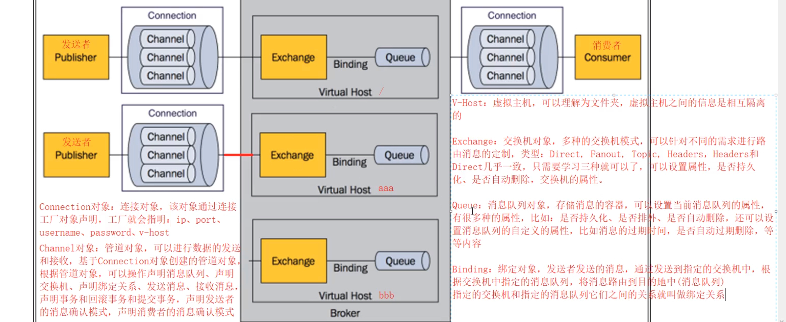

### Direct类型交换机

解释：`路由键`：相当于发送快递时填写的的`目的地地址`：交换机-->消息队列

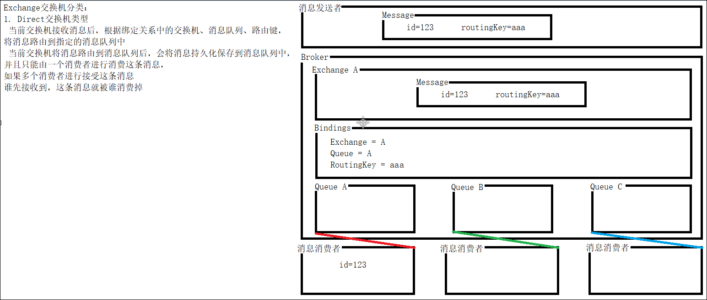

### Fanout类型交换机

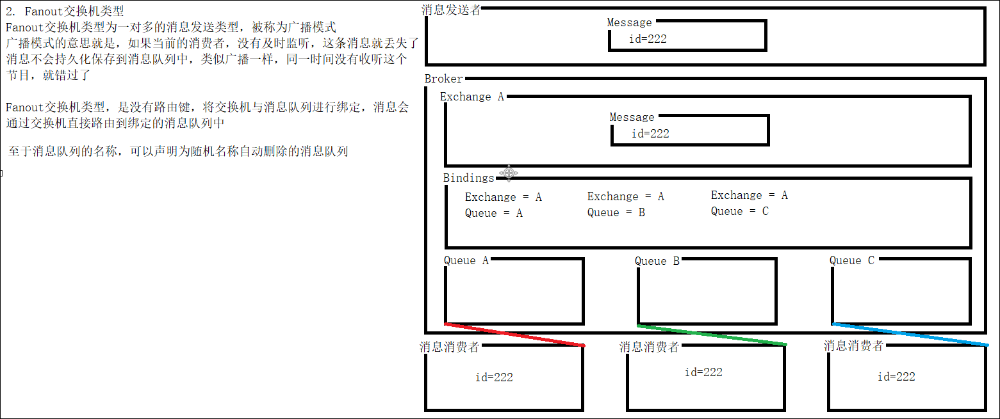

### `⭐Topic类型交换机`

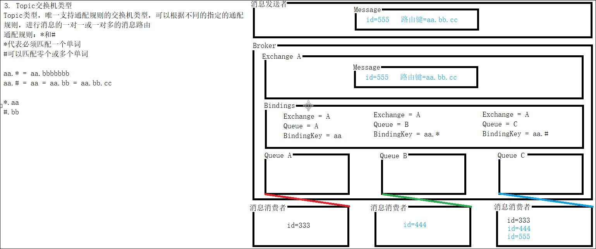


### 入门案例

#### 消息发送者

* pom.xml

```xml
<dependency>
    <groupId>org.springframework.boot</groupId>
    <artifactId>spring-boot-starter-amqp</artifactId>
</dependency>
```

* application.yml

```yml
server:
  port: 7003
spring:
  application:
    name: 004-rabbitmq-provider-sender
    
  # RabbitMQ配置信息
  rabbitmq:
    # 域名
    host: 192.168.116.136
    # 端口号：
    # 15672，管理控制台的端口号
    # 5672，客户端连接RabbitMQ的端口号
    # 4369、25672，RabbitMQ集群需要管理的端口号
    port: 5672
    username: root
    password: root
    # 虚拟主机目录，默认为 /
    virtual-host: /
```

* 配置类

```java
@Configuration
public class RabbitMQConfig {

    //-------声明基本的消息队列-------
    @Bean
    public Queue baseQueue(){
        /*
            public Queue(String name)
                持久化、非排外、非自动删除
            public Queue(String name, boolean durable)
            public Queue(String name, boolean durable, boolean exclusive, boolean autoDelete)
            public Queue(String name, boolean durable, boolean exclusive, boolean autoDelete,@Nullable Map<String, Object> arguments)
            参数1，消息队列的名称
            参数2，是否持久化，true代表持久化消息到消息队列中，false代表非持久化
            参数3，是否排外，false代表当前消息只能被一个消费者进行消费，true代表当前消息可以被多个消费者消费
            参数4，是否自动删除，是否自动删除消息队列，当没有消费者监听这个队列时，这个队列就会被自动删除掉
            参数5，消息队列的其他参数，指定过期时间等等，可以在管理控制台进行查看
         */
        return new Queue("baseQueue");
    }


    //-------声明基本的消息队列-------
    //-------声明Direct类型交换机、消息队列、绑定关系-------
    @Bean
    public Exchange directExchange(){
        /*
            public DirectExchange(String name)
                持久化、非自动删除的交换机
            public DirectExchange(String name, boolean durable, boolean autoDelete)
            public DirectExchange(String name, boolean durable, boolean autoDelete, Map<String, Object> arguments)
            参数1，交换机名称
            参数2，是否持久化
            参数3，是否自动删除
            参数4，交换机的其他参数，管理控制台可以查看
         */
        return new DirectExchange("directExchange");
    }

    @Bean
    public Queue directQueue(){
        return new Queue("directQueue");
    }

    @Bean
    public Binding directBinding(Exchange directExchange,Queue directQueue){
        return BindingBuilder.bind(directQueue).to(directExchange).with("directRoutingKey").noargs();
    }

    //-------声明Direct类型交换机、消息队列、绑定关系-------
    //-------声明Fanout类型交换机、消息队列、绑定关系-------
    @Bean
    public Exchange fanoutExchange(){
        //持久化，非自动删除的交换机类型
        return new FanoutExchange("fanoutExchange");
    }

    @Bean
    public Queue fanoutQueue1(){
        return new Queue("fanoutQueue1",false,true,true);
    }

    @Bean
    public Queue fanoutQueue2(){
        return new Queue("fanoutQueue2",false,true,true);
    }

    @Bean
    public Queue fanoutQueue3(){
        return new Queue("fanoutQueue3",false,true,true);
    }

    @Bean
    public Binding fanoutBinding1(Queue fanoutQueue1,Exchange fanoutExchange){
        return BindingBuilder.bind(fanoutQueue1).to(fanoutExchange).with("").noargs();
    }

    @Bean
    public Binding fanoutBinding2(Queue fanoutQueue2,Exchange fanoutExchange){
        return BindingBuilder.bind(fanoutQueue2).to(fanoutExchange).with("").noargs();
    }

    @Bean
    public Binding fanoutBinding3(Queue fanoutQueue3,Exchange fanoutExchange){
        return BindingBuilder.bind(fanoutQueue3).to(fanoutExchange).with("").noargs();
    }

    //-------声明Fanout类型交换机、消息队列、绑定关系-------
    //-------声明Topic类型交换机、消息队列、绑定关系-------

    @Bean
    public Exchange topicExchange(){
        //持久化、非自动删除的交换机
        return new TopicExchange("topicExchange");
    }

    @Bean
    public Queue topicQueue1(){
        return new Queue("topicQueue1");
    }

    @Bean
    public Queue topicQueue2(){
        return new Queue("topicQueue2");
    }

    @Bean
    public Queue topicQueue3(){
        return new Queue("topicQueue3");
    }

    @Bean
    public Binding topicBinding1(Exchange topicExchange,Queue topicQueue1){
        return BindingBuilder.bind(topicQueue1).to(topicExchange).with("aa").noargs();
    }

    @Bean
    public Binding topicBinding2(Exchange topicExchange,Queue topicQueue2){
        return BindingBuilder.bind(topicQueue2).to(topicExchange).with("aa.*").noargs();
    }

    @Bean
    public Binding topicBinding3(Exchange topicExchange,Queue topicQueue3){
        return BindingBuilder.bind(topicQueue3).to(topicExchange).with("aa.#").noargs();
    }

    //-------声明Topic类型交换机、消息队列、绑定关系-------


}
```

* 发送消息方法

```java
@Slf4j
@Component
public class SendMessage {

    @Autowired
    private AmqpTemplate template;

    public void sendBaseMessage(){

        /*
            void convertAndSend(Object message)
            参数1，发送的消息实体
            void convertAndSend(String routingKey, Object message)
            参数1，路由键，根据指定的路由键，将消息从交换机路由到指定的消息队列中，如果没有指定交换机，则使用默认的交换机
                如果使用的是默认的交换机，则路由键命名为消息队列的名称
            参数2，发送的消息实体
            void convertAndSend(String exchange, String routingKey, Object message)
            参数1，交换机名称
            参数2，路由键，根据指定的路由键，将消息从交换机路由到指定的消息队列中
            参数3，发送的消息实体

            在发送消息之前，需要先声明，交换机、消息队列、绑定关系
         */
        //发送一条消息，到默认的交换机中，将它路由到指定的消息队列中
        template.convertAndSend("baseQueue","测试...发送一条最基本的数据");

        log.info("发送成功...");
    }

    public void sendDirectMessage(){
        template.convertAndSend("directExchange","directRoutingKey","这是一条direct类型的消息 ╮(╯▽╰)╭ ");
    }

    public void sendFanoutMessage(){
        template.convertAndSend("fanoutExchange","","这是一条Fanout类型的消息 ╮(╯▽╰)╭ ");
    }

    public void sendTopicMessage(){
        template.convertAndSend("topicExchange","aa","这是一条Fanout类型的消息 ╮(╯▽╰)╭  aa");
        template.convertAndSend("topicExchange","aa.bb","这是一条Fanout类型的消息 ╮(╯▽╰)╭  aa.bb");
        template.convertAndSend("topicExchange","aa.bb.cc","这是一条Fanout类型的消息 ╮(╯▽╰)╭  aa.bb.cc");
    }

}
```

* 引导类

```java
@SpringBootApplication
public class RabbitMQ7003Application {

    public static void main(String[] args) {
        ConfigurableApplicationContext run = SpringApplication.run(RabbitMQ7003Application.class, args);

        SendMessage bean = run.getBean(SendMessage.class);

        //发送最基本的消息到消息队列中
        //bean.sendBaseMessage();

        //发送消息到Direct交换机中
        //bean.sendDirectMessage();

        //发送消息到Fanout交换机中
        //bean.sendFanoutMessage();

        //发送消息到Topic交换机中
        bean.sendTopicMessage();
    }

}
```


#### 消息消费者

* pom.xml

```xml
<dependency>
    <groupId>org.springframework.boot</groupId>
    <artifactId>spring-boot-starter-amqp</artifactId>
</dependency>
```

* application.yml

```yml
server:
  port: 8003
spring:
  application:
    name: 004-rabbitmq-consumer-receiver
  rabbitmq:
    host: 192.168.116.136
    port: 5672
    username: root
    password: root
    virtual-host: /
```

* 监听消息

```java
@Slf4j
@Component
public class ReceiveMessage {

    @RabbitListener(queues = {"baseQueue"})
    public void receiveBaseMessage(String msg){
        log.info("接收到 baseQueue 中的消息： {}",msg);
    }

    @RabbitListener(queues = {"directQueue"})
    public void receiveDirectMessage(String msg){
        log.info("接收到 directMessage 中的消息： {}",msg);
    }

//    @RabbitListener(queues = {"fanoutQueue1","fanoutQueue2","fanoutQueue3"})
//    public void receiveCustomFanoutMessage(String msg){
//        log.info("接收到fanout类型消息：{}",msg);
//    }

    /*
        声明Fanout广播模式
     */
//    @RabbitListener(
//        //queues = {"fanoutQueue1"},
//        //@Queue如果没有定义消息队列的名称，则使用的是随机名称的消息队列
//        bindings = @QueueBinding(
//                        value = @Queue ,
//                        exchange = @Exchange(name = "fanoutExchange",type = "fanout"))
//    )
//    public void receiveFanoutMessage1(String msg){
//        log.info("接收到fanout1类型消息：{}",msg);
//    }

//    @RabbitListener(
//            //queues = {"fanoutQueue1"},
//            //@Queue如果没有定义消息队列的名称，则使用的是随机名称的消息队列
//            bindings = @QueueBinding(
//                    value = @Queue ,
//                    exchange = @Exchange(name = "fanoutExchange",type = "fanout"))
//    )
//    public void receiveFanoutMessage2(String msg){
//        log.info("接收到fanout2类型消息：{}",msg);
//    }

    @RabbitListener(
            //queues = {"fanoutQueue1"},
            //@Queue如果没有定义消息队列的名称，则使用的是随机名称的消息队列
            bindings = @QueueBinding(
                    value = @Queue ,
                    exchange = @Exchange(name = "fanoutExchange",type = "fanout"))
    )
    public void receiveFanoutMessage3(String msg){
        log.info("接收到fanout3类型消息：{}",msg);
    }

    @RabbitListener(queues = {"topicQueue1"})
    public void receiveTopicQueue1Message(String msg){
        log.info("接收到 topicQueue1 的消息：{}",msg);
    }

    @RabbitListener(queues = {"topicQueue2"})
    public void receiveTopicQueue2Message(String msg){
        log.info("接收到 topicQueue2 的消息：{}",msg);
    }

    @RabbitListener(queues = {"topicQueue3"})
    public void receiveTopicQueue3Message(String msg){
        log.info("接收到 topicQueue3 的消息：{}",msg);
    }

}
```

### 


### RabbitMQ集群搭建

#### 普通模式集群

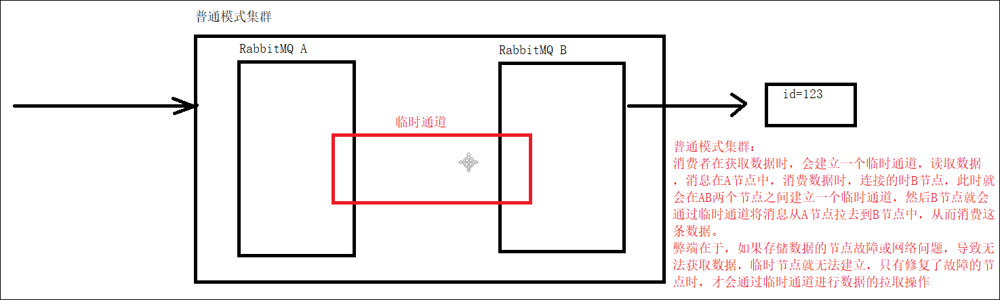

##### 搭建普通模式集群

1. 安装了两台虚拟机的Erlang环境和RabbitMQ环境
2. 修改/etc/hosts文件
   * 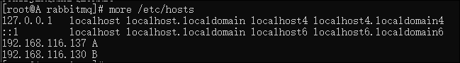

3. 重启两台虚拟机
   * reboot

4. 将两个 `.erlang.cookie` 同步内容
   * /var/lib/rabbitmq/.erlang.cookie
     * 必须是 400 的权限
     * 所有者和群组必须是 rabbitmq
     * 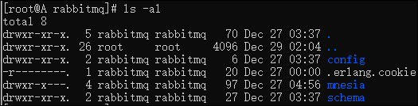
5. 启动rabbitmq，然后将B节点加入到A节点中
   * 创建账号，授权和角色设置
6. 通过浏览器远程连接一下管理控制台

#### 镜像模式集群 `高可用`

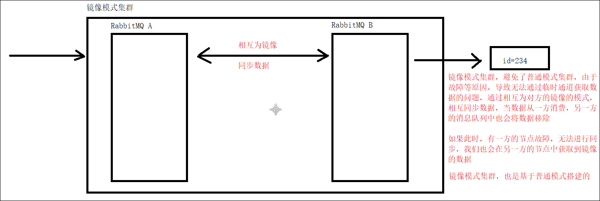

* 设置高可用策略
* 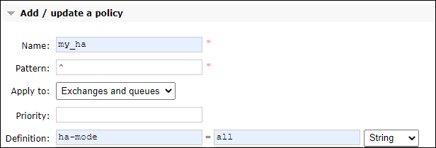