# Docker

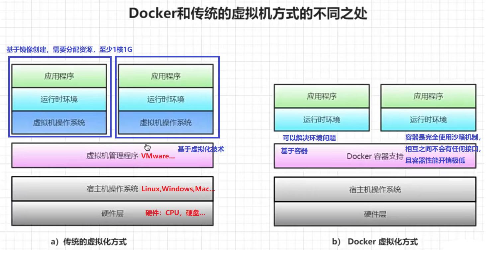

Docker 是一个开源的应用容器引擎，基于 [Go 语言](https://www.runoob.com/go/go-tutorial.html) 并遵从 Apache2.0 协议开源。

Docker 可以让开发者打包他们的应用以及依赖包到一个`轻量级、可移植的容器`中，然后发布到任何流行的 Linux 机器上，也可以实现虚拟化。

#### Docker应用场景

- Web 应用的自动化打包和发布。

- 自动化测试和持续集成、发布。

- 在服务型环境中部署和调整数据库或其他的后台应用。

- 从头编译或者扩展现有的 OpenShift 或 Cloud Foundry 平台来搭建自己的 PaaS 环境。

  #### Docker 的优点

  1、`快速，一致地交付`您的应用程序

  Docker 允许开发人员使用您提供的应用程序或服务的本地容器在`标准化环境`中工作，从而简化了开发的生命周期。

  2、响应式部署和扩展

  Docker 是`基于容器`的平台，允许`高度可移植`的工作负载。Docker 容器可以在开发人员的本机上，数据中心的物理或虚拟机上，云服务上或`混合环境中运行`。

  Docker 的可移植性和轻量级的特性，还可以使您轻松地完成动态管理的工作负担，并根据业务需求指示，实时扩展或拆除应用程序和服务。

  3、在`同一硬件上运行更多工作负载`

  Docker `轻巧快速`。它为基于虚拟机管理程序的`虚拟机提供了可行、经济、高效的替代方案`，因此您可以利用更多的计算能力来实现业务目标。Docker 非常适合于`高密度环境`以及`中小型部署`，而您可以`用更少的资源做更多的事情`。


## 安装Docker

* Window系统安装 `了解`
  * https://www.runoob.com/docker/windows-docker-install.html

* Linux系统安装 `掌握`!!!!
  * https://www.runoob.com/docker/centos-docker-install.html
* 主要以Linux系统安装为主

### 安装

* 使用Linux的Root用户操作
  * 如果没有root用户,或者用普通用户操作,需要使用 `sudo` 命令授权
* 卸载旧的Docker版本

```bash
yum remove docker \
           docker-client \
           docker-client-latest \
           docker-common \
           docker-latest \
           docker-latest-logrotate \
           docker-logrotate \
           docker-engine
```

* 安装Docker所需依赖包

```bash
yum install -y yum-utils \
               device-mapper-persistent-data \
               lvm2
```

* 设置下载镜像的国内的源地址
  * 由于Docker下载镜像的地址是国外的服务器,需要替换为国内的阿里云或清华大学提供的源地址
  * 下载速度会快一些,稳定一些

```bash
# 阿里云源地址
yum-config-manager \
    --add-repo \
    http://mirrors.aliyun.com/docker-ce/linux/centos/docker-ce.repo

# 二选一即可

# 清华大学源地址
yum-config-manager \
    --add-repo \
    https://mirrors.tuna.tsinghua.edu.cn/docker-ce/linux/centos/docker-ce.repo
```

* 安装Docker

```bash
# 安装Docker的最新版本
yum install docker-ce docker-ce-cli containerd.io

# 安装Docker指定的版本
# 查询Docker的版本信息
yum list docker-ce --showduplicates | sort -r
# 根据查询出的Docker版本信息,指定版本安装
yum install docker-ce-<VERSION_STRING> docker-ce-cli-<VERSION_STRING> containerd.io
```


### 启动Docker

```bash
systemctl start docker
```


### 关闭Docker

```bash
systemctl stop docker
```


## Hello World

* 下载一个镜像

* 运行这个容器

* 输出一段字符串 `Hello World`

* ```bash
  docker run ubuntu:15.10 /bin/echo "Hello World"
  ```

  * `docker run` 代表`运行一个容器`
  * `ubuntu:15.10` 容器的`镜像`
    * 如果当前镜像没有,则会先下载这个镜像,然后再运行容器
  * `/bin/echo"Hello World"` 在控制台`输出` `Hello World` 内容

  

## Docker镜像

* 官网地址

  * https://registry.hub.docker.com/
  * 可以在官网中搜索相关的镜像,查看对应的版本和描述信息
    * 描述信息中可以看到如何使用当前的镜像
    * 版本的内容是当前镜像的版本号,默认是最新的版本 `latest`

* 搜索镜像

  * ```bash
    docker search 镜像名称
    ```

  * 通过命令在命令行中进行查找镜像内容

  * 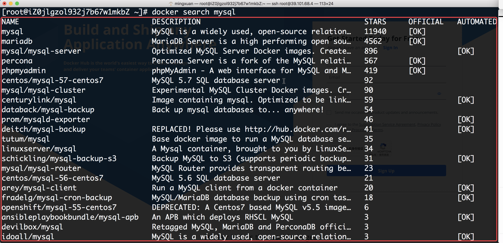

    * NAME `镜像名称`
    * DESCRIPTION `镜像描述`
    * STARS `点赞数`
    * OFFICIAL `是否官方`
    * AUTOMATED `是否开源`

* 下载镜像

  * ```bash
    # 下载最新版本的镜像
    docker pull 镜像名称
    # 指定下载版本号的镜像
    docker pull 镜像名称:版本号
    ```

* 查看本地镜像

  * ```bash
    docker images
    ```

  * 查看本地已经下载好的Docker镜像
  * 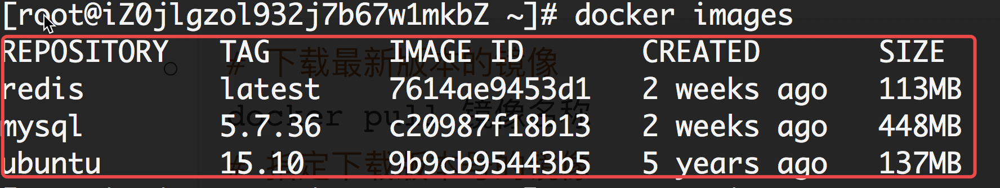
    * REPOSITORY
      * 仓库的镜像名称
    * TAG
      * 镜像版本号
    * IMAGE ID
      * 镜像唯一标识
    * CREATED
      * 镜像创建的时间
    * SIZE
      * 镜像文件大小

* 删除镜像

  * ```bash
    docker rmi 镜像ID
    ```

  * 删除镜像时,必须停止容器,而且需要将容器删除
    
    * 就算容器没有在运行,只要它存在就无法删除镜像

## Docker容器

* 查看当前正在运行的容器

  * ```bash
    docker ps
    ```

    * 正在运行的容器可以查看到

* 查看所有容器

  * ```bash
    docker ps -a
    ```

    * 所有的容器包括运行中的和停止的容器,都可以查看到

  * 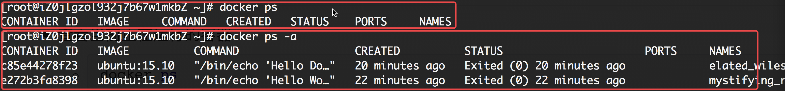

    * CONTAINER ID
      * 容器的唯一标识
    * IMAGE
      * 容器加载镜像
    * COMMAND
      * 执行的命令
    * CREATED
      * 创建容器的时间
    * STATUS
      * 容器运行的状态
        * 运行的时间
        * 已经停止的时间
    * PORTS
      * 宿主机和容器关联的端口号
    * NAMES
      * 容器名称

* 删除容器

  * ```bash
    docker rm 容器ID
    ```

    * 根据容器ID删除容器
    * 因为一个镜像可以运行多个容器,但是容器的名字不能重复,容器ID不能重复

* 创建容器

  * ```bash
    #语法
    docker run -it --name=容器名称 镜像名称:版本号 /bin/bash
    # 指定redis最新版本的镜像创建容器
    # 创建并运行容器,以交互式的方式运行,然后进行容器内部
    docker run -it --name=myRedis redis:latest /bin/bash
    
    # 指定redis最新版本的镜像创建容器
    # 创建并运行容器,以守护式的方式运行,后台运行,不进入容器内部
    docker run -id --name=myRedis redis:latest
    
    # 容器内部,没有vi/vim等命令,想要安装,首先要保证宿主机是可以联网
    # 进入容器内部执行命令
    # 在容器内部查询可使用命令ls -al /usr/bin/
    apt update
    apt install -y vim
    
    # 容器内部想要退出到宿主机
    # 以交互式的方式运行时,创建容器后会进入容器内部,此时执行退出操作,会关闭掉容器
    # 以守护式的方式运行时,创建容器后不会进入容器内部,需要手动的进入容器内部,进入容器后,此时执行退出操作,则不会关闭掉容器
    exit
    
    # 创建一个Redis的容器,并进行端口的映射
    # -p 宿主机端口:容器端口
    docker run -id --name aliyunRedis -p 1111:6379 redis:latest
    
    # 创建一个Mysql的容器,端口映射和目录挂载
    # -p 宿主机端口:容器端口
    # -v 宿主机目录:容器目录
    # 进入：docker exec -it a255f6ae8106 /bin/bash
  docker run -id --name aliyunMysql -p 2222:3306 -v /home/mysqldatadir:/var/lib/mysql -e MYSQL_ROOT_PASSWORD=06011127 mysql:5.7.36
    
    ```
    
    `目录挂载：文件夹同步`
    
  * `docker run`

    * 运行容器

  * `--name=myRedis`

    * 容器的名称

  * `-i`

    * 交互式运行

  * `-t`

    * 开启终端

  * `-d`

    * 守护式运行,后台运行

  * `-it`

    * 创建容器,并通过终端执行,`进入容器内部`
      * 如果你有想要操作容器内部的方式,可以进入容器内部进行执行一些操作
      * 进入到容器内部,不会运行容器的组件,需要手动进行操作
        * 比如Redis进入执行 `redis-server &` 进行后台运行

  * `-id`

    * 创建容器,`后台运行`
      
      * 以`守护式`的方式运行容器,组件会被运行
      
      * 想进入容器：
      
        ```shell
         docker exec -it a255f6ae8106 /bin/bash
         ls -al
        ```

  * `-itd`

    * 创建容器,并通过终端执行,进入容器内部,和 `-it` 一样的意思

  * `-p`

    * `端口映射`,将宿主机的端口映射到容器的端口,进行绑定
    * 然后操作宿主机的端口就相当于操作容器的端口

  * `-v`

    * 目录挂载,`将宿主机的目录和容器目录进行绑定`
    * 这样做的目的就是将容器中存放的一些数据,可以`同步`到宿主机上
    * 这样`防止容器数据丢失`
    * 即使容器出现问题,删除了之后,将目录重新进行挂载,马上即可恢复原来的数据

  * 细节

    如果当前使用的容器不知道怎样使用,可以看官网提供的描述信息

    * 上面有很多详细的参数的介绍

      建立数据库

      端口号：`2222`

      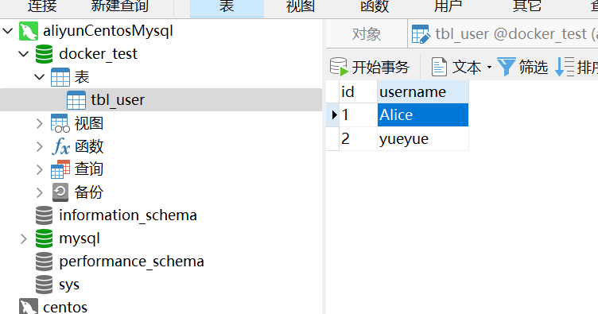

      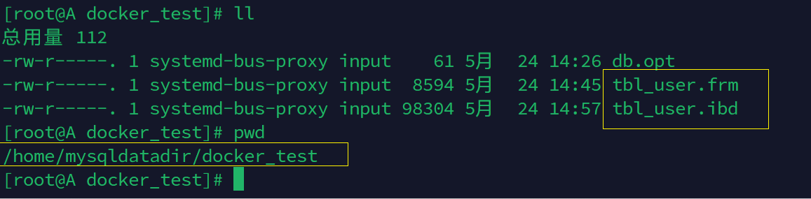

      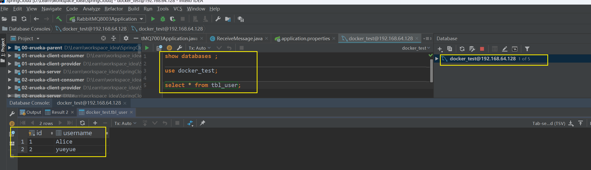

      端口号：`1111`

      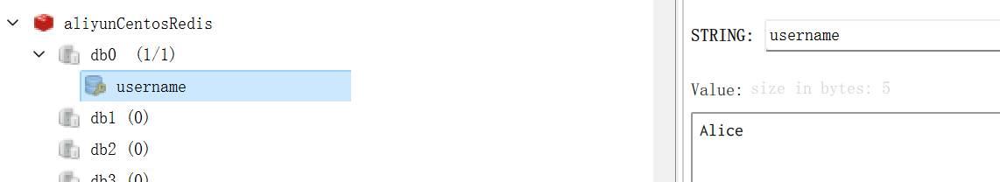

      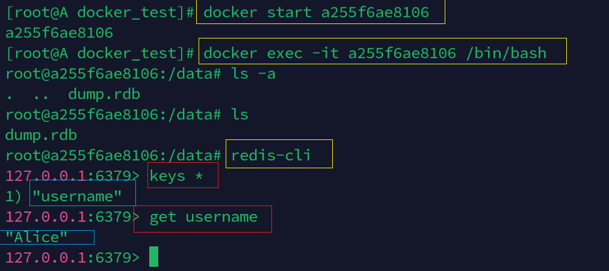

      查阅

    番外：

    如何打开和进入已经关闭的容器

    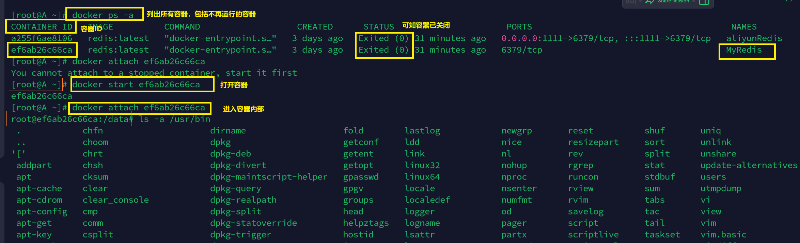

## 使用Docker安装FastDFS

* 下载镜像

  * docker pull season/fastdfs

* 创建 `tracker` 容器

  * ```bash
    docker run -ti -d --name trakcer -v ~/tracker_data:/fastdfs/tracker/data --net=host season/fastdfs tracker 
    ```

* 创建 `storage` 容器
  * ```bash
    docker run -tid --name storage -v ~/storage_data:/fastdfs/storage/data -v ~/store_path:/fastdfs/store_path --net=host -e TRACKER_SERVER:宿主机ip:22122 season/fastdfs storage
    ```
  
    
  
* 查看容器ID,修改 `storage` 容器的配置文件,启动

  * 将storage.conf配置文件复制到宿主机中

    * ```bash
      # 查看运行的容器ID
      docker ps
      
      # 语法: docker cp 代表复制的意思
      # 用法1: docker cp 容器ID:容器中的文件 保存的宿主机的目录(.代表当前目录)
      # 用法2: docker cp 宿主机文件 容器ID:容器中路径
      # 将宿主机的文件复制到容器中的路径中,如果有相同文件,则直接覆盖
      docker cp 容器ID:/etc/fdfs/storage.conf .
      ```

    * 修改storage.conf配置文件

      * 修改tracker路径,修改为自己的ip地址(Linux虚拟机)

        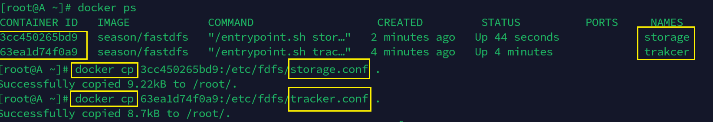

        
    
    * 将修改后的storage.conf配置文件覆盖到容器中

      * ```bash
    docker cp storage.conf 容器ID:/etc/fdfs/
        ```
    
        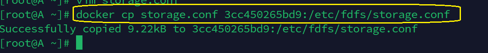
    
    * 重新启动storage

      * 进入`容器内部`,通过命令重新启动

        ```shell
    docker exec -it 容器ID /bin/bash
        ```

      * 容器内部通过
    
        ```shell
        fdfs_storaged /etc/fdfs/storage.conf start
        ```
    
    * 通过代码进行远程测试了
    
    * 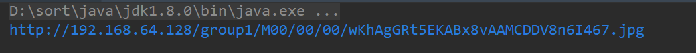
    
    * 通过宿主机的本地目录挂载查看是否上传成功
    
    * 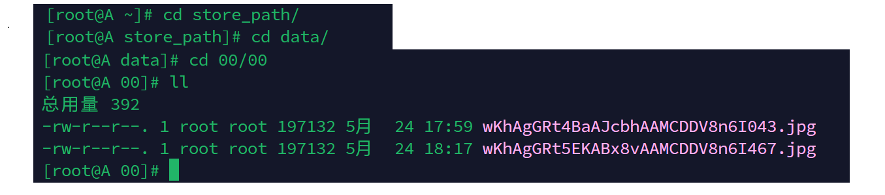
    
      番外：测试代码
    
      ```java
      package com.work.fastdfs.utils;
      
      import org.csource.common.MyException;
      import org.csource.fastdfs.*;
      import org.springframework.stereotype.Component;
      
      import java.io.IOException;
      import java.util.UUID;
      
      /**
       * ClassName:FastDFSConfig
       * Package:com.work.fastdfs.utils
       * Description: 与远程建立连接，进行文件的上传下载删除等操作
       *
       * @date:2023/5/4 10:39
       * @author:yueyue
       */
      @Component
      public class FastDFSUtil {
          public static void main(String[] args) throws IOException, MyException {
      
      
              //上传文件（从本地到远端）
              String url = localFileUpload("C:\\Users\\yanyu\\Desktop\\bb.jpg");
              System.out.println(url);             //http://192.168.64.128/group1/M00/00/00/wKhAgGRTLsqAEg28AAPthACz3X4944.jpg
      
              //下载文件（从远端到本地）
      //        localFileDownload("group1","M00/00/00/wKhAgGRTLsqAEg28AAPthACz3X4944.jpg","C:\\Users\\yanyu\\Desktop\\cc");
      //        localFileDownload("group1","M00/00/00/wKhAgGRTLsqAEg28AAPthACz3X4944.jpg");
      
              //删除文件(删除远程文件) 文件在Linux下的/opt/fastDFS/storage/files/data/00/00文件夹中
      //        deleteFile("group1","M00/00/00/wKhAgGRTLsqAEg28AAPthACz3X4944.jpg");
      
      
          }
      
      
      
          //本地文件上传
          public static String localFileUpload(String localFileName) throws IOException, MyException {
              //获取后缀名
              String suffix = localFileName.substring(localFileName.lastIndexOf(".") + 1);
              //获取StorageClient对象
              StorageClient storageClient = getStorageClient();
              //上传文件  第一个参数：本地文件路径 第二个参数：上传文件的后缀 第三个参数：文件信息
              //上传成功后，会将群组名称和远程文件名称返回
              String[] uploadArray = storageClient.upload_file(localFileName, suffix, null);
      
              if(uploadArray == null || uploadArray.length == 0){
                  //上传失败
                  throw new MyException("上传失败...");
              }
      
              return "http://192.168.64.128/"+uploadArray[0]+"/"+uploadArray[1];
          }
      
      
          //流方式文件上传
          public static String bytesFileUpload(byte[] bytes,String suffix) throws IOException, MyException {
              //获取StorageClient对象
              StorageClient storageClient = getStorageClient();
      
              String[] uploadArray = storageClient.upload_file(bytes, suffix, null);
      
              if(uploadArray == null || uploadArray.length == 0){
                  //上传失败
                  throw new MyException("上传失败...");
              }
      
              return "http://192.168.64.128/"+uploadArray[0]+"/"+uploadArray[1];
      
          }
      
          //下载文件
          public static void localFileDownload(String groupName,String remoteFileName,String localFileName) throws IOException, MyException {
      
              StorageClient storageClient = getStorageClient();
              String suffix = remoteFileName.substring(remoteFileName.lastIndexOf("."));
      
              //参数1：群组名称
              //参数2：远程文件名称
              //参数3：本地下载绝对路径，C:\Users\Administrator\Desktop\aaa.jpg，当前路径+文件名称，必须要有文件名称
      
              //可以指定具体路径的下载方式
              storageClient.download_file(groupName,remoteFileName,localFileName+suffix);
      
          }
          //下载文件
          public static void localFileDownload(String groupName,String remoteFileName) throws IOException, MyException {
      
              StorageClient storageClient = getStorageClient();
              String suffix = remoteFileName.substring(remoteFileName.lastIndexOf("."));
              //参数1：群组名称
              //参数2：远程文件名称
              //参数3：本地下载绝对路径，C:\Users\Administrator\Desktop\aaa.jpg，当前路径+文件名称，必须要有文件名称
              String newFileName = UUID.randomUUID().toString()+suffix;
              //指定固定位置的下载方式
              storageClient.download_file(groupName,remoteFileName,"C:\\Users\\yanyu\\Desktop\\"+newFileName);
      
          }
          //下载文件
          public static byte[] bytesFileDownload(String groupName,String remoteFileName) throws IOException, MyException {
      
              StorageClient storageClient = getStorageClient();
              String suffix = remoteFileName.substring(remoteFileName.lastIndexOf("."));
              //参数1：群组名称
              //参数2：远程文件名称
              return storageClient.download_file(groupName,remoteFileName);
      
          }
      
      
          //删除文件
          public static void deleteFile(String groupName,String remoteFileName) throws IOException, MyException {
              StorageClient storageClient = getStorageClient();
      
              storageClient.delete_file(groupName,remoteFileName);
      
          }
      
      
      
          //获取StorageClient对象，这个对象完成对文件的操作
          private static StorageClient getStorageClient(){
              TrackerServer trackerServer = null;
              StorageServer storageServer = null;
              try {
                  //1.加载配置文件，默认去classpath下加载
                  ClientGlobal.init("fdfs_client.conf");
                  //2.创建TrackerClient对象
                  TrackerClient trackerClient = new TrackerClient();
                  //3.创建TrackerServer对象
                  trackerServer = trackerClient.getConnection();
                  //4.创建StorageServler对象
                  storageServer = trackerClient.getStoreStorage(trackerServer);
                  //5.创建StorageClient对象，这个对象完成对文件的操作
                  StorageClient storageClient = new StorageClient(trackerServer, storageServer);
                  if(storageClient == null) {return null;}
                  return storageClient;
              } catch (IOException e) {
                  e.printStackTrace();
              } catch (MyException e) {
                  e.printStackTrace();
              } finally {
                  if (storageServer != null) {
                      try {
                          storageServer.close();
                      } catch (IOException e) {
                          e.printStackTrace();
                      }
                  }
                  if (trackerServer != null) {
                      try {
                          trackerServer.close();
                      } catch (IOException e) {
                          e.printStackTrace();
                      }
                  }
              }
              return null;
          }
      }
      
      
      
      ```
    
      注意修改配置文件中的宿主机的ip
    
      ```shell
      connect_timeout = 2
      network_timeout = 30
      charset = UTF-8
      http.tracker_http_port = 8080
      http.anti_steal_token = no
      http.secret_key = FastDFS1234567890
      
      tracker_server = 192.168.64.128:22122
      #tracker_server = 192.168.64.130:22122
      #tracker_server = 192.168.64.131:22122
      ```
    
      