# Nginx

Nginx （engine x） 是一个高性能的Web服务器和反向代理服务器，也可以作为邮件代理服务器。

## 正向代理

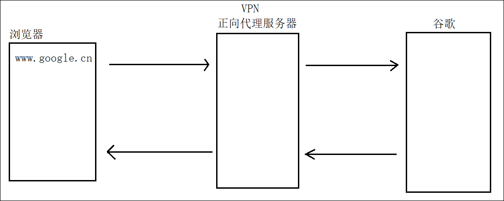

## 反向代理

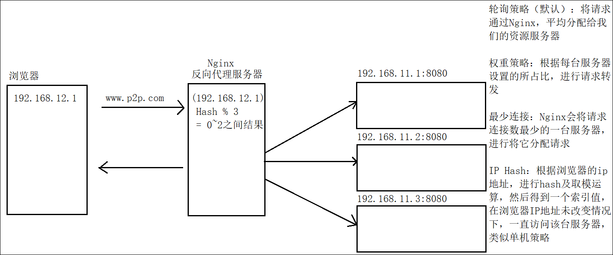

## 安装Nginx

1. 将 `nginx-1.14.2.tar.gz` 上传到Linux服务器中

2. 安装前，将环境统一进行执行

   * ```shell
     yum install gcc openssl openssl-devel pcre pcre-devel zlib zlib-devel -y
     ```

3. 解压缩 `Nginx`

   * ```shell
     tar -zxvf nginx-1.14.2.tar.gz -C /usr/local
     cd /usr/local/nginx-1.14.2
     ```

4. 配置编译后的目录，并编译安装

   * ```shell
     ./configure --prefix=/usr/local/nginx
     ```

   * ```shell
     make && make install
     ```

   * 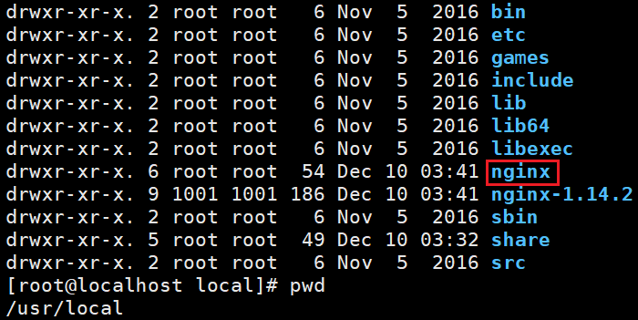

5. 测试

   * ```shell
     # 进入Nginx安装目录，带版本号不是安装目录
     cd /usr/local/nginx
     # 进入可执行文件的目录，启动nginx
     cd sbin
     # 启动nginx命令
     ./nginx
     ```

   * Linux服务器中
     * `curl http://localhost:80`
     * `curl http://localhost`
     * `curl localhost`
     * 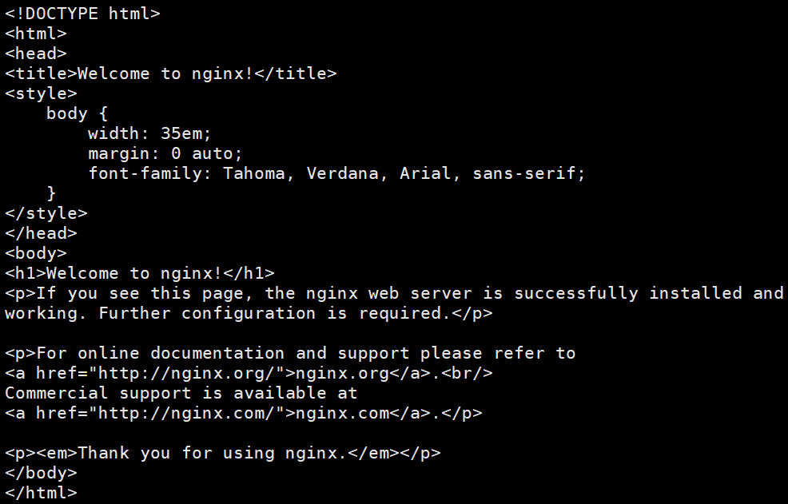

## 防火墙管理

* 开启防火墙

  * ```shell
    systemctl start firewalld
    ```

* 关闭防火墙

  * ```shell
    systemctl stop firewalld
    ```

* 防火墙的状态查询

  * ```shell
    systemctl status firewalld
    ```

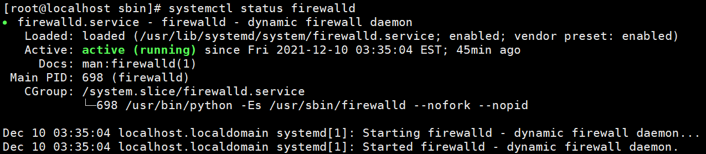

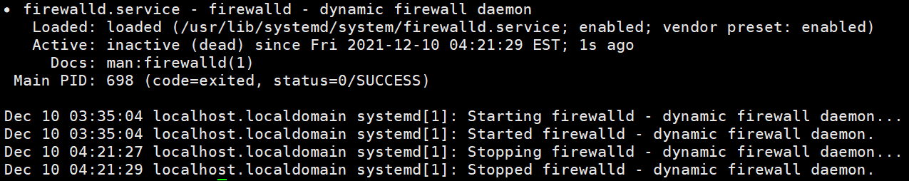

* 开放端口访问

  * ```shell
    firewall-cmd --zone=public --add-port=80/tcp --permanent
    ```

    * `firewall-cmd` 操作防火墙的命令
    * `--zone=public` 开放操作
    * `--add-port=80/tcp` 开放80端口
    * `--permanent` 持久化的开放，重启之后依然生效
    * 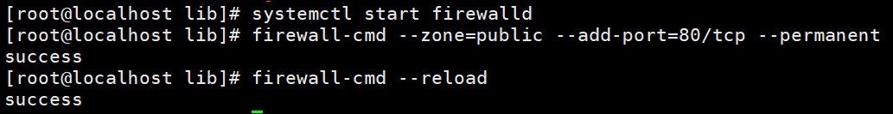
    * 不同于在Windows中配置环境变量是立即生效的，在Linux中配置环境变量需要再在配置信息(reload)才能生效

* 关闭端口访问

  * ```shell
    firewall-cmd --zone=public --remove-port=80/tcp --permanent
    ```

    * `--remove-port=80/tcp` 关闭80端口的访问
    * 

* 重新加载防火墙信息

  * ```shell
    firewall-cmd --reload
    ```

* 查询已开放的端口

  * ```shell
    firewall-cmd --list-ports
    ```

    * 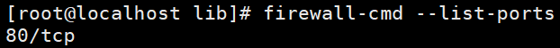

* Nginx欢迎页面

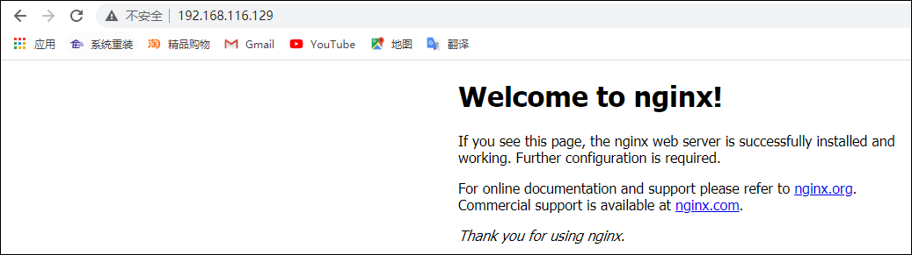


## Nginx的启动和关闭

### 启动

#### 默认启动方式

* `./nginx`
  * 使用的是默认的配置文件启动
  * 默认配置文件的路径 `/usr/local/nginx/conf/nginx.conf`

#### 启动前检查配置

* `/usr/local/nginx/sbin/nginx -c /usr/local/nginx/conf/nginx.conf -t`

#### 指定配置文件启动

* `/usr/local/nginx/sbin/nginx -c /usr/local/nginx/conf/nginx.conf`

#### 细节

* 配置文件是存在多份的
  * `/usr/local/nginx/conf/nginx.conf` `安装后的Nginx目录`
  * `/usr/local/nginx-1.14.2/conf/nginx.conf` `解压缩的Nginx目录`

### 关闭

* 查看PID
  * `ps -ef | grep nginx`
  * 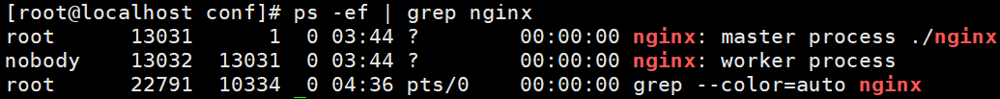

#### 快速关闭

* `kill -TERM PID`

#### 优雅关闭

* `kill -QUIT PID`

#### 强制关闭

* `kill -9 PID`


### 重启Nginx

* 只能限制单机使用，如果是多台Nginx，则无法指定具体重启哪一台
* `./nginx -s reload`


## Nginx配置文件说明

```shell
#配置worker进程运行用户 nobody也是一个linux用户，一般用于启动程序，没有密码
user  nobody;  
#配置工作进程数目，根据硬件调整，通常等于CPU数量或者2倍于CPU数量
worker_processes  1;  

#配置全局错误日志及类型，[debug | info | notice | warn | error | crit]，默认是error
error_log  logs/error.log;  
#error_log  logs/error.log  notice;
#error_log  logs/error.log  info;

pid        logs/nginx.pid;  #配置进程pid文件 


###====================================================


#配置工作模式和连接数
events {
    worker_connections  1024;  #配置每个worker进程连接数上限，nginx支持的总连接数就等于worker_processes * worker_connections
}

###===================================================


#配置http服务器,利用它的反向代理功能提供负载均衡支持
http {
    #配置nginx支持哪些多媒体类型，可以在conf/mime.types查看支持哪些多媒体类型
    include       mime.types;  
    #默认文件类型 流类型，可以理解为支持任意类型
    default_type  application/octet-stream;  
    #配置日志格式 
    #log_format  main  '$remote_addr - $remote_user [$time_local] "$request" '
    #                  '$status $body_bytes_sent "$http_referer" '
    #                  '"$http_user_agent" "$http_x_forwarded_for"';

    #配置access.log日志及存放路径，并使用上面定义的main日志格式
    #access_log  logs/access.log  main;

    sendfile        on;  #开启高效文件传输模式
    #tcp_nopush     on;  #防止网络阻塞

    #keepalive_timeout  0;
    keepalive_timeout  65;  #长连接超时时间，单位是秒

    #gzip  on;  #开启gzip压缩输出
	
	###-----------------------------------------------
	

    #配置虚拟主机
    server {
        listen       80;  #配置监听端口
        server_name  localhost;  #配置服务名

        #charset koi8-r;  #配置字符集

        #access_log  logs/host.access.log  main;  #配置本虚拟主机的访问日志

		#默认的匹配斜杠/的请求，当访问路径中有斜杠/，会被该location匹配到并进行处理
        location / {
	    	#root是配置服务器的默认网站根目录位置，默认为nginx安装主目录下的html目录
            root   html;  
	    	#配置首页文件的名称
            index  index.html index.htm;  
        }		

        #error_page  404              /404.html;  #配置404页面
        # redirect server error pages to the static page /50x.html
        #error_page   500 502 503 504  /50x.html;  #配置50x错误页面
        
        #精确匹配
        # http://192.168.64.128:80/50x.html
        # html/50x.html
        location = /50x.html {
            root   html;
        }

		#PHP 脚本请求全部转发到Apache处理
        # proxy the PHP scripts to Apache listening on 127.0.0.1:80
        #
        #location ~ \.php$ {
        #    proxy_pass   http://127.0.0.1;
        #}

		#PHP 脚本请求全部转发到FastCGI处理
        # pass the PHP scripts to FastCGI server listening on 127.0.0.1:9000
        #
        #location ~ \.php$ {
        #    root           html;
        #    fastcgi_pass   127.0.0.1:9000;
        #    fastcgi_index  index.php;
        #    fastcgi_param  SCRIPT_FILENAME  /scripts$fastcgi_script_name;
        #    include        fastcgi_params;
        #}

		#禁止访问 .htaccess 文件
        # deny access to .htaccess files, if Apache's document root
        # concurs with nginx's one
        #
        #location ~ /\.ht {
        #    deny  all;
        #}
    }

	
	#配置另一个虚拟主机
    # another virtual host using mix of IP-, name-, and port-based configuration
    #
    #server {
    #    listen       8000;
    #    listen       somename:8080;
    #    server_name  somename  alias  another.alias;

    #    location / {
    #        root   html;
    #        index  index.html index.htm;
    #    }
    #}

	
	#配置https服务，安全的网络传输协议，加密传输，端口443，运维来配置
	#
    # HTTPS server
    #
    #server {
    #    listen       443 ssl;
    #    server_name  localhost;

    #    ssl_certificate      cert.pem;
    #    ssl_certificate_key  cert.key;

    #    ssl_session_cache    shared:SSL:1m;
    #    ssl_session_timeout  5m;

    #    ssl_ciphers  HIGH:!aNULL:!MD5;
    #    ssl_prefer_server_ciphers  on;

    #    location / {
    #        root   html;
    #        index  index.html index.htm;
    #    }
    #}
}
```

匹配优先级：

(location =) > (location 完整路径) > (location ^~ 路径) > (location ~,~* 正则顺序) > (location 部分起始路径) > (location /)

即：（精确匹配）> (最长字符串匹配，但完全匹配) >（非正则匹配）>（正则匹配）>（最长字符串匹配，不完全匹配）>（location通配）

## 案例一、静态网站部署

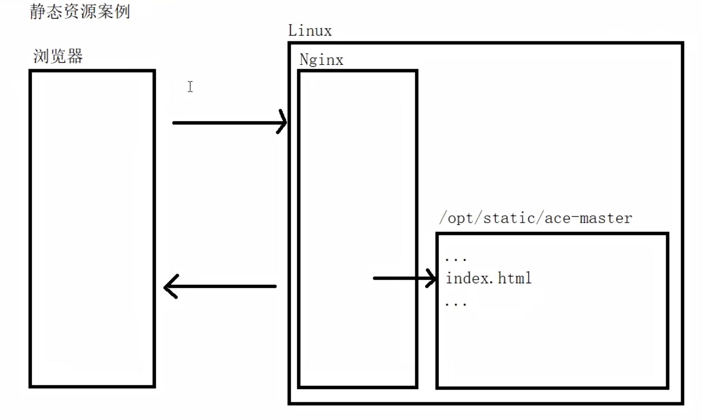

* 上传 `ace-master.zip` 到Linux服务器中

* 安装命令

  * `yum intall -y unzip vim`

* 将 `ace-master` 移动到 `/opt/static` 中

* 编写nginx的配置文件

  * ```shell
    ...
    location / {
        # html in /usr/local/nginx/html
        # root   html;
        # web -->  http://192.168.64.128:80/  -->  /opt/static/ace-master/index.html
        root   /opt/static/ace-master;
        index  index.html index.htm;
    }
    
    location /ace-master {
        # web -->  http://192.168.64.128:80/ace-master  -->  /opt/static
        root /opt/static;
        index index.html;
    }
    ...
    ```

* 启动测试

  * `http://192.168.64.128` 不带项目名的静态资源访问
  * `http://192.168.64.128/ace-master` 带项目名的静态资源访问

 ## 案例二、负载均衡

* 轮询
  * 将请求平均转发到所有服务器中，轮询操作
  * 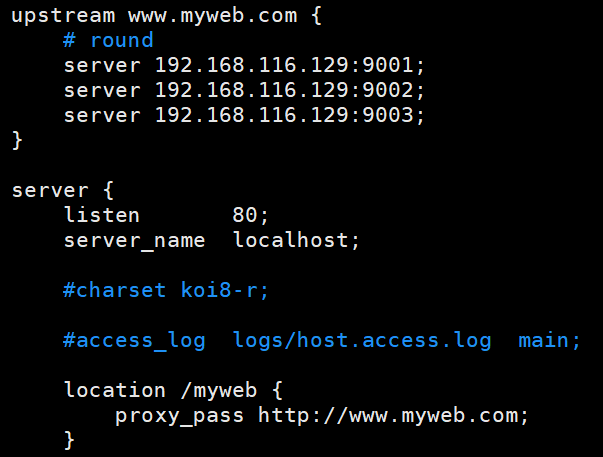
* 权重
  * 根据权重的匹配规则，将请求按照比例分配到对应的服务器中，权重操作
  * 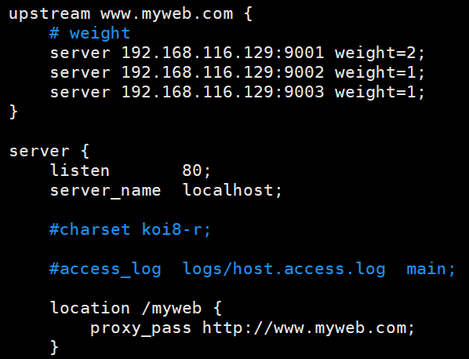
* 最少连接
  * 将当前连接数最少的服务器，进行请求的转发
  * 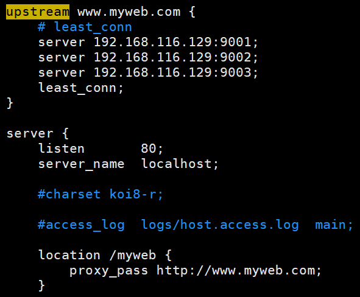
* ip hash
  * 当浏览器ip地址不变情况下，单机访问
    * hash(浏览器ip) % 服务器数量 = 索引值
  * 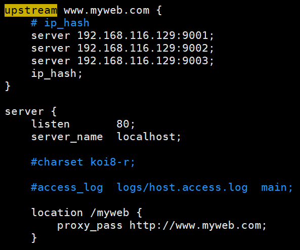

* 其他参数
  * down
    * 被该属性修饰的服务器，无法参与负载均衡操作。相当于下线
    * 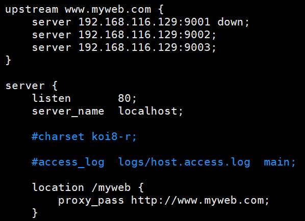
  * bakcup
    * 被该属性修饰的服务器，是当做备份机使用
      * 备份机
        * 当前如果服务器集群如果有正常的服务器对外提供访问，备份机则无法被访问
        * 如果当前所有服务器全部故障或宕机，备份机则提供负载均衡访问
    * 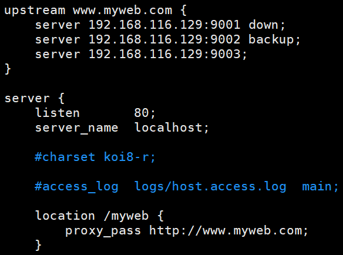

### Tomcat案例

* 上传 Tomcat 到Linux服务器中
* 解压缩到 `/usr/local` 目录下
* 复制3份服务器到 `/usr/local` 目录下
  * `cp -R apache-tomcat-9.0.13 tomcat9001`
  * `cp -R apache-tomcat-9.0.13 tomcat9002`
  * `cp -R apache-tomcat-9.0.13 tomcat9003`
* 修改Tomcat的端口号
  * 每台服务器修改3个
    * 8080修改为9001 9002 9003
    * 8005修改为8004 8003
    * 8009修改为8008 8007
    * 8443无需修改，有两个
  * 修改Tomcat服务器的index.jsp文件，标识9001 9002 9003
    * `/usr/local/tomcat-9001/webapps/ROOT/index.jsp`
    * `/usr/local/tomcat-9002/webapps/ROOT/index.jsp`
    * `/usr/local/tomcat-9003/webapps/ROOT/index.jsp`
* 修改nginx配置文件

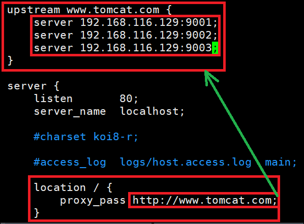

* 访问时，当前无需加载项目名称

### Myweb案例

* 将 myweb.war 上传到Linux服务器中
* 将 myweb.war 复制到 9001 9002 9003服务器中
  * `cp myweb.war /usr/local/tomcat-9001/webapps/`
  * `cp myweb.war /usr/local/tomcat-9002/webapps/`
  * `cp myweb.war /usr/local/tomcat-9003/webapps/`
  * 此时Tomcat会自动将war包进行解压缩
* 修改index.jsp的文件，标识出 9001 9002 9003 各自服务器
* 修改nginx的配置文件

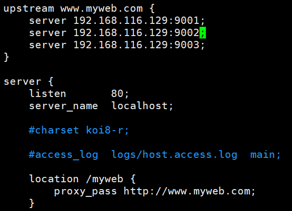

* 访问时，当前需要加载项目名称


## 案例三、静态代理

* 动态的请求，访问的是Tomcat资源
* 静态的请求，访问的是本地的静态资源 `/opt/static`

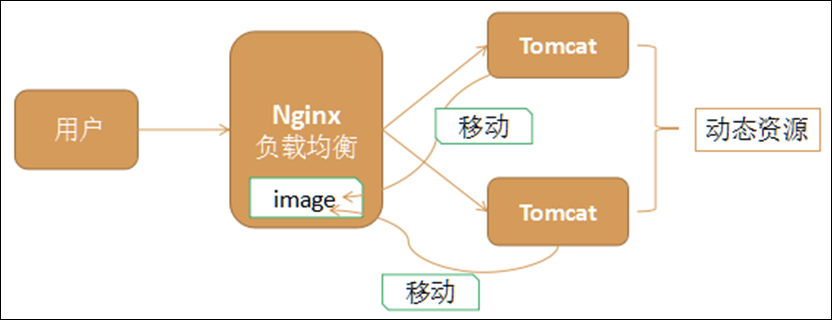

### 通配符

* `.`
  * 第一个点 `.` 表示任意字符
* `*`
  * 表示一个或多个字符
* `\.`
  * 是转移字符，是后面这个点的转移字符
  * `.jpg`，如果第一个点不添加转义 ，会认为是任意字符
* `|`
  * 表示或者
* `$`
  * 表示结尾

### 动态的请求

* 负载均衡访问，Tomcat集群

### 静态的请求

1. 通过后缀名进行区分
   * http://192.168.64.128/myweb/image/001.jpg
   * 访问的请求固定以 `.jpg` 后缀名结尾
   * 不推荐使用的原因，是因为后缀名太多了
   * 
2. 通过目录中的关键字进行区分 `推荐`
   * http://192.168.64.128/myweb/image/001.jpg
   * 访问的请求路径中，包含 `image` 关键字，代表获取的是图片资源
   * 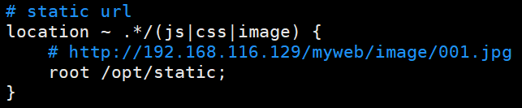
3. 创建目录，并删除Tomcat中的静态资源
   * 创建目录
     * `mkdir /opt/static/myweb`
     * `mkdir /opt/static/myweb/image`
   * 将Tomcat中的myweb项目中的 `myweb/image/001.jpg` 图片移动到 `/opt/static/myweb/image/` 下
   * 删除 9001 9002 9003 中的服务器的静态资源
4. Nginx配置文件 `二选一`

* 拦截后缀名

* 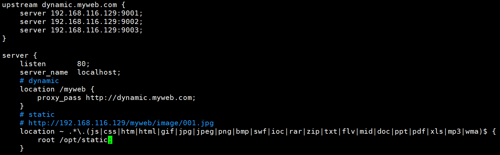
* 拦截资源路径中的关键字 `推荐`

* 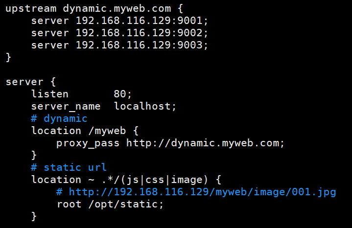

5. 测试
   * 访问服务器
   * http://192.168.64.128/myweb/
   * 
   * 图片资源响应状态码为403，不是404
     * 403代表权限问题，`/opt/static/myweb/image/001.jpg` 它的文件夹或图片资源的权限问题
     * 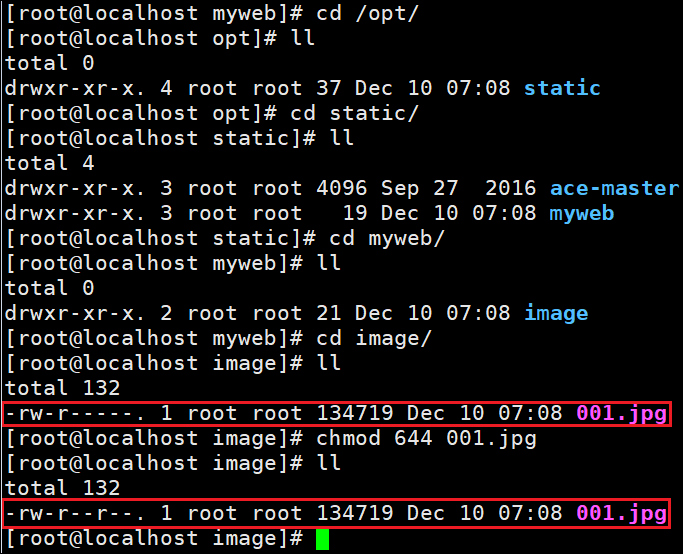
   * 当权限被修改后，只需要只读的权限，即可被访问


## 案例四、动静分离

* 动态资源负载均衡操作
  * 通过Nginx80，进行负载均衡
* 静态资源负载均衡操作
  * 以拦截路径中的关键字进行区分静态资源文件

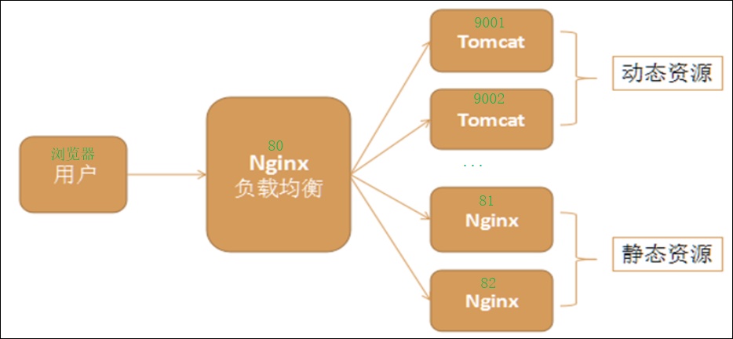

* 编辑Nginx配置文件
  * 80 `负载均衡动态资源和静态资源`
    * 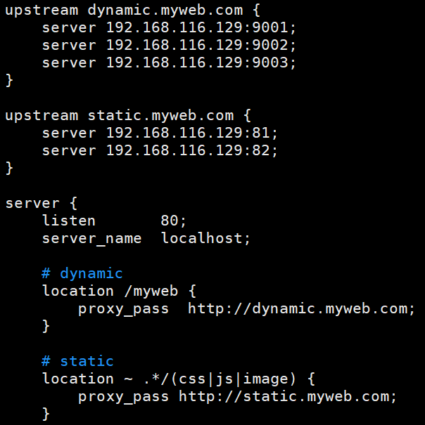
  * 81 `访问本地静态资源`
    * 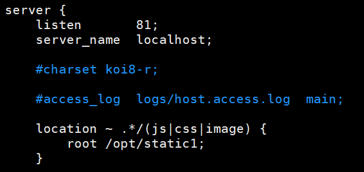
  * 82 `访问本地静态资源`
    * 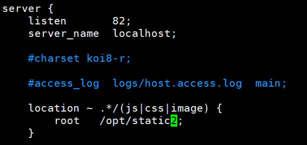

## 案例五、虚拟主机

* 上传 `beijing.war` `nanjing.war` `tianjin.war` 到Linux服务器中
* 清除 9001/9002/9003的ROOT文件夹下所有内容
* 将war包部署到每台的ROOT文件夹中
  * 解压缩
* Nginx配置文件
  * 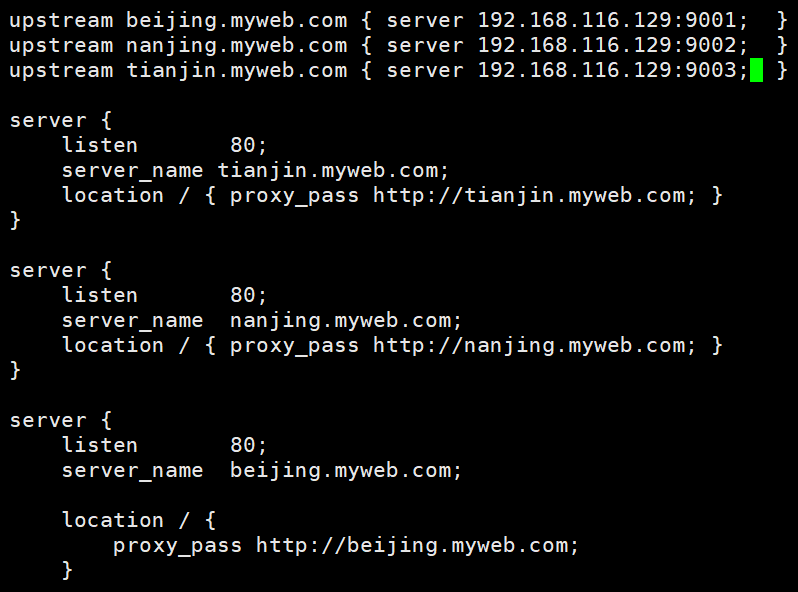
* 添加window的域名与ip地址的映射关系
  * 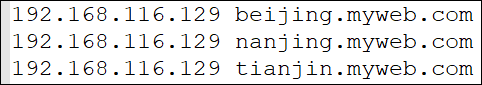

## 测试工具 `Jmeter`

* 官方的的每秒钟的转发请求操作时5万

* 案例一测试报告：
  * 工作进程数：1
    * 吞吐量：4600/s
  * 工作进程数：8
    * 吞吐量：4600/s
* 案例二测试报告：
  * 工作进程数：1
    * 吞吐量：4000/s
  * 工作进程数：8
    * 吞吐量
* 案例三测试报告：
  * 工作进程数：1
    * 吞吐量：3600/s
  * 工作进程数：8
    * 吞吐量
* 案例四测试报告：
  * 工作进程数：1
    * 3台Tomcat、3台Nginx
    * 吞吐量：`3000/s`
  * 工作进程数：8
    * 3台Tomcat、3台Nginx
    * 吞吐量：`7200/s`