# FastDFS `分布式文件存储系统`

``FastDFS``是一个开源的轻量级``分布式文件系统``，为互联网应用量身定做，简单、灵活、高效，采用C语言开发，由阿里巴巴开发并开源。

​    ``FastDFS``对``文件``进行管理，功能包括：文件存储、文件同步、文件访问（文件上传、文件下载、文件删除）等，解决了``大容量文件存储``的问题，特别适合``以文件为载体的在线服务``，如相册网站、文档网站、图片网站、视频网站等等。

​    FastDFS充分考虑了冗余备份、线性扩容等机制，并注重高可用、高性能等指标，使用FastDFS很容易搭建一套高性能的文件服务器集群提供文件上传、下载等服务。

#### 分布式文件系统与传统文件系统对比

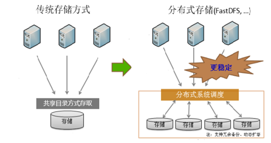

#### FastDFS整体架构

​    ``FastDFS文件系统``由两大部分构成，一个是``客户端``，一个是``服务端``

​    ``客户端通常指我们的程序``，比如我们的Java程序去连接FastDFS、操作FastDFS，那我们的Java程序就是一个客户端，FastDFS提供专有API访问，目前提供了C、``Java``和PHP几种编程语言的API，用来访问FastDFS文件系统。

   ``服务端由两个部分构成``：一个是``跟踪器（tracker）``，一个是``存储节点（storage）``

​    跟踪器（tracker）主要做``调度``工作，在``内存``中记录集群中存储节点storage的状态信息，是``前端Client和后端存储节点storage的枢纽``。因为相关信息全部在内存中，``Tracker server的性能非常高``，一个较大的集群（比如上百个group）中有3台就足够了。

   `` 存储节点（storage）``用于``存储文件``，包括``文件``和``文件属性（meta data）``都保存到存储服务器磁盘上，完成文件管理的所有功能：文件存储、文件同步和提供文件访问等。

## FastDFS环境搭建

1. #### 安装前准备：

   ```she
   yum install gcc libevent libevent-devel -y
   ```

2. #### 安装libfastcommon库

   libfastcommon 库是 FastDFS 文件系统运行需要的公共 C 语言函数库

   (1)通过xftp7将下载好的libfastcommon文件上传到Linuxs

   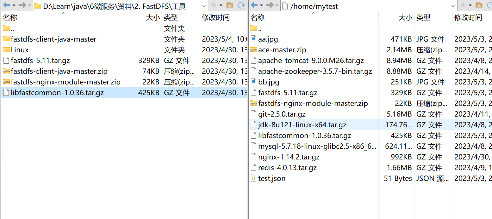

   (2)解压下载下来的tar.gz压缩包到当前目录

   ```she
   tar -zxvf libfastcommon-1.0.36.tar.gz -C /uer/local
   ```

   (3)切换到解压后的libfastcommon目录

   ```shell
   cd /usr/local/libfastcommon-1.0.36
   ```

   (4)执行make脚本进行编译, 执行make install进行安装

   ```she
   ./make.sh 
   ./make.sh install
   ```

3. #### 安装FastDFS

   (1)通过xftp7

   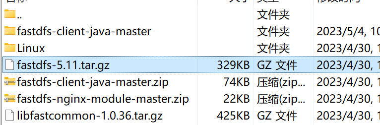

   

   步骤同2.(2)~(4)

   所有编译出来的文件存放在/usr/bin**目录下

   所有配置文件存放在/etc/fdfs**目录下

   (5)查看安装后的效果

   ```shell
   ll /usr/bin/fdfs*
   ```

   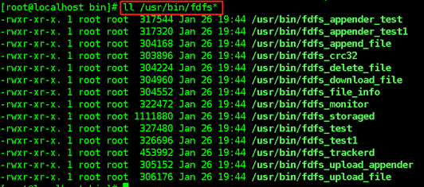

   (6)**注意**需要把解压后的``fastdfs-5.11/conf``目录下的两个文件拷贝到``/etc/fdfs/`` ，否则后续会有很多奇怪问题不好解决

   ```she
   cp http.conf /etc/fdfs/
   cp mime.types /etc/fdfs/
   ```

4. #### FastDFS配置

   (1))去掉**/etc/fdfs/**目录下FastDFS配置文件的后缀名**sample**

   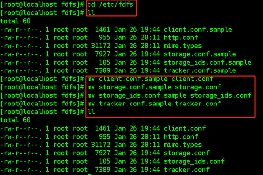

   (2)修改tracker.conf文件

   ```she
   base_path=/opt/fastdfs/tracker       #配置tracker存储数据的目录
   ```

   (3)修改storage.conf文件

   ```shell
   base_path=/opt/fastdfs/storage 			#storage存储数据目录
   store_path0=/opt/fastdfs/storage/files 	#真正存放文件的目录
   tracker_server=192.168.64.128:22122 	#注册当前存储节点的跟踪器地址
   
   ```

   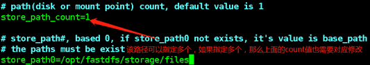

   (4) 在Linux服务器上创建上面指定的目录

   /opt/fastdfs/tracker

   /opt/fastdfs/storage

   /opt/fastdfs/storage/files

   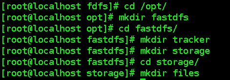

5. #### 启动FastDFS

   (1)FastDFS服务启动需要启动两个脚本：tracker.conf;  storage.conf

   在任意目录下执行：

   ```she
   fdfs_trackerd /etc/fdfs/tracker.conf
   ```

   在任意目录下执行：

   ```shell
   fdfs_storaged /etc/fdfs/storage.conf
   ```

   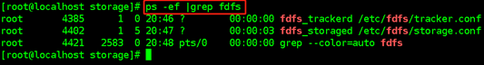

   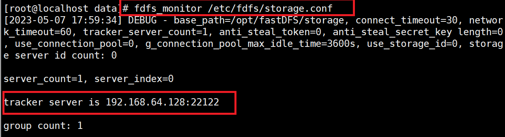

   (2)首次启动storage后，会在配置的路径下创建存储文件的目录

   

   (3)重启FastDFS: restart（仅限单机可以使用restart）

   ```shell
   fdfs_trackerd /etc/fdfs/tracker.conf restart
   fdfs_storaged /etc/fdfs/storage.conf restart
   ```

   (4)关闭FastDFS

   在任意目录下执行：

   ```shell
   fdfs_trackerd /etc/fdfs/tracker.conf stop
   fdfs_storaged /etc/fdfs/storage.conf stop
   ```

   或者kill关闭fastdfs，但不建议在线上使用 kill -9 强制关闭，因为可能会导致文件信息不同步问题

6. #### FastDFS测试

   (1)测试之前，需要修改``client.conf``配置文件，修改两个配置

   ```shell
   cd /etc/fdfs/
   base_path=/opt/fastdfs/client
   tracker_server=192.168.64.128:22122
   ```

    (2)在/opt/fastdfs/目录下创建client

   (3)执行上传命令

   ```shell
   fdfs_test /etc/fdfs/client.conf upload xxxxx(要上传的文件路径) 
   ```

   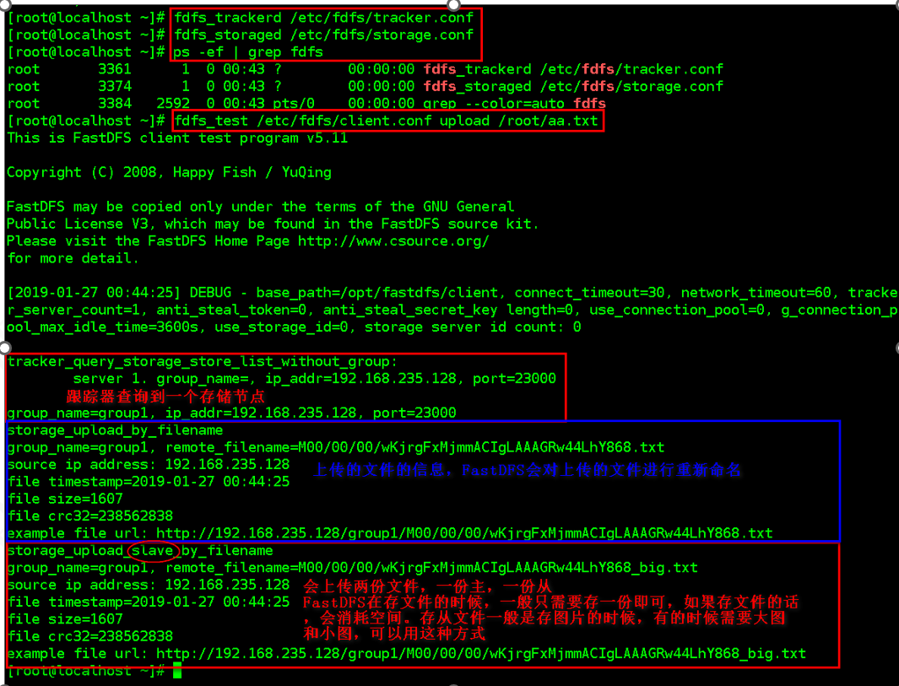

   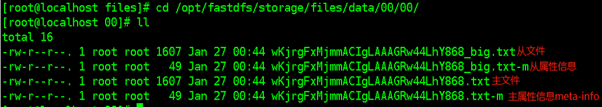

   (4)FastDFS生成的文件目录结构及名称示例

   

   (5)测试文件删除

   fdfs_delete_file /etc/fdfs/client.conf group1/要删除的文件路径

   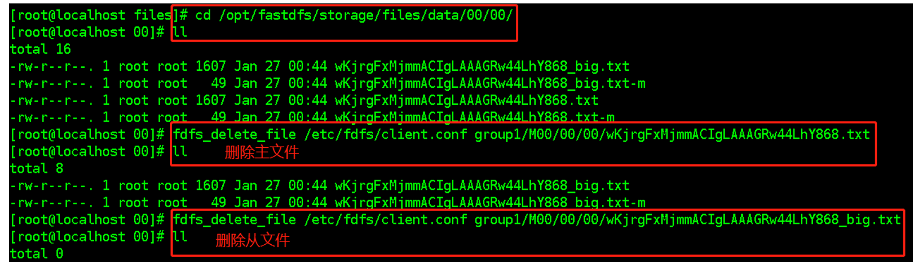

   (6)注意

   没有搭建集群默认只有一个组group1 

   后缀名包含-m的为属性文件(meta)

   在Linux中并没有磁盘一说,是虚拟的

   ##  分布式文件系统FastDFS的HTTP访问

   在文件上传的时候，上传成功的信息中有提示我们可以通过某个路径去访问上传的文件，但是我们直接访问这个路径，却不可以，那么**已经上传到FastDFS文件系统中的文件，我们如何在浏览器中访问呢？**

   ​    FastDFS提供了一个``Nginx扩展模块``，利用该模块，我们``可以通过Nginx访问已经上传到FastDFS上的文件``

   1. #### 准备工作

      (1)通过xftp7将Fastdfs的Nginx扩展模块源代码``fastdfs-nginx-module-master.zip``上传到Linux上

      (2)解压下载下来的fastdfs-nginx-module-master.zip 文件

      ```shell
      unzip fastdfs-nginx-module-master.zip
      ```

   2. #### 安装Nginx并且添加fastDFS模块

      因为这个模块必须在Nginx的安装的过程中才能添加，所有我们需要重新安装一个nginx，为了和原来已安装的Nginx进行区分，我们把新安装的Nginx取名为nginx_fdfs

      (1)通过xftp7将Nginx的tar包``nginx-1.14.2.tar.gz``上传到Linux上

      (2)解压到/usr/local

      (3)切换至解压后的``Nginx主目录``，执行配置操作

      ```she
      cd /usr/local/nginx-1.14.2
      ./configure --prefix=/usr/local/nginx_fdfs --add-module=/usr/local/fastdfs-nginx-module-master/src
      ```

       --prefix是指定nginx安装路径

       --add-module指定fastDFS的nginx模块的源代码路径

      (4)执行make脚本进行编译, 执行make install进行安装

      ```she
      ./make.sh 
      ./make.sh install
      ```

   3. #### FastDFS的Nginx访问配置

      (1)将/usr/local/fastdfs-nginx-module-master/src``(自己实际存放Nginx扩展模块的目录)``目录下的mod_fastdfs.conf文件拷贝到 /etc/fdfs/目录下，这样才能正常启动Nginx

      ```she
      cp /usr/local/fastdfs-nginx-module-master/src/mod_fastdfs.conf /etc/fdfs/
      ```

      (2)修改mod_fastdfs.conf配置文件

      ```shell
      base_path=/opt/fastdfs/nginx_mod
      tracker_server=192.168.64.128:22122
      url_have_group_name = true
      store_path0=/opt/fastdfs/storage/files
      ```

      (3) 在/opt/fastdfs/目录下创建nginx_mod目录

      (4) 配置Nginx的配置文件

      ```shell
      cd /usr/local/nginx_fdfs/conf/
      vim nginx.conf
      location ~ /group[1-9]/M0[0-9] {	
           ngx_fastdfs_module;  
      }
      #ngx_fastdfs_module:这个指令不是Nginx本身提供的，是扩展模块提供的，根据这个指令找到FastDFS提供的Nginx模块配置文件，然后找到Tracker，最终找到Stroager
      ```

   4. #### FastDFS的Nginx访问启动与测试

      (1) 启动带有Fastdfs模块的Nginx

      ```shell
      /usr/local/nginx_fdfs/sbin/nginx -c /usr/local/nginx_fdfs/conf/nginx.conf -t
      /usr/local/nginx_fdfs/sbin/nginx -c /usr/local/nginx_fdfs/conf/nginx.conf
      ```

      (2) 重启或启动FastDFS服务进程

      ```shell
      fdfs_trackerd /etc/fdfs/tracker.conf restart
      fdfs_storaged /etc/fdfs/storage.conf restart
      ```

      (3)上传一个文件进行测试验证

      ```shell
      fdfs_test /etc/fdfs/client.conf upload /root/aa.txt
      ```

      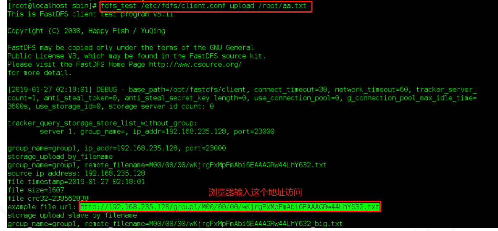

      (4)在浏览器访问上传的文件:输入上述url即可

      当遇到400错误，检查配置/etc/fdfs/mod_fastdfs.conf url_have_group_name=true 

      该配置表示访问路径中是否需要带有group1，改为true表示路径中需要有group1

## FastDFS在Java项目中开发示例

1. #### 准备工作

   (1)从https://codeload.github.com/happyfish100/fastdfs-client-java/zip/master 上下载FastDFS源代码到本地并解压缩

   ``fastdfs-client-java-master.zip``

   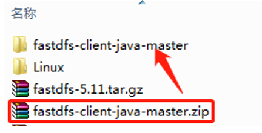

   (2) 采用maven命令编译成jar安装到本地maven库

   mvn clean install

   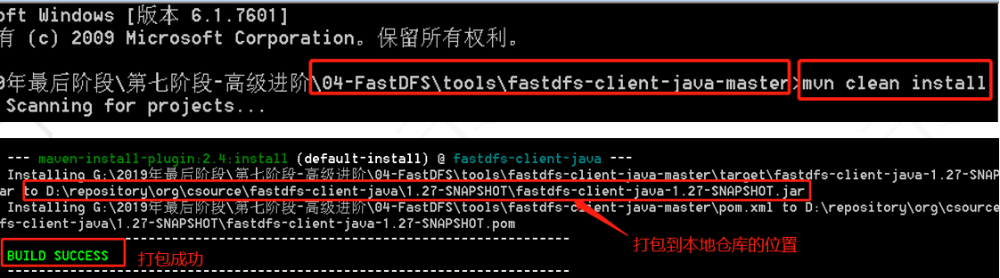

2. IDEA配置

   (1)使用IDEA创建普通的maven项目，不需要使用框架

   (2)在pom.xml文件中添加我们打包好的FastDFS本地仓库的jar包（FastDFS的java客户端依赖）

   ```shell
   <!--加入FastDFS的java客户端依赖-->
   <dependencies>
       <dependency>
           <groupId>org.csource</groupId>
           <artifactId>fastdfs-client-java</artifactId>
           <version>1.27-SNAPSHOT</version>
       </dependency>
   </dependencies>
   ```

   (3)拷贝源代码包``fastdfs-client-java-master``中的``fdfs_client.conf``文件到``resources``目录下，在里面主要配置tracker地址

   ```shell
   connect_timeout = 2
   network_timeout = 30
   charset = UTF-8
   http.tracker_http_port = 8080
   http.anti_steal_token = no
   http.secret_key = FastDFS1234567890
   
   tracker_server = 192.168.64.128:22122
   #tracker_server = 192.168.64.130:22122
   #tracker_server = 192.168.64.133:22122
   ```

   (4)编写代码进行测试SpringBoot集成FastDFS操作 （单独列了一个在章节）

   

## SpringBoot集成FastDFS操作 

### 环境信息

* pom.xml

```xml
 <dependencies>
        <dependency>
            <groupId>org.springframework.boot</groupId>
            <artifactId>spring-boot-starter-web</artifactId>
        </dependency>

        <dependency>
            <groupId>org.springframework.boot</groupId>
            <artifactId>spring-boot-starter-test</artifactId>
            <scope>test</scope>
        </dependency>
        <!--FastDFS的java客户端依赖-->
        <dependency>
            <groupId>org.csource</groupId>
            <artifactId>fastdfs-client-java</artifactId>
            <version>1.27-SNAPSHOT</version>
        </dependency>

        <dependency>
            <groupId>org.springframework.boot</groupId>
            <artifactId>spring-boot-starter-thymeleaf</artifactId>
        </dependency>

        <!--lombok-->
        <dependency>
            <groupId>org.projectlombok</groupId>
            <artifactId>lombok</artifactId>
            <version>1.18.20</version>
        </dependency>

        <!--七牛云坐标依赖及相关依赖包-->
        <dependency>
            <groupId>com.qiniu</groupId>
            <artifactId>qiniu-java-sdk</artifactId>
            <version>7.7.0</version>
        </dependency>

        <dependency>
            <groupId>com.squareup.okhttp3</groupId>
            <artifactId>okhttp</artifactId>
            <version>3.14.3</version>
            <scope>compile</scope>
        </dependency>
        <dependency>
            <groupId>com.google.code.gson</groupId>
            <artifactId>gson</artifactId>
            <version>2.8.5</version>
            <scope>compile</scope>
        </dependency>
        <dependency>
            <groupId>com.qiniu</groupId>
            <artifactId>happy-dns-java</artifactId>
            <version>0.1.6</version>
            <scope>test</scope>
        </dependency>
        <dependency>
            <groupId>junit</groupId>
            <artifactId>junit</artifactId>
            <version>4.12</version>
            <scope>test</scope>
        </dependency>

    </dependencies>
```

* application.properties

```yml
#修改内置tomcat上下文和端口号
server.port=8001
server.servlet.context-path=/

#关闭thymeleaf的页面缓存
spring.thymeleaf.cache=false

#设置thymeleaf的视图解析器（可选，有默认）
spring.thymeleaf.prefix=classpath:/templates/
spring.mvc.view.suffix=.html
```

* Html页面

```html
<!DOCTYPE html>
<html lang="en">
<head>
    <meta charset="UTF-8">
    <title>文件上传页面</title>
</head>
<body>

<!--
    1.文件上传的表单
        提交方式必须为post :  GET - 从指定的资源请求数据。 POST - 向指定的资源提交要被处理的数据。
        enctype属性必须为multipart/form-data
        指定action请求路径
    2.文件上传框
        input标签type为file
        input标签的name属性和后台接收的参数(MultipartFile)必须一致
    3.提交按钮
-->
<h1>---FastDFS文件上传操作---</h1>
<form action="/uploadFile" method="post" enctype="multipart/form-data">
    <br/>
    <input type="file" name="uploadFile">
    <br/><br/>
    <input type="submit" value="上传">
</form>

<hr>
<button onclick="window.location.href='/downloadFile2Local?groupName=group1&remoteFileName=M00/00/00/wKhAgGRTWEqAcb6YAAddqElD6Pc236.jpg&localFileName=C:/Users/yanyu/Desktop/ans'">文件下载到本地</button>
<br/><br/>
<button onclick="window.location.href='/downloadFile2Local?groupName=group1&remoteFileName=M00/00/00/wKhAgGRTWEqAcb6YAAddqElD6Pc236.jpg'">文件下载到本地</button>
<br/><br/>
<button onclick="window.location.href='/downloadFile2Client?groupName=group1&remoteFileName=M00/00/00/wKhAgGRTWEqAcb6YAAddqElD6Pc236.jpg'">文件下载到浏览器</button>
<br/><br/>
<hr>
<button onclick="window.location.href='/deleteFile?groupName=group1&remoteFileName=M00/00/00/wKhAgGRTWEqAcb6YAAddqElD6Pc236.jpg'">删除远程文件</button>
<br/>
<hr>
<br/>
<br/>
<h1>---七牛云文件上传操作---</h1>
<hr>
<button onclick="window.location.href='/qiniuUpload1'">上传文件-七牛云-hello</button>
<hr>
<form action="/qiniuUpload2" method="post" enctype="multipart/form-data">
    <br/>
    <input type="file" name="uploadFile">
    <br/>
    <br/>
    <input type="submit" value="上传">
</form>

</body>
</html>
```

编写FastDFSUtil.java

```shell
package com.work.fastdfs.utils;

import org.csource.common.MyException;
import org.csource.fastdfs.*;
import org.springframework.stereotype.Component;

import java.io.IOException;
import java.util.UUID;

/**
 * ClassName:FastDFSConfig
 * Package:com.work.fastdfs.utils
 * Description: 与远程建立连接，进行文件的上传下载删除等操作
 *
 * @date:2023/5/4 10:39
 * @author:yueyue
 */
@Component
public class FastDFSUtil {
    public static void main(String[] args) throws IOException, MyException {


        //上传文件（从本地到远端）
        String url = localFileUpload("C:\\Users\\yanyu\\Desktop\\bb.jpg");
        System.out.println(url);             //http://192.168.64.128/group1/M00/00/00/wKhAgGRTLsqAEg28AAPthACz3X4944.jpg

        //下载文件（从远端到本地）
//        localFileDownload("group1","M00/00/00/wKhAgGRTLsqAEg28AAPthACz3X4944.jpg","C:\\Users\\yanyu\\Desktop\\cc");
//        localFileDownload("group1","M00/00/00/wKhAgGRTLsqAEg28AAPthACz3X4944.jpg");

        //删除文件(删除远程文件) 文件在Linux下的/opt/fastDFS/storage/files/data/00/00文件夹中
//        deleteFile("group1","M00/00/00/wKhAgGRTLsqAEg28AAPthACz3X4944.jpg");


    }
```


### 文件上传

```java
    public static String bytesFileUpload(byte[] bytes,String suffix) throws IOException, MyException {

        StorageClient storageClient = getStorageClient();

        String[] uploadArray = storageClient.upload_file(bytes, suffix, null);

        if(uploadArray == null || uploadArray.length == 0){
            //上传失败
            throw new MyException("上传失败...");
        }

        return "http://192.168.116.129/"+uploadArray[0]+"/"+uploadArray[1];

    }

    public static String localFileUpload(String localFileName) throws IOException, MyException {

        //获取后缀名
        String suffix = localFileName.substring(localFileName.lastIndexOf(".") + 1);

        StorageClient storageClient = getStorageClient();
        //上传文件  第一个参数：本地文件路径 第二个参数：上传文件的后缀 第三个参数：文件信息
        //上传成功后，会将群组名称和远程文件名称返回
        String[] uploadArray = storageClient.upload_file(localFileName, suffix, null);

        if(uploadArray == null || uploadArray.length == 0){
            //上传失败
            throw new MyException("上传失败...");
        }

        return "http://192.168.116.129/"+uploadArray[0]+"/"+uploadArray[1];

    }

    private static StorageClient getStorageClient(){
        TrackerServer trackerServer = null;
        StorageServer storageServer = null;
        try {
            //1.加载配置文件，默认去classpath下加载
            ClientGlobal.init("fdfs_client.conf");
            //2.创建TrackerClient对象
            TrackerClient trackerClient = new TrackerClient();
            //3.创建TrackerServer对象
            trackerServer = trackerClient.getConnection();
            //4.创建StorageServler对象
            storageServer = trackerClient.getStoreStorage(trackerServer);
            //5.创建StorageClient对象，这个对象完成对文件的操作
            StorageClient storageClient = new StorageClient(trackerServer, storageServer);

            if(storageClient == null)
                return null;

            return storageClient;
        } catch (IOException e) {
            e.printStackTrace();
        } catch (MyException e) {
            e.printStackTrace();
        } finally {
            if (storageServer != null) {
                try {
                    storageServer.close();
                } catch (IOException e) {
                    e.printStackTrace();
                }
            }
            if (trackerServer != null) {
                try {
                    trackerServer.close();
                } catch (IOException e) {
                    e.printStackTrace();
                }
            }
        }
        return null;
    }
```


### 文件下载

```java
    public static byte[] bytesFileDownload(String groupName,String remoteFileName) throws IOException, MyException {

        StorageClient storageClient = getStorageClient();

        //参数1：群组名称
        //参数2：远程文件名称
        //参数3：本地下载绝对路径，C:\Users\Administrator\Desktop\aaa.jpg，当前路径+文件名称，必须要有文件名称

        String suffix = remoteFileName.substring(remoteFileName.lastIndexOf("."));

        String newFileName = UUID.randomUUID().toString()+suffix;
        //可以指定具体路径的下载方式
        return storageClient.download_file(groupName,remoteFileName);

    }

    public static void localFileDownload(String groupName,String remoteFileName,String localFileName) throws IOException, MyException {

        StorageClient storageClient = getStorageClient();

        //参数1：群组名称
        //参数2：远程文件名称
        //参数3：本地下载绝对路径，C:\Users\Administrator\Desktop\aaa.jpg，当前路径+文件名称，必须要有文件名称

        String suffix = remoteFileName.substring(remoteFileName.lastIndexOf("."));

        String newFileName = UUID.randomUUID().toString()+suffix;
        //可以指定具体路径的下载方式
        storageClient.download_file(groupName,remoteFileName,localFileName+"\\"+newFileName);

    }

    public static void localFileDownload(String groupName,String remoteFileName) throws IOException, MyException {

        StorageClient storageClient = getStorageClient();

        //参数1：群组名称
        //参数2：远程文件名称
        //参数3：本地下载绝对路径，C:\Users\Administrator\Desktop\aaa.jpg，当前路径+文件名称，必须要有文件名称

        String suffix = remoteFileName.substring(remoteFileName.lastIndexOf("."));

        String newFileName = UUID.randomUUID().toString()+suffix;
        //指定固定位置的下载方式
        storageClient.download_file(groupName,remoteFileName,"C:\\Users\\Administrator\\Desktop\\"+newFileName);

    }
```


### 文件删除

```java
    public static void deleteFile(String groupName,String remoteFileName) throws IOException, MyException {

        StorageClient storageClient = getStorageClient();

        storageClient.delete_file(groupName,remoteFileName);

    }
```

### Controller

```shell
package com.work.fastdfs.controller;

import com.work.fastdfs.utils.FastDFSUtil;
import com.work.fastdfs.utils.QiNiuYunUtil;
import org.csource.common.MyException;
import org.springframework.beans.factory.annotation.Autowired;
import org.springframework.stereotype.Controller;
import org.springframework.web.bind.annotation.RequestMapping;
import org.springframework.web.bind.annotation.RequestParam;
import org.springframework.web.bind.annotation.ResponseBody;
import org.springframework.web.multipart.MultipartFile;

import javax.servlet.http.HttpServletResponse;
import java.io.IOException;
import java.util.HashMap;
import java.util.Map;

/**
 * ClassName:UPloadController
 * Package:com.work.fastdfs.controller
 * Description: 描述信息
 *
 * @date:2023/5/4 12:57
 * @author:yueyue
 */
@Controller
public class UPloadController {

    @Autowired
    FastDFSUtil fastDFSUtil;

    @Autowired
    QiNiuYunUtil qiNiuYunUtil;

    @RequestMapping("/")
    public String indexView(){
        return "index";
    }

    /**上传文件*/
    @RequestMapping("/uploadFile")
    @ResponseBody
    public Map<String,Object> upload(MultipartFile uploadFile) throws IOException, MyException {
        //获取上传文件的字节数组
        byte[] bytes = uploadFile.getBytes();

        //获取文件的名称及后缀名称
        String suffix = uploadFile.getOriginalFilename().substring(uploadFile.getOriginalFilename().lastIndexOf(".") + 1);

        String url = fastDFSUtil.bytesFileUpload(bytes,suffix);
        Map<String,Object> resultMap = new HashMap<>();
        //上传失败
        if(url == null){
            resultMap.put("code",1);
            resultMap.put("message","上传失败！");
            return resultMap;
        }
       //上传成功
        resultMap.put("code",0);
        resultMap.put("message","上传成功！");
        resultMap.put("data",url);
        return resultMap;
    }

    /**下载文件*/
    //当前如果通过get方式进行传递接收参数，尽量不要使用RestFul风格的api操作
    @RequestMapping("/downloadFile2Local")
    @ResponseBody
    //@RequestParam(required = false)  String localFileName：表明 localFileName参数不是必须的
    public Map<String,Object> downloadFile2Local(String groupName,String remoteFileName,@RequestParam(required = false) String localFileName) throws IOException, MyException {

        Map<String,Object> resultMap = new HashMap<>();

        if(localFileName != null){
            fastDFSUtil.localFileDownload(groupName,remoteFileName,localFileName);
            resultMap.put("code",0);
            resultMap.put("msg","下载成功...");
            return resultMap;
        }
        //没有传递本地的路径通过本地下载
        fastDFSUtil.localFileDownload(groupName,remoteFileName);
        //上传成功
        resultMap.put("code",0);
        resultMap.put("msg","下载成功...");
        return resultMap;
    }

    @RequestMapping("/downloadFile2Client")
    public void downloadFile2Client(String groupName,
                                    String remoteFileName,
                                    @RequestParam(required = false) String localFileName,
                                    HttpServletResponse response) throws IOException, MyException {

        if(localFileName != null){
            fastDFSUtil.localFileDownload(groupName,remoteFileName,localFileName);
        }

        //设置响应头相关的内容
        //浏览器识别后，会打开下载框完成下载操作
//        response.setContentType();
        //设置下载完成后的文件名称
        response.setHeader("Content-Disposition","attachment;filename="+remoteFileName);

        //通过本地下载
        byte[] bytes = fastDFSUtil.bytesFileDownload(groupName, remoteFileName);

        //将字节文件响应回浏览器
        response.getOutputStream().write(bytes);

    }


    /**删除文件*/
    @RequestMapping("/deleteFile")
    @ResponseBody
    public Map<String,Object> deleteFile(String groupName,String remoteFileName) throws IOException, MyException {
        fastDFSUtil.deleteFile(groupName,remoteFileName);
        Map<String,Object> resultMap = new HashMap<>();
        resultMap.put("code",0);
        resultMap.put("message","删除成功！");
        return resultMap;
    }


    /**七牛云文件上传*/
    @RequestMapping("/qiniuUpload1")
    @ResponseBody
    public Map<String,Object> qiniuUpload(){

        String fileName = qiNiuYunUtil.uploadFile();
        Map<String,Object> resultMap = new HashMap<>();
        resultMap.put("code",0);
        resultMap.put("message","七牛云上传文件成功！");
        resultMap.put("data","http://ru4iukum2.hn-bkt.clouddn.com/"+fileName);
        return resultMap;
    }

    @RequestMapping("/qiniuUpload2")
    @ResponseBody
    public Map<String,Object> qiniuUpload(MultipartFile uploadFile) throws IOException {

        String fileName = qiNiuYunUtil.uploadFileByte(uploadFile.getBytes());

        Map<String,Object> resultMap = new HashMap<>();
        resultMap.put("code",0);
        resultMap.put("msg","上传成功啦！");
        resultMap.put("data","http://ru4iukum2.hn-bkt.clouddn.com/"+fileName);
        return resultMap;
    }


}

```


## SpringBoot集成七牛云操作

### 环境信息

* pom.xml

```xml
<!--七牛云坐标依赖及相关依赖包-->
<dependency>
    <groupId>com.qiniu</groupId>
    <artifactId>qiniu-java-sdk</artifactId>
    <version>7.7.0</version>
</dependency>

<dependency>
    <groupId>com.squareup.okhttp3</groupId>
    <artifactId>okhttp</artifactId>
    <version>3.14.3</version>
    <scope>compile</scope>
</dependency>
<dependency>
    <groupId>com.google.code.gson</groupId>
    <artifactId>gson</artifactId>
    <version>2.8.5</version>
    <scope>compile</scope>
</dependency>
<dependency>
    <groupId>com.qiniu</groupId>
    <artifactId>happy-dns-java</artifactId>
    <version>0.1.6</version>
    <scope>test</scope>
</dependency>
<dependency>
    <groupId>junit</groupId>
    <artifactId>junit</artifactId>
    <version>4.12</version>
    <scope>test</scope>
</dependency>
```


### 文件上传

```java
package com.work.fastdfs.utils;

import com.google.gson.Gson;
import com.qiniu.common.QiniuException;
import com.qiniu.http.Response;
import com.qiniu.storage.Configuration;
import com.qiniu.storage.Region;
import com.qiniu.storage.UploadManager;
import com.qiniu.storage.model.DefaultPutRet;
import com.qiniu.util.Auth;
import org.springframework.stereotype.Component;

import java.io.UnsupportedEncodingException;

/**
 * ClassName:QiNiuYunUtil
 * Package:com.work.fastdfs.utils
 * Description: 描述信息
 *
 * @date:2023/5/4 15:45
 * @author:yueyue
 */
@Component
public class QiNiuYunUtil {

    public static String uploadFile() {
        //构造一个带指定 Region 对象的配置类
        Configuration cfg = new Configuration(Region.huanan());
        //...其他参数参考类注释
        UploadManager uploadManager = new UploadManager(cfg);
        //...生成上传凭证，然后准备上传
        String accessKey = "bEEecQA37hpB44kcMDVA_1kTL71WPAaFZLx9D1Ly";
        String secretKey = "mFdwDfslDcWdnSRdJ6o0njp55zM6rR7lSWl_Xgup";
        String bucket = "yueyue-storage-01";
        //默认不指定key的情况下，以文件内容的hash值作为文件名
        String key = null;
        try {
            byte[] uploadBytes = "hello qiniu cloud,I am yueyue!".getBytes("utf-8");
            Auth auth = Auth.create(accessKey, secretKey);
            String upToken = auth.uploadToken(bucket);
            try {
                Response response = uploadManager.put(uploadBytes,key, upToken);
                //解析上传成功的结果
                DefaultPutRet putRet = new Gson().fromJson(response.bodyString(), DefaultPutRet.class);
                System.out.println(putRet.key);
                System.out.println(putRet.hash);
                return putRet.hash;

            } catch (QiniuException ex) {
                Response r = ex.response;
                System.err.println(r.toString());
                try {
                    System.err.println(r.bodyString());
                } catch (QiniuException ex2) {
                    //ignore
                }
            }
        } catch (UnsupportedEncodingException ex) {
            //ignore
        }
        return null;
    }

    public static String uploadFileByte(byte[] bytes) {
        //构造一个带指定 Region 对象的配置类
        Configuration cfg = new Configuration(Region.huanan());
        //...其他参数参考类注释
        UploadManager uploadManager = new UploadManager(cfg);
        //...生成上传凭证，然后准备上传
        String accessKey = "bEEecQA37hpB44kcMDVA_1kTL71WPAaFZLx9D1Ly";
        String secretKey = "mFdwDfslDcWdnSRdJ6o0njp55zM6rR7lSWl_Xgup";
        String bucket = "yueyue-storage-01";
        //默认不指定key的情况下，以文件内容的hash值作为文件名
        String key = null;
        try {
            Auth auth = Auth.create(accessKey, secretKey);
            String upToken = auth.uploadToken(bucket);
                            Response response = uploadManager.put(bytes, key, upToken);
                //解析上传成功的结果
                DefaultPutRet putRet = new Gson().fromJson(response.bodyString(), DefaultPutRet.class);
                System.out.println(putRet.key);
                System.out.println(putRet.hash);
                return putRet.hash;
        } catch (Exception ex) {
        }
        return null;
    }
}

```

##  FastDFS分布式文件系统集群

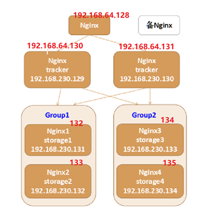

  搭建一个FastDFS分布式文件系统集群，推荐至少部署``6个服务器``节点；

### 搭建集群

1. #### 第一步：安装6个迷你版的Linux，

   迷你版Linux没有图形界面，占用磁盘及资源小，企业里面使用的Linux都是没有图形界面的Linux；

2. #### 第二步：安装迷你版Linux缺少一些常用的工具库

   由于迷你版Linux缺少一些常用的工具库，操作起来不方便，推荐安装如下的工具库：

1、安装lrzsz， yum install lrzsz -y

2、安装wget, yum install wget -y

4、安装vim， yum install vim -y

5、安装unzip，yum install unzip -y

6、安装ifconfig，yum install net-tools -y

yum install -y lrzsz wget vim unzip net-tools 

7、安装nginx及fastdfs需要的库依赖：

  yum install -y gcc perl openssl openssl-devel pcre pcre-devel zlib zlib-devel libevent libevent-devel 

3. #### 第三步 安装fastdfs 

1、  上传fastdfs的安装包和libfastcommon的安装包

通过xftp上传

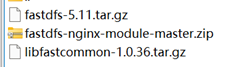

2、  解压``libfastcommon`` 安装libfastcommon

cd /home/mytest

tar -zxvf ``libfastcommon-1.0.36.tar.gz`` -C /usr/local/

cd /usr/local/libfastcommon-1.0.36/

./make.sh

./make.sh install

3、  解压``fastdfs ``安装fastdfs

cd /home/mytest

tar -zxvf ``fastdfs-5.11.tar.gz ``-C /usr/local

cd /usr/local/ fastdfs-5.11/

./make.sh

./make.sh install

4、  拷贝``fastdfs``目录中的``http.conf``和``mime.types``到``/etc/fdfs ``目录中

cp /usr/local/fastdfs-5.11/conf/http.conf /etc/fdfs

cp /usr/local/fastdfs-5.11/conf/mime.types /etc/fdfs

注：6台机器全部执行这些操作

4. #### 第四步：部署两个tracker server服务器，需要做的工作:

1、修改两个tracker服务器的配置文件：

cd /etc/fdfs/

修改后缀名

mv tracker.conf.sample tracker.conf

2、创建文件夹

mkdir /opt/fastdfs

mkdir /opt/fastdfs/tracker

3、tracker.conf: 修改**一个**地方：

vim tracker.conf

  base_path=/opt/fastdfs/tracker  #设置tracker的数据文件和日志目录（需预先创建）

4、启动tracker服务器

fdfs_trackerd /etc/fdfs/tracker.conf

5. #### 第五步 修改两个组中的4台storage中storage.conf文件

1、cd /etc/fdfs/

2、修改后缀名

mv storage.conf.sample storage.conf

3、创建文件夹

mkdir /opt/fastdfs

mkdir /opt/fastdfs/storage 

mkdir /opt/fastdfs/storage/files

  4、第一组group1的第一个storage server（修改storage.conf配置文件）：

```shell
  group_name=group1  #组名，根据实际情况修改，值为 group1 或 group2

  base_path=/opt/fastdfs/storage  #设置storage的日志目录（需预先创建）

  store_path0=/opt/fastdfs/storage/files  #存储路径

  tracker_server=192.168.64.130:22122 #tracker服务器的IP地址以及端口号

  tracker_server=192.168.64.131:22122
```

  第二组group2的第一个storage server（修改storage.conf配置文件）：

```shell

  group_name=group2  #组名，根据实际情况修改，值为 group1 或 group2

  base_path=/opt/fastdfs/storage  #设置storage的日志目录（需预先创建）

  store_path0=/opt/fastdfs/storage/files  #存储路径

  tracker_server=192.168.64.130:22122 #tracker服务器的IP地址以及端口号

  tracker_server=192.168.64.131:22122
```

5、启动storage服务器

  fdfs_storaged /etc/fdfs/storage.conf

  6、使用之前的Java代码测试FastDFS的6台机器是否可以上传文件

注意：FastDFS默认是带有负载均衡策略的可以在tracker的2台机器中修改tracker.conf文件:store_lookup=1

   0 随机存放策略

  1 指定组

  2 选择磁盘空间的优先存放 默认值

  修改后重启服务

fdfs_trackerd /etc/fdfs/tracker.conf restart

### 使用Nginx进行负载均衡

6. #### 第六步 安装 nginx ，使用nginx 对fastdfs 进行负载均衡 

  (1)上传 ``nginx-1.12.2.tar.gz``以及 nginx的fastdfs扩展模块安装包``fastdfs-nginx-module-master.zip``

  (2)添加nginx的安装依赖

​    yum install gcc openssl openssl-devel pcre pcre-devel zlib zlib-devel -y

  (3）解压nginx(6个都做)

​    tar -zxvf nginx-1.12.2.tar.gz

(4)编译并安装nginx

​    ./make

​    ./make install

 (5)解压fastdfs扩展模块(4个存储节点做)

​    unzip fastdfs-nginx-module-master.zip

​    mv fastdfs-nginx-module-master /usr/local/

(6)配置nginx的安装信息

cd /usr/local/nginx-1.14.2/

​    2台tracker服务器的配置信息（不需要fastdfs模块）

 ```shell
./configure --prefix=/usr/local/nginx_fdfs
 ```

​    4台storage服务器其的配置信息（需要使用fastdfs模块）

4台storage的服务器需要拷贝mod_fastdfs文件

将/root/fastdfs-nginx-module-master/src目录下的mod_fastdfs.conf文件拷贝到 /etc/fdfs/目录下，这样才能正常启动Nginx；

cp /usr/local/fastdfs-nginx-module-master/src/mod_fastdfs.conf  /etc/fdfs/

```shell
./configure --prefix=/usr/local/nginx_fdfs --add-module=/usr/local/fastdfs-nginx-module-master/src
```

7. #### 第七步 配置tracker 的两台机器的nginx

  (1)进入安装目录

cd /usr/local/nginx_fdfs/conf

vim ``nginx.conf``

 (2)添加一个location 对请求进行拦截，

配置一个正则规则拦截fastdfs的文件路径， 并将请求转发到其余的4台storage服务器(修改 conf目录下nginx.conf 文件)

  \#nginx拦截请求路径：

 ```shell
  location ~ /group[1-9]/M0[0-9] { 

	  proxy_pass http://fastdfs_group_server; 
  }
 ```

  (3)添加一个upstream 执行服务的IP为 另外的4台stroage 的地址

```shell
  #部署配置nginx负载均衡:

  upstream fastdfs_group_server {

   server 192.168.64.132:80;

    server 192.168.64.133:80;

    server 192.168.64.134:80;

    server 192.168.64.135:80;

}
```

(4)启动nginx

/usr/local/nginx_fdfs/sbin/nginx -c /usr/local/nginx_fdfs/conf/nginx.conf 

8. #### 第八步 配置另外4台storage的nginx添加http访问的请求路径拦截

  (1)进入安装目录

cd /usr/local/nginx_fdfs/conf

vim ``nginx.conf``

 (2)添加一个location 对请求进行拦截

配置一个正则规则 拦截fastdfs的文件路径，使用fastdfs的nginx模块转发请求(修改 conf目录下nginx.conf 文件)

  \#nginx拦截请求路径：

```shell
  location ~ /group[1-9]/M0[0-9] {  

    ngx_fastdfs_module;

  }
```

9. #### 第九步 分别修改4台storage服务器的mod_fasfdfs.conf文件

(1)创建文件夹

mkdir /opt/fastdfs/``nginx_mod``

(2)修改配置文件

修改/etc/fdfs/``mod_fastdfs.conf``里面

```shell
 base_path=/opt/fastdfs/nginx_mod #保存日志目录

  #指定两台tracker服务器的ip和端口

  tracker_server=192.168.64.130:22122 #tracker服务器的IP地址以及端口号

  tracker_server=192.168.64.131:22122

  #指定storage服务器的端口号

  storage_server_port=23000 #通常情况不需要修改

  #指定当前的storage服务器所属的组名 （当前案例03和04为group1 05和06为group2）

  group_name=group1 #当前服务器的group名

  #指定url路径中是否包含组名 （当前案例url包含组名）

  url_have_group_name=true   #文件url中是否有group名

  store_path_count=1      #存储路径个数，需要和store_path个数匹配（一般不用改）

  store_path0=/opt/fastdfs/storage/files  #存储路径

  #指定组个数，根据实际配置决定，（当前案例拥有2个组group1和group2）

  group_count = 2          #设置组的个数

 # 在末尾增加2个组的具体信息：

  [group1]

  group_name=group1

  storage_server_port=23000

  store_path_count=1

  store_path0=/opt/fastdfs/storage/files

 

  [group2]

  group_name=group2

  storage_server_port=23000

  store_path_count=1

  store_path0=/opt/fastdfs/storage/files
```

  第一个组的第二个storage按照相同的步骤操作；

  另外一个组的两个storage也按照相同的步骤操作；唯一改变：

```shell
group_name=group2 #当前服务器的group名
```

(3)启动nginx：

/usr/local/nginx_fdfs/sbin/nginx -c /usr/local/nginx_fdfs/conf/nginx.conf

(4)测试：使用浏览器分别访问 6台服务器中的fastdfs文件

10. #### 第十步：部署前端用户访问入口服务器，即访问192.168.64.128上的Nginx，该Nginx负载均衡到后端2个tracker server；

  (1)配置nginx.conf文件

  location ~ /group[1-9]/M0[0-9] { 

​    proxy_pass http://fastdfs_group_server; 

  }

(2)添加一个upstream 执行服务的IP为 2台tracker 的地址

  \#部署配置nginx负载均衡:

  upstream fastdfs_group_server { 

​    server 192.168.116.130:80; 

​    server 192.168.116.131:80; 

  }

(3)测试：使用浏览器访问128（唯一入口的nginx服务器）服务器中的fastdfs文件

注意：由于之前128的nginx中可能拥有静态资源拦截会导致访问不到文件，这时可以注释或删除这些静态资源拦截

 

 

 

 

#### 补充资料

最后，为了让服务能正常连接tracker，请关闭所有机器的防火墙：

systemctl status firewalld  查看防火墙状态

systemctl disable firewalld 禁用开机启动防火墙

systemctl stop firewalld   停止防火墙

systemctl restart network 重启网络

systemctl start network   启动网络

systemctl stop network   停止网络

 

可能安装的linux（无图形的）没有开启网卡服务，可以修改/etc/sysconfig/network-scripts 下的网卡配置文件设置 ONBOOT=yes 

表示开机启动网卡，然后启动网络服务即可

Keepalived当主nginx出现故障后会自动切换到备用nginx服务器的一款软件 通常由运维人员进行使用

## 简历

熟悉分布式文件系统FastDFS的环境安装与部署，并具有项目应用经验

